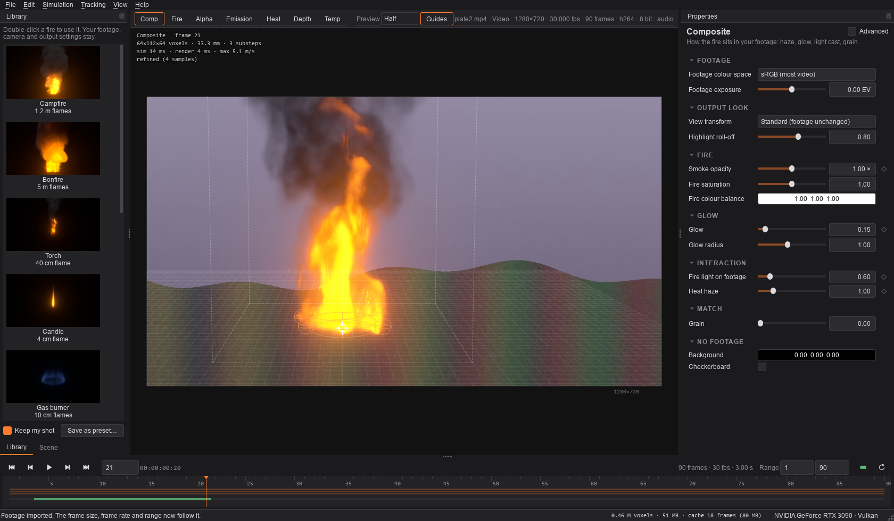
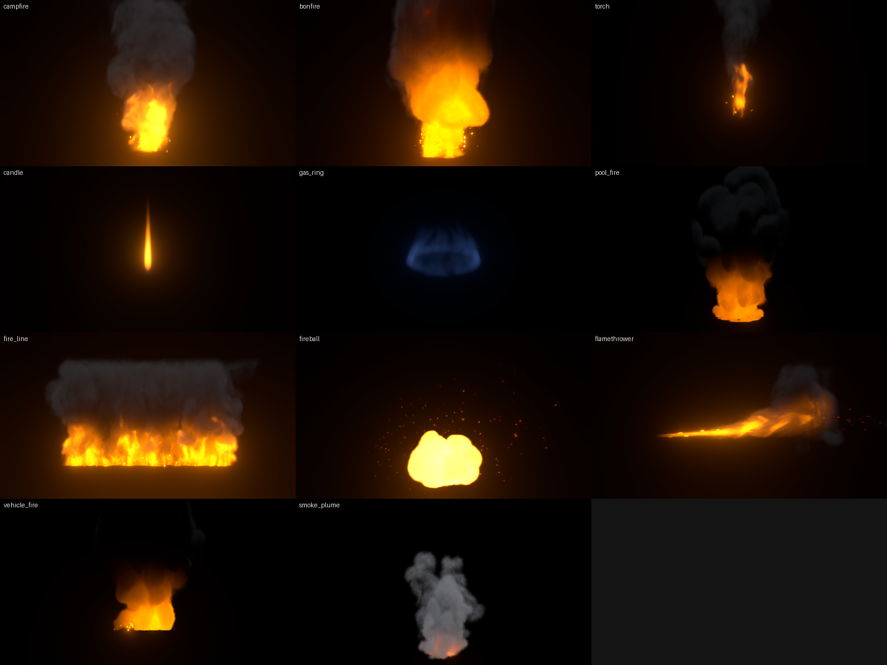
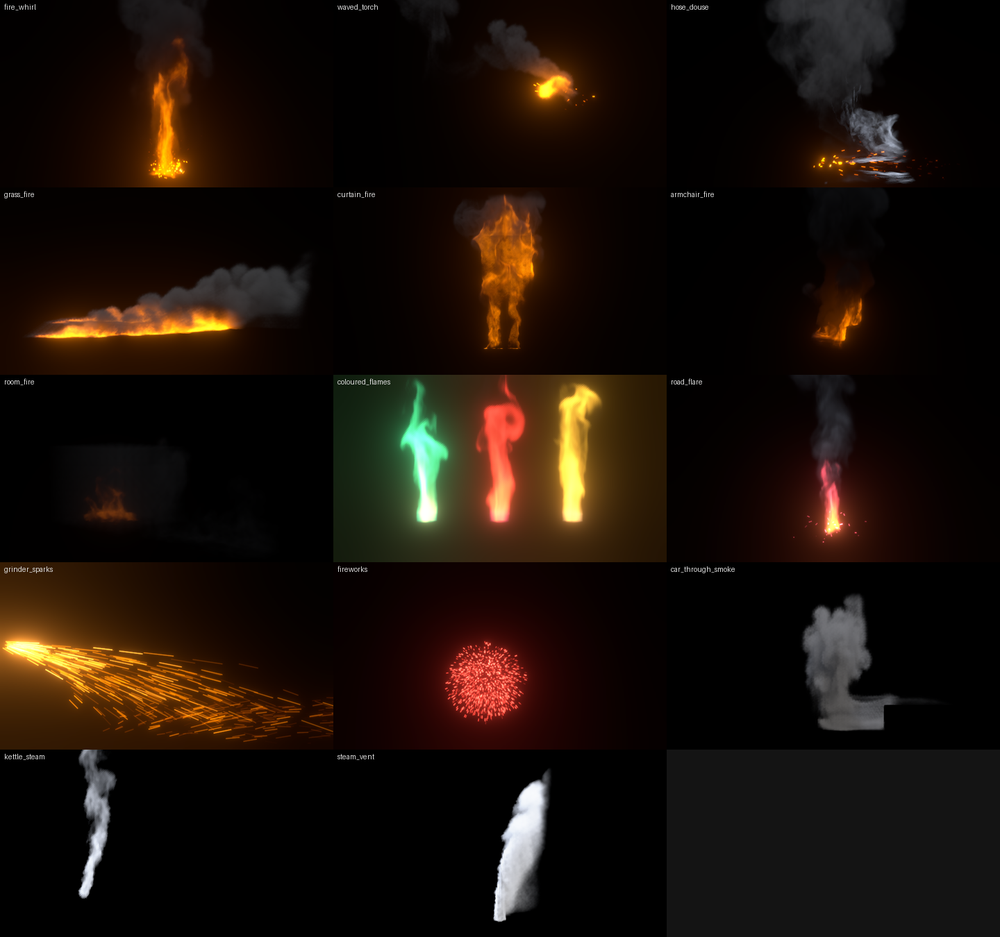
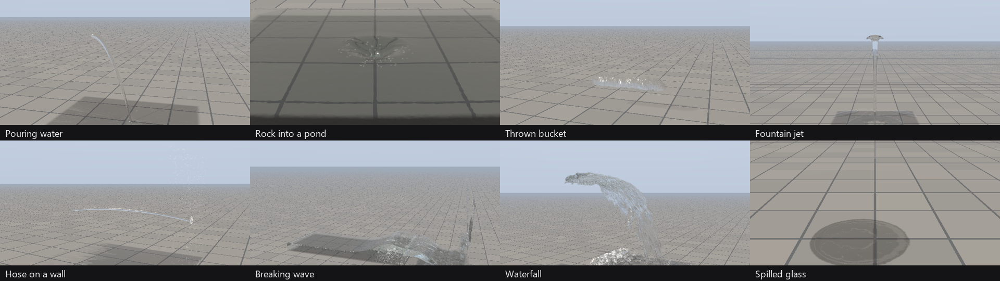

# Blackbody

GPU fire, smoke and liquid simulation for putting realistic fire and water into live-action footage.

Blackbody simulates fire as a real gas: fuel burns into heat, soot and flame. Hot gas rises, swirls and expands, and smoke drifts. It renders the result physically: flame colour and brightness come from blackbody radiation, and thick flame saturates the way real flame does. Smoke is lit by the fire, the sky and a key light.

It also simulates liquids: water that pours, splashes, sheets and breaks into drops, with spray, foam and bubbles, rendered as a real dielectric that refracts and reflects your footage (see *Liquids*).

You place the effect in your shot, match it to the footage, and render one of:

- a finished composite
- a fire element with alpha for your editor
- multi-layer EXRs for compositing
- OpenVDB volumes for 3D packages



## Requirements

- A GPU with Vulkan, Direct3D 12 or Metal. Most cards from the last eight years qualify: NVIDIA, AMD, Intel, and Apple Silicon.
- 4 GB of GPU memory for everyday work; 8 GB or more for high-resolution final renders.
- Windows 10/11. macOS 12+ and Linux run from source (see *Limitations*).

## Install and run

**Standalone (Windows):** run `dist/Blackbody/Blackbody.exe`. The same folder has `blackbody-cli.exe` for command-line rendering.

**From source (any platform):** double-click `Blackbody.bat` (Windows) or run `./blackbody.sh` (macOS/Linux). The first run creates a private Python environment and installs the dependencies (about 400 MB). You need Python 3.10 or newer.

Or install it yourself:

```bash
python -m venv .venv
.venv/bin/pip install -r requirements.txt   # Windows: .venv\Scripts\pip ...
.venv/bin/python -m blackbody               # the app
.venv/bin/python -m blackbody render --help # the command line
```

To build the standalone app: `pip install pyinstaller`, then `pyinstaller blackbody.spec`.

## Put fire in a shot in five steps

1. **Import your footage.** File › Import footage (Ctrl+I). Video files, image sequences (EXR, DPX, TIFF, PNG) and stills all work. The frame size, frame rate and length follow the footage.
2. **Pick a fire.** Double-click one in the Library. With *Keep my shot* on, your footage, camera and output settings stay.
3. **Place it.**
   - Drag the ring at the fire's base onto the spot, and drag the square above it to scale.
   - Alt-drag orbits the camera around the fire; Alt + right-drag changes its distance.
   - Drag an emitter to move it along the ground (Shift moves it up and down).
4. **Match it** in Composite:
   - Fire exposure (Shading)
   - Heat haze
   - Fire light on the footage
   - Glow and grain

   Smoke is lit by the average colour of the footage automatically (Lighting › Match ambient to footage).
5. **Render** (Ctrl+M). See *Outputs* below.

Space plays. The simulation runs live, so you can change settings while it plays. Frames are cached (the green bar in the timeline): scrubbing back, and changing anything about the look, camera or composite, re-renders from the cache without re-simulating.

## Presets





| Preset | Size | Notes |
|---|---|---|
| Campfire | 1.2 m flames | Crossed logs, grey smoke, embers |
| Bonfire | 5 m flames | Big pile, smoke column, heavy ember shower |
| Torch | 40 cm flame | Hand-held torch head in mid-air |
| Candle | 4 cm flame | Calm teardrop with a blue base |
| Gas burner | 10 cm flames | Blue, almost smokeless ring |
| Fuel spill | 3 m flames | Petrol pool fire with black smoke |
| Fire line | 6 m long | Burning trail or grass-fire front |
| Fireball | 8 m ball | Burst, rolling fireball, smoke column |
| Flamethrower | 7 m jet | Burning jet that curls upward |
| Vehicle fire | car-sized | Flames over a car body collider, black smoke |
| Smoke plume | 6 m column | Smouldering smoke, no flame |
| Fire whirl | 8 m column | Pool fire drawn into a spinning column of flame (emitter swirl) |
| Waved torch | 40 cm flame | Torch swung back and forth; flame and embers trail behind (keyframed emitter) |
| Fire put out | 1.2 m flames | Campfire hit by a hose: flames collapse into steam (dousing emitter) |
| Grass fire | 14 m patch | Dropped torch lights dry grass; wind drives the front (spreading fire) |
| Curtain catching | 2.4 m curtain | Small flame climbs a curtain (burnable collider) |
| Burning armchair | 1 m mesh | Fire spreads over an armchair mesh (burnable mesh collider) |
| Starved room fire | 2.6 m room | Closed-room fire runs out of air; flames roll out when the door opens (tracked air, moving collider) |
| Coloured flames | 3 burners | Copper green, strontium red, sodium orange (colourants) |
| Road flare | 20 cm flame | Strontium-red flare, white smoke, red sparks |
| Grinder sparks | angle-grinder cut | Hot metal sparks in a cone, full gravity, skittering off the floor |
| Firework bursts | 20 m bursts | Red, green and gold stars (sparks coloured by colourants) |
| Car through smoke | car at 30 km/h | A car drags a smoke column along in its wake (moving collider) |
| Kettle steam | spout plume | Clear at the spout, clouding as it cools, evaporating as it mixes (steam) |
| Steam vent | 6 m plume | Dense white column venting into freezing air (steam) |

Every setting has a tooltip; drag a setting's name to scrub it and double-click it to reset. Tick *Advanced* in Properties for expert settings. **File › Save as preset** (in the Library) keeps your own fires.

## Swirl, sparks, steam and more

Each of these is a few settings on an emitter or collider, or a Properties section. The presets above show each one working.

- **Swirl (fire whirls).** Emitter › Swirl spins the air around the emitter's vertical axis. The spin is driven near the base and the rising gas carries it up, so a pool fire twists into a column. About 2–3 m/s suits a 2 m pool; much more makes the column break down into a spinning carpet of flame. *Swirl width* sets how far out the spin reaches.
- **Moving emitters.** Keyframe an emitter's *Position* to wave a torch, run a burning stuntman through the shot or drop burning debris. The emitter drags the air and its embers along (*Motion inheritance*), and emitters move smoothly within each frame, so fast ones leave a continuous trail.
- **Putting fire out.** Emitter › *Put out* cools the gas toward 100 °C, smothers fuel and flame, and puts out burning surfaces: a hose, an extinguisher, rain. The heat it takes turns to steam (Combustion › *Steam from dousing*). Give the emitter a *Start* time to turn the hose on mid-shot.
- **Sparks.** Embers › *Launch direction* and *Launch cone* aim the particles; *Gravity* 9.81 and low *Air drag* make them fall like hot metal. Particles bounce off the ground and colliders (*Bounce*, *Friction*, *Hit colliders*). An emitter with no fuel still throws sparks, so they work without any fire.
- **Coloured flames.** Emitter › *Colourant* releases a metal salt with the fuel. It glows in its own colour wherever the gas is hot: copper green, strontium red, sodium orange, potassium lilac. The same colour tints that emitter's embers, which is how the firework stars are coloured. Shading › *Base glow colour* changes the blue base of gas flames to any colour, for the whole fire.
- **Moving colliders.** Keyframe a collider's *Position*, *Size* or *Rotation*. It pushes the gas out of its way and drags it along: a car through smoke, a door swinging open.
- **Rooms, walls and doors.** A collider can be *Hollow* (walls of that thickness, for a room, tank or pipe) and have an *Opening* cut out of it (a door, window or vent; keyframe its size to open it). One hollow box with an opening replaces a room built from separate walls. A scene can have up to 16 emitters and 16 colliders.
- **Spreading fire.** Turn on *Spreading fire* (its own section in Settings) and fire spreads by itself over the ground and over any collider marked *Burnable*; a burnable collider can move or fall while it burns, and its fire goes with it. A spot catches after sitting in hot gas for the *Catch time*, flames for the *Burn time*, smoulders, then is burnt out for good. Light it with any emitter, even one that burns for only a moment. Wind-blown flames carry the front downwind; *Creep speed* spreads it in still air. *Coverage* leaves bare patches.
- **Tracked air (closed rooms).** Combustion › *Air supply* › *Tracked* makes burning use up the air's oxygen. A fire in a closed room (colliders for walls, with a gap to leak through) dies down, unburnt fuel builds up, and flames flare again when fresh air gets in. *Air use* sets how fast a room runs out. Combustion › *Heat expansion* makes gas swell as it heats and shrink as it cools, as real air does, so a hot closed room pushes smoke out of every gap.
- **Meshes.** Set an emitter's or collider's *Shape* to *Mesh* and choose an OBJ or STL file (metres, y up; it need not be watertight). A mesh collider blocks the gas like the real object; mark it *Burnable* to let fire spread over it. A mesh emitter releases fuel within *Surface depth* of its surface. *Size* scales the mesh on each axis. The mesh is converted to a distance field on the GPU the first time it is used (Domain › *Mesh detail*, advanced) and kept on disk, so it is only converted once per machine.
- **Steam.** Emitter › *Steam* releases water vapour (about 600 g/m³ for steam straight off boiling water) and the gas needs a little *Heat* to rise (0.055 is 100 °C at the default flame temperature). The vapour stays clear while hot and condenses into visible steam as it cools and mixes, then evaporates at its edges. Colder, more humid air (Shading › *Air temperature*, *Air humidity*) makes more of it. Combustion › *Water from burning* adds the water vapour flames make, for fires in freezing air. Condensing steam gives off its latent heat (Combustion › *Latent heat*), so it billows upward like a cloud. With a liquid in the same box, water puts fire out and boils to steam (Combustion › *Water on fire*).

In the viewer, click an emitter or a collider to select it and drag it along the ground (Shift: up and down). The selected one shows a ring with a knob to turn it and a square to resize it (Shift snaps the turn to 15°).

### Fitting the fire into the footage

- **Objects in front of the fire.** A collider marked *Hides fire* (on by default) hides the fire, smoke and embers behind it, as the real object in the shot would. Put a collider over the car, wall or chair in your footage and the fire goes behind it. Turn it off for helper colliders that are not in the shot.
- **Fire light on surfaces.** Composite › *Fire light on surfaces* lights the ground and every collider in the shot the way the fire lights the real ones: brightest where they face the flames, falling off with distance. It has a soft shoulder, so a big fire brightens the footage at most about four times.
- **Scorch.** With spreading fire, Composite › *Scorch* darkens the ground and objects where they have burnt.
- **Multiple scattering.** Shading › *Multiple scattering* lets light bounce around inside smoke more than once. Pale smoke and steam glow white inside instead of going grey; dark smoke barely changes.
- **Detail upres.** Render › *Detail upres* (2 or 3) carries the fire and smoke on a grid that many times finer for final renders, moved by the simulated air plus small swirls where the air is spinning, and burns the fuel there too. It gives much finer detail for a fraction of the cost of simulating at that resolution (*Upres turbulence* sets the swirls).

## Liquids

Set *Domain › Simulation* to **Liquid**, or double-click a liquid in the Library. The Properties panel then shows the liquid sections (*Liquid* for how it behaves, *Liquid look* for how it looks); fire-only settings are hidden. Everything else works as for fire: placing it in the shot, tracking, keyframes, the cache, every output.

- **Sources.** Emitters become liquid *sources*. A **stream** keeps pouring at its *Velocity*: the flow is speed times area, so a spout 3 cm in radius pouring at 1 m/s gives about 2.8 litres a second. A **volume** fills its shape with liquid once, at *Starts at*: a pond, a thrown bucket, a wall of water. Any emitter shape works, meshes included. Keyframe *Flow* to open and close a tap, or *Position* to swing a hose.
- **Colliders** are solid: the liquid flows around them, splashes off them and runs down them. Keyframe one to move it (a rock dropped in a pond, a paddle): it pushes the liquid out of its way. Colliders are not rendered; put the real object in your footage or render it separately.
- **Surface tension** (*Liquid › Surface tension*, 0.073 N/m for water) smooths small ripples and beads small drops. It matters at centimetre scale; on big shots it has no visible effect. *Grip on surfaces* slows liquid sliding on the ground and colliders, so fast sheets slide on but spills settle into puddles.
- **Whitewater.** Where the liquid moves fast and traps air (plunging, colliding), churns or breaks at a crest, it releases spray, foam and bubbles. Spray flies in the air, foam rides the surface and pops after *Foam lifetime*, bubbles rise. *Liquid look › Foam / Spray / Bubbles* set how dense each looks.
- **The look.** The surface is ray traced as a dielectric (index of refraction 1.333 for water). Your footage is refracted through the liquid, reflected in it, and seen through it tinted by the liquid's *Colour* over its *Clarity* distance; *Murkiness* scatters light inside (muddy water, milk). *Background distance* says how far behind the liquid the scene is, which sets how strongly the footage bends. A key light (Lighting) adds sun glints. The ground under and around the liquid darkens where it is wet (*Wet ground*) and dries slowly (*Liquid › Drying*).
- **Calm water.** *Calm surfaces* smooths the surface of the bulk of the liquid along the surface only, so a still pond is glassy without shrinking thin sheets and drops. A pond or tank filled at the start sloshes as it settles; *Liquid › Settle during pre-roll* calms it before frame 1.
- **Scale and resolution.** Liquids need finer grids than fire: a feature needs a few cells across to hold together. Keep the box tight around the action, and aim for cells (shown in the viewer) a quarter of the size of the thinnest stream or sheet you want. Water that leaves the box through an open side is gone; closed sides behave like glass walls.



| Liquid preset | Size | Notes |
|---|---|---|
| Pouring water | 80 cm pour | A stream from knee height onto the ground, spreading into a puddle |
| Rock into a pond | 15 cm rock | Crown splash, cavity, rebound; the rock is a keyframed collider |
| Thrown bucket | 8 litres | A mass of water thrown forward, landing and fanning out |
| Fountain jet | 1.2 m jet | Rises, breaks up at the top and rains back down |
| Hose on a wall | 1.5 m jet | Hits a wall collider, fans out, throws up spray |
| Breaking wave | 4 m channel | A wall of water crashing over a step (glass-sided channel) |
| Waterfall | 1.5 m drop | A sheet off a ledge collider, white water where it lands |
| Spilled glass | 25 cl | A glass knocked over, spreading into a puddle |

## Moving shots

- **Handheld or moving camera, no 3D solve:** park the fire where it should be, then Tracking › Track the fire base (Ctrl+T). The fire follows that point through the shot. Dragging the ring afterwards offsets the whole track. Pick a spot with texture or a corner; the tracker follows position only, not rotation, scale or perspective.
- **Matchmoved shots:** File › Import camera track (.chan). This covers exports from Nuke, Blender, SynthEyes, 3DEqualizer and PFTrack. The camera switches to Free mode. Place the fire in the tracked scene with Camera › Fire position (metres, y up).
- **Keyframes:** click the ◆ next to a setting to key it on the current frame. Changing an animated setting keys it automatically. Keyframe *Master fuel* (Combustion) to ignite, grow or extinguish a fire.

## Outputs

One render pass can write several outputs at once.

| Output | Use it in | Notes |
|---|---|---|
| **Fire element · OpenEXR** | Nuke, After Effects, Fusion, Resolve, Flame | Scene-linear, premultiplied RGBA. Layers: `emission` (fire only), `glow`, `heat` (drives distortion), `depth` (metres), `light` (fire light on the ground and colliders: multiply the plate by it and add), `holdout` (matte of the colliders in the shot) and `scorch`. ZIP, PIZ, DWAA and more; half or float. |
| **Fire element · PNG** | Any editor or motion-graphics app | 8 or 16 bit with alpha. Premultiplied or straight. |
| **Fire element · ProRes 4444** | Premiere, Final Cut, Resolve, After Effects | One file with alpha. |
| **Composite over the footage** | Delivery or review | ProRes 422 HQ, H.264, H.265 (10-bit), DNxHR. The footage's audio comes along, trimmed to the rendered frames: copied untouched when the container can hold it, otherwise converted (24-bit PCM in `.mov`, AAC in `.mp4`). |
| **Volume · OpenVDB** | Blender, Houdini, Maya, Cinema 4D, Unreal | `density`, `temperature`, `flame`, `fuel` (float grids) and `vel` (vec3). Scenes with steam add `steam` (condensed water, g/m³) and `vapour`; tracked air adds `oxygen_used` (0–1); colourants add `color` (vec3). With *Detail upres* the grids are written at the finer voxel size. Metres, y up. Validated with OpenVDB 11. |

**Premultiplied or straight alpha.** Fire is light, so much of it has little alpha.

- **Premultiplied (recommended):** keeps that exactly. Interpret the footage as *premultiplied* (After Effects: *Premultiplied – Matted With Color: black*; Resolve: *Alpha mode › Premultiplied*).
- **Straight:** folds the light into alpha, so the element drops onto footage with a plain *Normal* blend in any editor.

**Heat distortion in comp.** Use the `heat` layer as the amount for a displacement:

- Nuke: *IDistort* with a noise, or *STMap*.
- After Effects: *Displacement Map* with a fractal noise.
- Inside Blackbody's own composite, the haze is already applied.

**Liquid outputs.** A liquid element carries the footage as seen *through* the liquid, with alpha 1 where there is liquid, so it drops straight onto the same footage. Its EXR `emission` layer holds the sun glints (for extra glow in comp), `ground` multiplies the footage outside the liquid (wet and shadowed ground; use it as a multiply), `depth` is in metres and `speed` in m/s. The VDB of a liquid holds `density` (1 inside, 0 outside, the 0.5 iso-surface is the liquid surface: mesh it with Blender's *Volume to Mesh* or Houdini's *Convert VDB*), `vel` (m/s) and `spray`, `foam` and `bubbles` densities, on the render surface grid.

**VDB in Blender.** Blender is z-up, so rotate the imported volume 90° about X. In a *Principled Volume*, use `density` for density and `flame` (times a strength) for emission with a *Blackbody* colour of about 1700 K. The file metadata records the Kelvin mapping: `blackbody_temperature_1_kelvin`.

## Command line (batch and render farms)

```bash
blackbody render shot.bbfire -o renders/fire.####.exr
blackbody render shot.bbfire -o comp.mov --content composite --format prores422hq
blackbody render --preset campfire --footage plate.mov -o comp.mp4 --content composite
blackbody render shot.bbfire -o vdb/fire.####.vdb --frames 1001-1100 --res 256
blackbody render shot.bbfire -o fire.####.exr --set motion.wind_speed=3 --set shading.exposure=-0.5
blackbody render shot.bbfire -o wedge/fuel20.####.exr --set emitter.0.fuel=20
blackbody presets
blackbody settings motion
blackbody info
```

- `####` is the frame number. The output type follows the extension: `.exr` `.png` `.vdb` `.mov` `.mp4` `.webm`.
- `--set section.key=value` overrides any setting; `emitter.N.key` and `collider.N.key` reach one emitter or collider (numbered from 0). `blackbody settings` lists every name with its default and range. Values are checked before anything renders: a typo stops the job instead of rendering with a default.
- `--draft` renders at interactive quality.
- Each render also writes a `<name>_render.json` sidecar with the full scene and settings, for reproducibility.
- **On a farm:** when the output goes to a log instead of a terminal, progress is written as whole lines (`Progress: 25.0%  Frame 1 of 4 …`, one per frame) in UTF-8. Exit codes: `0` done, `1` failed (the log ends with `Error: …`), `2` bad arguments, `130` cancelled.

## Performance and memory

Resolution is set by *Domain › Voxels (longest side)*. Memory grows with the cube of it, and so does detail:

| Voxels (longest side) | Campfire grid | GPU memory | Simulate + preview on an RTX 3090 |
|---|---|---|---|
| 96 | 56×96×56 | 0.03 GB | 59 fps |
| 144 | 88×144×88 | 0.12 GB | 33 fps |
| 192 | 120×192×120 | 0.31 GB | 16 fps |
| 256 | 160×256×160 | 0.72 GB | 8 fps |
| 384 | 232×384×232 | 2.3 GB | 1.6 fps (final renders) |

(Measured with `python tools/benchmark.py`: campfire, 960×540 preview, adaptive substeps.)

Writing a VDB frame (all five grids, ZIP) takes about 1 s at 256 voxels on a 16-thread CPU; files are 50–80 MB at that size.

Tracked air or steam, colourants and spreading fire each keep one more field, about 16 bytes per voxel (0.1 GB at 256 voxels). A scene only pays for the ones it uses. A mesh is converted to a distance field once and kept in a disk cache (`%LOCALAPPDATA%\Blackbody\meshes` on Windows, `~/.cache/blackbody/meshes` elsewhere; `BLACKBODY_CACHE` moves it). Dense meshes use a banded conversion: a 58,000-triangle mesh takes about 0.05 s on an RTX 3090. *Detail upres* keeps about 28 bytes per fine voxel, so 2× costs about 0.25 GB for a 144-voxel campfire. `python tools/benchmark.py --features` measures what each feature costs on your GPU.

Liquids cost more per voxel than fire (particles, a second grid for the surface). The *Rock into a pond* preset (a 2 m pond, 24 cm deep), simulated and rendered at 960×540 on an RTX 3090:

| Voxels (longest side) | Grid | Particles | GPU memory | Simulate | Render |
|---|---|---|---|---|---|
| 128 | 128×56×128 | 2.0 M | 1.6 GB | 43 ms/frame | 28 ms |
| 192 | 192×88×192 | 6.8 M | 3.3 GB | 0.26 s/frame | 86 ms |
| 256 | 256×112×256 | 16 M | 4.7 GB | 0.41 s/frame | 0.20 s |

At 256 voxels this pond reaches the default *Particle limit* (16 M): the viewer says so, and sources hold back. Raise the limit (Liquid, advanced) if the GPU has the memory, about 100 bytes a particle.

While you work, the simulation runs at *Interactive resolution* (75% by default) and the viewer at *Preview* resolution. Idle frames refine to full quality automatically. Final renders use the full resolution times *Render › Final resolution*, with *Samples per pixel* and velocity-based motion blur.

## How it works

- **Solver:** an incompressible, buoyant, reacting gas on a staggered (MAC) grid, entirely in GPU compute shaders (WGSL, through wgpu).
  - MacCormack advection with a revert-to-semi-Lagrangian limiter.
  - Combustion with an oxygen limit, so fuel-rich cores burn from the outside in. With tracked air, an advected oxygen field is used up by burning, mixed by a sub-grid diffusion and replaced through open boundaries; flames die when about 80% of it is gone.
  - Heat release, soot, gas expansion, and exponential plus radiative cooling.
  - Vorticity confinement, curl-noise turbulence and disturbance, and emitter swirl (a Rankine vortex driven at the base).
  - Wind with gusts, and an absorbing layer at open boundaries so the box edge never shows.
  - Colliders from analytic shapes or meshes (a GPU-baked signed distance field, inside/outside by generalised winding number). Animated colliders rebuild their distance field every substep, and their surfaces carry their velocity into the pressure solve, so they push the gas.
  - Emitters are evaluated every substep; a moving one imposes its own velocity. Dousing cools toward 100 °C and turns the heat removed into water vapour; vapour is lighter than air and adds lift.
  - Burnable surfaces: a cell layer on the floor, and for each burnable collider a grid in the collider's own frame (so the burn moves with it), that catches from hot gas or burning neighbours, releases fuel, smoulders and burns out.
  - Heat expansion from the ideal gas law at constant pressure (the divergence is the heating rate over the absolute temperature). In a box closed on every side the mean of the pressure equation's source is removed, since a sealed box can only hold a net-zero expansion.
  - Latent heat: condensed water is tracked and its heat added to the gas; the stiff balance between condensing and warming is solved with Newton's method each step.
  - Detail upres: the fire's fields on a grid 2 or 3 times finer, advected (MacCormack) by the simulation's velocity plus curl noise scaled by the local vorticity, with the reaction run on the fine grid too.
  - A geometric multigrid pressure solve. Its open boundaries are Dirichlet at the face, which keeps it consistent across levels.
  - Adaptive substeps from a GPU CFL reduction.
- **Renderer:** a volume ray-marcher.
  - Emission follows Kirchhoff's law: flame and hot soot emit in proportion to their absorption, times Planck blackbody radiance integrated against the CIE 1931 colour-matching functions. Thick flame saturates; thin flame stays translucent.
  - Smoke scattering uses a Henyey–Greenstein phase function. It is lit by blurred fire light, a shadowed key light and sky occlusion.
  - Steam is the vapour above what the air can hold at the local temperature (Magnus formula), scattered as white droplets and shadowed like smoke.
  - Flame colourants add their line colour wherever the gas is hot.
  - Multiple scattering after Wrenninge et al.: extra octaves with the albedo's share of the light, thinner shadowing and flatter scattering.
  - Colliders in the shot are found by sphere tracing their exact shapes and stop the volume march; the ground plane and those colliders receive fire light from a short list of point lights built from the fire's emission, with a cosine and inverse-square falloff (no shadows).
  - Render-time detail noise, empty-space skipping, multi-sample anti-aliasing and velocity motion blur.
  - GPU embers and sparks are carried by the simulated air, launched into a cone, bounce off the ground and colliders, and are drawn as motion-blurred streaks.
- **Liquid solver:** FLIP/APIC particles on the same MAC grid, all on the GPU.
  - Particle-to-grid transfers into fixed-point integer atomics, so the result does not depend on thread order and the simulation is deterministic.
  - A free-surface pressure solve with ghost-fluid boundary conditions (the surface found from the particle density) and a surface-tension pressure jump from the curvature, solved by conjugate gradients preconditioned with a multigrid V-cycle, entirely on the GPU (the CG scalars never come back to the CPU).
  - A volume correction that pushes apart particles that have bunched up, so the liquid keeps its volume.
  - Particles move through the grid velocity (midpoint rule) inside the liquid and ballistically where they are sparse; moving colliders carry their velocity into the solve; contact friction at solids.
  - Time steps limited by the flow speed, by surface tension's capillary time step, and by the gravity-wave time step of a cell.
  - Whitewater (after Ihmsen et al. 2012) from trapped air (converging flow), vorticity and stretched crests, classed as spray, foam and bubbles by the liquid density each step.
- **Liquid renderer:**
  - The surface is rebuilt every frame from the particles on a grid finer than the simulation (Zhu and Bridson's smooth surface where particles are dense, bounded by the union of particle spheres where they are sparse), smoothed, and flattened by curvature flow along the surface in the bulk of the liquid.
  - Ray tracing of that surface with exact Fresnel, refraction through the body with Beer–Lambert absorption and scattering, total internal reflection, re-entry into other drops, GGX sun glints, and footage-based reflections; the footage is looked up where the refracted ray meets the ground or the backdrop.
  - Spray, foam and bubbles rendered as scattering media; a ground wetness map darkens the footage.
- **Compositor:**
  - footage decoded to linear
  - heat-haze displacement
  - fire light cast onto the footage
  - bloom
  - grain
  - view transforms: Standard (footage untouched, highlight roll-off), AgX, ACES fit

## Troubleshooting

- **The wrong GPU is used:** set `BLACKBODY_GPU` to part of the GPU's name (for example `3090`) and/or `BLACKBODY_BACKEND` to `Vulkan`, `D3D12` or `Metal`. `blackbody info` lists what is available.
- **The engine does not start:** update the graphics driver.
- **Out of GPU memory:** lower *Voxels (longest side)* or *Final resolution*.
- **Footage will not open:** anything FFmpeg decodes should work. Image sequences are found from any one numbered file.
- **Footage missing after moving a project:** Blackbody looks for the clip at its saved path, then at the same place relative to the project, then next to the project file. If none of those has it, File › Import footage relinks it; the fire, camera and track are kept.

## Limitations

- Tested on Windows 11 with an NVIDIA RTX 3090 (Vulkan). macOS and Linux use the same code from source, but have not been tested.
- Colour management is built in: sRGB, Rec.709, Linear and ACEScg footage; Standard, AgX filmic, ACES fit and Raw view transforms. EXR and VDB outputs are scene-linear; PNG and video fire elements are sRGB-encoded with the highlight roll-off. OCIO configs are not read yet.
- The tracker follows one point in 2D. Shots with strong perspective change need a camera track (.chan).
- `.chan` import is tested with generated files, not with exports from each package.
- A fast-moving collider deletes the smoke it sweeps into rather than compressing it. A burnable collider's burn is laid out around its size at the start; animating its *Size* stretches the burn.
- Fire light on surfaces has no shadows, and the ground is a flat plane at the fire's base. Holdouts are only as good as the colliders you place over the real objects.
- Detail upres adds detail the simulation did not compute: the fine grid follows the simulated air plus noise, so its small swirls are plausible rather than simulated.
- Heat expansion makes a fireball shrink as it cools, which is real, but it looks smaller than one tuned with *Gas expansion* alone.
- Tracked air models flames going out and flaring again; it does not reproduce the violent pressure wave of a true backdraft.
- A swirl core narrower than about six cells (a small dust devil) is under-resolved and spreads out instead of forming a column.
- Liquids: colliders are not rendered, and the liquid does not push colliders (a floating object must be keyframed). There is no viscosity for honey or lava yet. A body of water cannot continue past the box: open sides let it drain, closed sides are glass walls. Streams and sheets thinner than about two cells break up early; raise the resolution or keep the box tight.

## Tests

```bash
pip install pytest
pytest -q
```

The suite covers:

- scene and keyframe round trips, and camera maths
- EXR, PNG and VDB round trips, and `.chan` import
- frame-accurate footage decoding and the point tracker
- solver stability, incompressibility and determinism on the GPU
- liquids: stability, volume, incompressibility, determinism, source flow rates, whitewater, rendering, the cache, switching between fire and liquid, and VDB output
- rendering
- command-line renders of every output type, and argument checking
- swirl, moving emitters and colliders, dousing, sparks bouncing off colliders, colourants, spreading fire, tracked air in a sealed box, mesh distance fields and steam (`tests/test_features.py`)
- 16 emitters, hollow colliders with openings, the banded mesh bake against the exact one and its disk cache, holdouts, fire light and scorch on surfaces (and their EXR layers), multiple scattering, detail upres, heat expansion in a closed box, latent heat, water from a liquid putting fire out, and a burning object carrying its fire as it moves
