<p align="center">
  
</p>

<h1 align="center">Blackbody</h1>

<p align="center">
  <b>Fire, water, cloth, destruction, sand and weather, simulated on your GPU and put into your footage.</b><br>
  Build an effect from nothing or start from one of 97 presets, line it up with your shot, and render a finished composite or the passes your compositor wants.
</p>

<p align="center">
  <a href="https://gjnail.github.io/blackbody/"><b>Website</b></a> ·
  <a href="https://gjnail.github.io/blackbody/#showreel"><b>Watch the film</b></a> ·
  <a href="docs/getting-started.md"><b>Install</b></a> ·
  <a href="docs/tutorial.md"><b>Tutorial</b></a> ·
  <a href="https://gjnail.github.io/blackbody/guides.html"><b>Guides</b></a> ·
  <a href="docs/presets.md"><b>Presets</b></a>
</p>

<p align="center">
  <a href="https://ko-fi.com/gnail"></a>
  <a href="LICENSE"></a>
  
  
  
</p>

<p align="center">
  <a href="https://gjnail.github.io/blackbody/#showreel">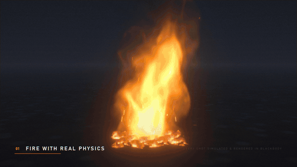</a><br>
  <sub>From the 90-second film. Blackbody simulated and rendered every fire, splash, brick and grain in it, and the screen recordings are the app itself. <a href="https://gjnail.github.io/blackbody/#showreel">Watch it with sound</a>.</sub>
</p>

Blackbody simulates fire as a real gas: fuel burns into heat, soot and flame, hot gas rises, swirls and expands, and smoke drifts. Flame colour and brightness come from blackbody radiation, so thick flame saturates the way real flame does. It simulates liquids too, from a pour to an ocean, and lava, ice and steam, cloth that burns, objects that fall and break, ropes and hinges, explosions, lightning, sand, snow and mud, and the weather, up to clouds that build into storms. You can put any of them together in one scene, and they push on each other.

You place the effect in your shot: line up the ground in the footage, track the camera move, line up the walls and steps it should meet, and it stands in the shot at its real size. Then render any of these:

| Output | For |
|---|---|
| A finished composite (ProRes, H.264, H.265, DNxHR) | delivery and review |
| An element with alpha (ProRes 4444, PNG) | any editor |
| Multi-layer and deep OpenEXR | Nuke, After Effects, Fusion, Resolve, Flame |
| OpenVDB volumes, and USD or OBJ meshes | Blender, Houdini, Maya, Cinema 4D, Unreal |

**New since 1.0** (see the [changelog](CHANGELOG.md)): things that fall, break and hang on ropes and hinges · ramps, wheels and motors · explosions · lightning · sand, snow, mud, jelly and clay · burning text and logos · Build and Shot workspaces with a 3D gizmo and right-click actions · lining up the ground and tracking moving cameras · surfaces · layers and roto · search everything (Ctrl+K) · your own blocks · repeat in a row or a ring.

## Contents

- [A tour of what it simulates](#a-tour)
- [Build anything](#build-anything)
- [Into your footage](#into-your-footage)
- [Get started](#get-started)
- [Documentation](#documentation)
- [Command line](#command-line) · [How it works](#how-it-works) · [Contributing](#contributing) · [Support](#support) · [License](#license)

## A tour

### Fire and smoke

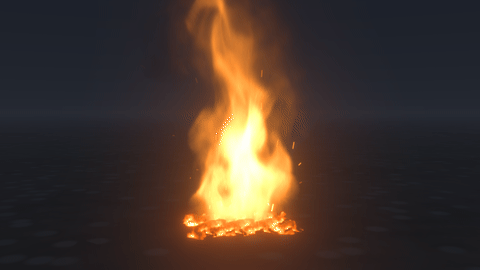 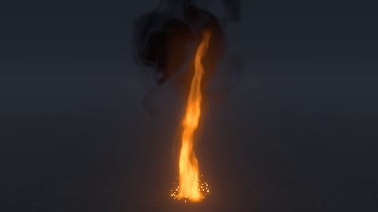

Each fire is measured against real ones: its flame height, its gas speed, and the rate at which a fire of its size puffs. Fire can spread over the ground and burnable objects, start spot fires from blown embers, and flash back through spilled vapour. A closed room runs out of air, and a hose puts the fire out into steam. Metal salts colour the flames, and sparks fly with full gravity and bounce off the ground. [The fire guide](docs/fire.md)

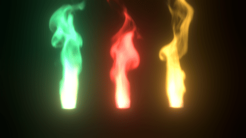 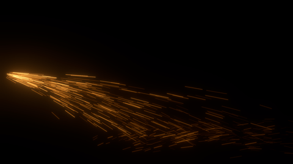

### Burning fabric

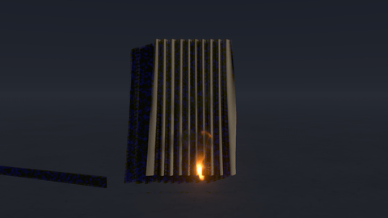 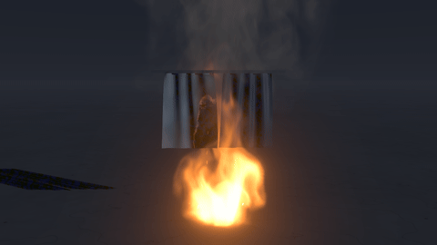

Curtains, flags and towels are made from real fabrics with their measured weight, stretch and stiffness. They blow in the fire's own air and catch at their ignition temperature. They then burn the way cloth does: toasting, a glowing line, char, and holes that spread. Wet cloth holds at 100 °C and steams until it dries. [The fabric guide](docs/fabric.md)

### Things that fall, break and swing

 

Any object can fall: it tumbles, slides, bounces, stacks and knocks things over, in real materials (wood, stone, brick, steel, glass, rubber and more), and the smoke, the water and the wind push it about. Things break where they are hit hard enough: a brick wall comes apart at the mortar, a window shatters round the stone thrown through it, a vase smashes on the tiles, in a puff of dust. Burning ones keep burning as they tumble, and lights or flames attached to them go along. Things that break and burn go piece by piece: a shed on fire chars, sags and falls in, its burnt pieces crumbling to ash. [The guide](docs/physics.md)

 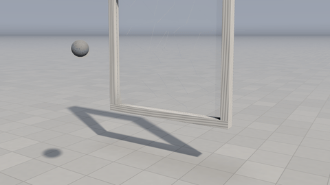

Objects hang on ropes, steel cables, springs, hinges and ball joints, from a fixed point or from another object: a wrecking ball on a crane, a door on its hinges, a lamp swaying on its flex, a seesaw. Ropes go slack and are caught with a jolt, and they snap past their strength. Without footage, everything is drawn in CG on a stage, a floor out to the horizon lit by the fire. In your footage it goes in with its shadows on the real ground.


Any object can be tilted and rolled as well as turned, so a plank becomes a ramp, a wall leans and a wheel stands on its rim; things slide down a slope steeper than their friction angle and stay put on a gentler one. A hinge can have a **motor**: four wheels hinged to a cart drive it along, a turntable spins up until what is on it flies off, a windmill's sails stir the smoke. [Tilted objects](docs/physics.md#tilted-objects) · [Motors](docs/physics.md#motors)

### Explosions and lightning

 

A source's **Blast** is an explosive charge, in kilograms of TNT. When it goes off, its blast wave throws the things that fall, blows breakable things apart piece by piece and scatters sand and snow, by the impulse a blast that size gives at that distance, while the fireball and smoke column rise. **Lightning** is a light: a bolt from where it starts to where it strikes, jagged at every scale, with branches in its first flash. It flashes a few times down the same channel, lights the set and the smoke through each flash, and sets fire to what it hits. [Explosions](docs/physics.md#explosions) · [Lightning](docs/physics.md#lightning)

### Sand, snow and mud

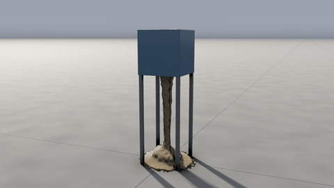 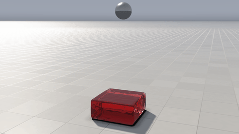

Sand pours and piles at its angle of repose, wet sand holds a cut edge, snow packs into snowballs that splat, mud slumps and flows until it is thin enough to stop, jelly wobbles and springs back, and clay squashes and stays squashed. Each is hundreds of thousands of particles that remember how they have been squeezed (the material point method, on the GPU). Things that fall land on it or sink into it, objects plough through it, and cloth catches it (a sheet held at its corners sags under the sand poured onto it) or drapes over it. Water gets into sand and carries it off (a pour digs a gully down a heap, and a sand castle the water reaches soaks through and slumps), and snow melts where flames touch it. Wax, chocolate and metal melt in the fire and set again as they cool, and molten iron glows and lights the floor round it. Dry leaves, sawdust and coal catch fire, feed it, and burn down to ash. [The guide](docs/matter.md)

### Grass and plants

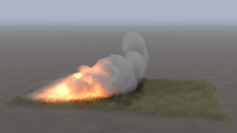

Lawns, long grass, wheat and reeds, every blade simulated: they bend in the wind in rolling waves and lean into a fire's draught, part round what moves through them and spring back, and grow on the ground or up a hillside. A dry field lit at one edge carries the fire across by itself, faster downwind, feeding the flames and leaving black stubble. [The guide](docs/grass.md)

### Text and logos

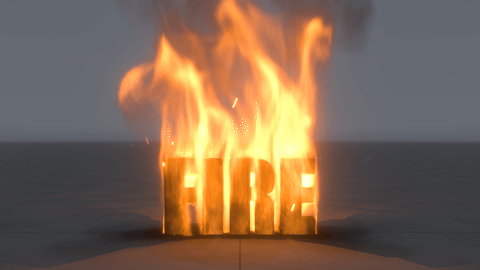 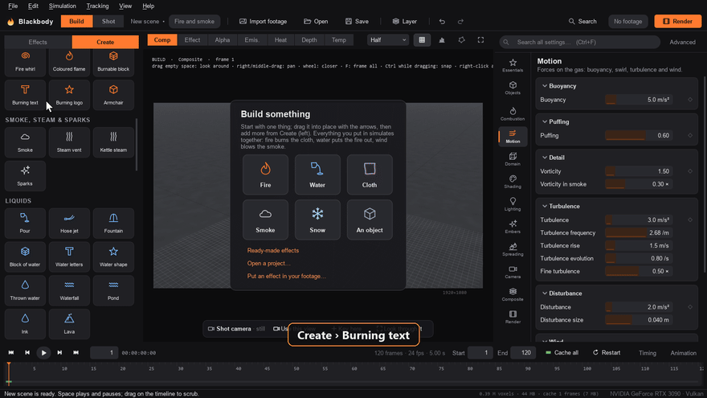

Type words in any installed font and they become solid 3D letters: **Burning text** has fire all over them, **Text** is a solid object to set on fire, drop or smash, and **Water letters** fall and splash. **Burning logo**, **Logo or picture** and **Water shape** trace an SVG, PNG or JPG the same way. Change the words, font or size later from the right-click menu. [Words on fire](docs/getting-started.md#words-on-fire)

### Water

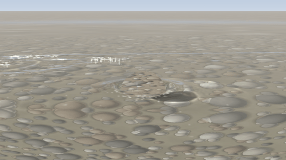 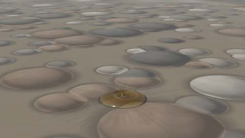

FLIP particles on the GPU produce splashes, sheets, drops, spray, foam and bubbles. The surface is ray traced as a real dielectric, so your footage refracts through it and reflects in it. Floating objects behave as rigid bodies, and viscosity ranges from olive oil to honey. Dyes, two liquids that don't mix, rain, caustics and an underwater camera are all built in. [The liquids guide](docs/liquids.md)

### The sea

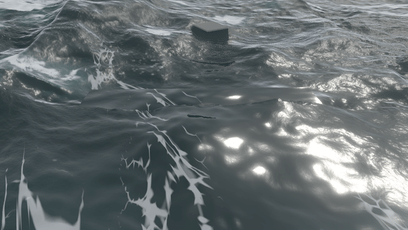 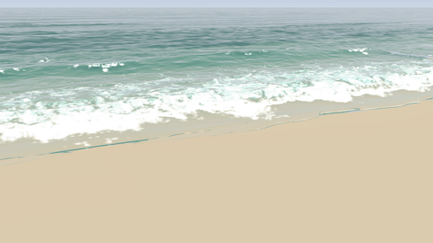

A real ocean spectrum of waves runs on to the horizon. Whitecaps and foam streaks match the wind. Surf spills, plunges and throws a barrel over a reef, and there are tsunamis, tidal bores, tides and rivers. [The sea guide](docs/ocean.md)

### Lava, and fire with water

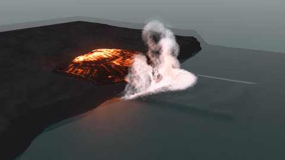 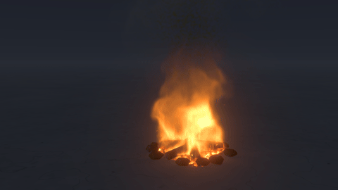

Lava glows as a blackbody, crusts over as it cools and lights everything around it. Fire, water and lava can share one box: water soaks the fuel and boils off in a plume of steam, and lava boils the sea while its skin chills black. [The lava guide](docs/lava.md)

### Ice, boiling and steam

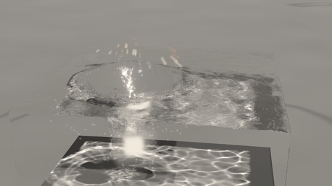 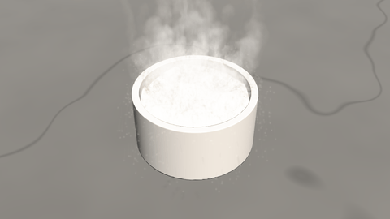

Liquids carry a temperature, with water's real heat capacities and latent heats. Water freezes into ice that floats a tenth out of the water, boils in streams of bubbles, skates on its own vapour on a hot plate, and evaporates into steam. [The ice and steam guide](docs/heat.md)

### Weather and clouds

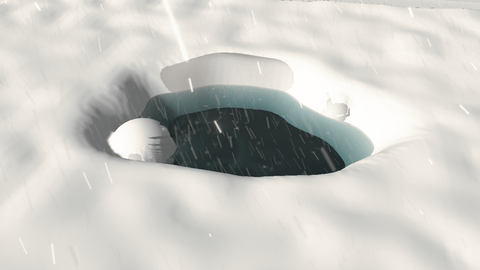 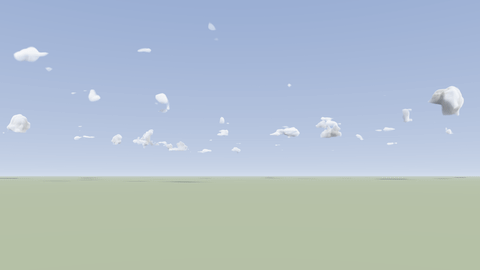

Snow, sleet, freezing rain, graupel and hail fall as the column of air above decides. Each piece melts and refreezes on the way down and settles where it lands. Clouds build from the sun-warmed ground into storms that rain and hail. [The weather guide](docs/weather.md)

## Build anything

Blackbody opens in **Build**: an empty stage with a camera of your own. Put in one thing from the card on the stage, or anything from **Create** (Ctrl+N), which has more than 90 building blocks: fires, smoke, steam and sparks, liquids, fabric, weather, forces, objects, things that fall, ropes and hinges, sand, snow and mud, lights, text and logos, and the blocks you saved yourself. What you put in decides what the scene simulates, and fire, water, cloth, rigid bodies and sand all simulate together.

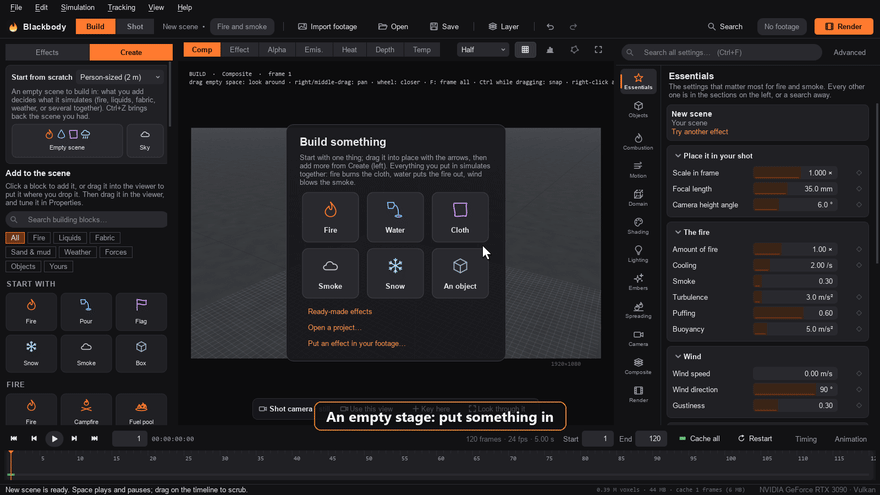

- **Move it with the gizmo.** Arrows move the selected thing along X, Y and Z, squares stretch it, the ring turns it and its middle slides it over the ground. Ctrl snaps. Drag a block from Create into the viewer to put it where you drop it.
- **Right-click it for what it can do.** Set it on fire. Make it fall, or drop it at this frame. Make it breakable, and choose what it breaks into. Hang it on a rope, put it on a spring, hinge it or tie it to another object. Make it float, sink, hot or freezing, hollow it out. Soak a cloth or let it go. Pour sand from it, or change what it is made of. Turn a source into fire, smoke, steam, water, lava or a force. Attach it to something so it follows it, or send it along a path you click out on the ground.
- **Forces:** a fan, an updraft, suction, a vortex and wind push the air, and with it the smoke, flames, embers and cloth.

 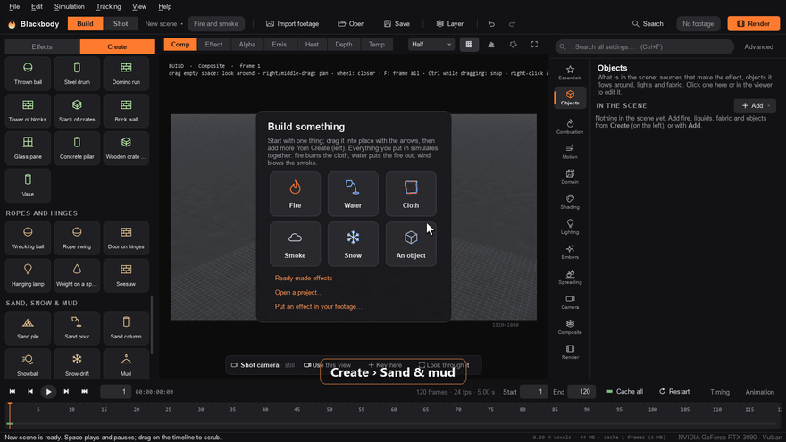

- **Search everything (Ctrl+K).** Type what you want: an action on the selection (*make it fall*, *set it on fire*), a building block, a menu command, a setting or an effect, and press Enter.
- **Several things at once.** Ctrl+click, Shift+drag a box or Ctrl+A to select several, and they move and turn together. Group them, or **Repeat** them in a row, a ring or scattered, with what is attached to them coming along.
- **Your own blocks.** *Save as a block* keeps what you built, with its meshes and what is attached to it, under *Yours* in Create, as one `.bbblock` file you can share.

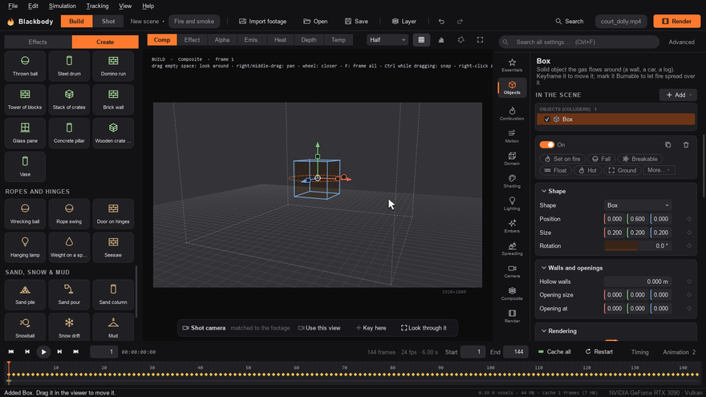 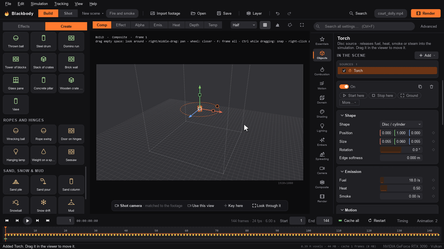

- **Animate it.** Click the ◆ next to a setting to keyframe it. The animation editor lists every animated setting with its keys, and the timeline shows each source's start and stop, each cloth's let-go time and each pour as bars you drag.
- **Layers and roto.** Layers put several effects in one shot, such as a campfire in front and a waterfall behind, each its own simulation, composited back to front. Roto shapes drawn round what is in front of the effect, and keyed over the shot, put the effect behind them.
- **Start from an effect.** The Effects tab has 97 presets, from a candle to a thunderstorm, sorted into fire, liquids, fabric, the sea, smoke, blasts, ice, weather, falling and breaking, and sand, snow and mud. Click one and it simulates live.

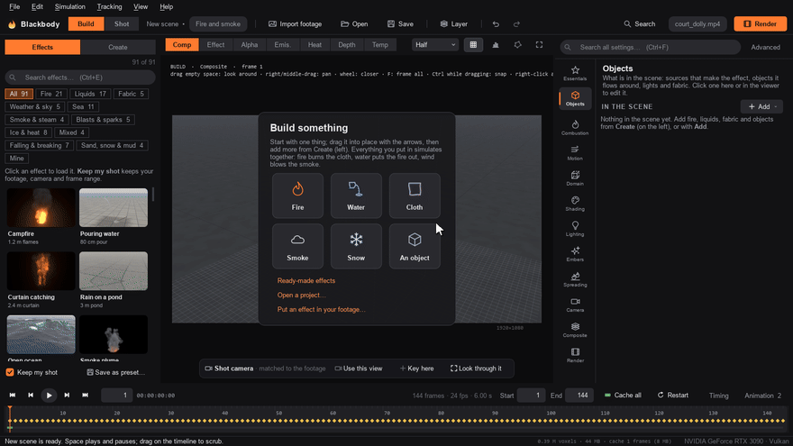

[Build your own](docs/getting-started.md#build-your-own) has every block and action.

## Into your footage

Stock elements never match your camera, your light or your lens. Blackbody puts the simulation inside your shot.

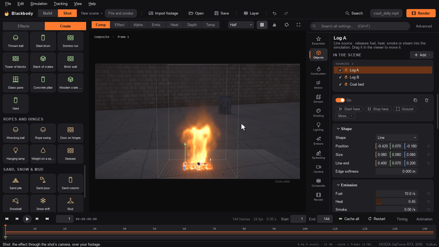

1. **Line up the ground.** Drag a grid's four corners onto anything rectangular lying on the ground in the footage: a paving slab, a rug, a parking bay. The lens comes from the vanishing points and the camera's tilt, roll and height from the rectangle (or from what the file says about the lens, for photos and phone video), and a perspective grid, the horizon and a 1.75 m figure are drawn over the footage to check it. The effect then stands on the real ground at its real size. No rectangle in view? Line up from the horizon. Sloping ground? Add two upright lines and the world stays level.
2. **Track the camera** (Ctrl+T). About 60 spots are followed through the footage to a fraction of a pixel, spots that move by themselves are dropped, and the camera's turn and travel are worked out on every frame, in metres: a pan, a dolly, a walk, a car or a drone. The effect stays put on the ground.

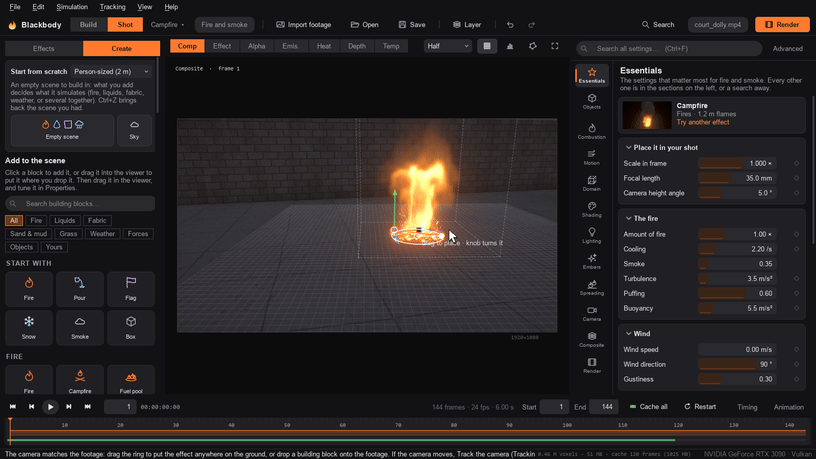 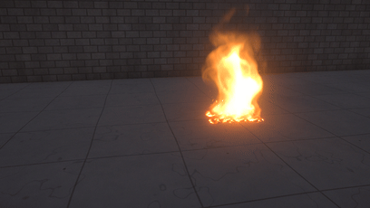

3. **Line up surfaces.** A wall, a table, a step, a ramp or a flight of stairs in the footage becomes a solid where it is: water splashes off it and runs down it, smoke flows round it, fire spreads over it, and it hides the effect behind it. Blocks dropped onto the footage land on table tops, steps and slopes.
4. **It goes behind real things** using stand-in colliders, roto mattes or the footage's depth pass, and it **lights the scene**: the fire lights the ground and walls in the footage, shadowed by its own smoke.
5. **It looks like your camera shot it:** the lens's blur and distortion, heat haze, highlight roll-off, and the footage's own noise.

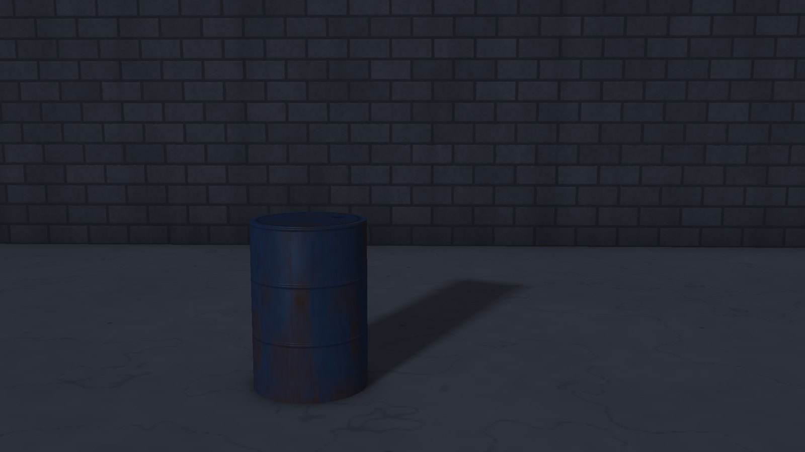 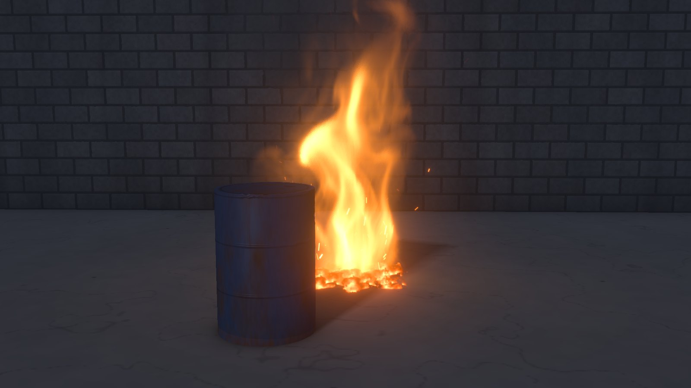

A camera solve from your matchmover (.chan), or a whole USD scene with its camera, objects and lights, comes in too. [Fitting it into your footage](docs/compositing.md) · [Moving shots and scene import](docs/scene-import.md)

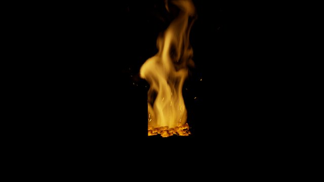 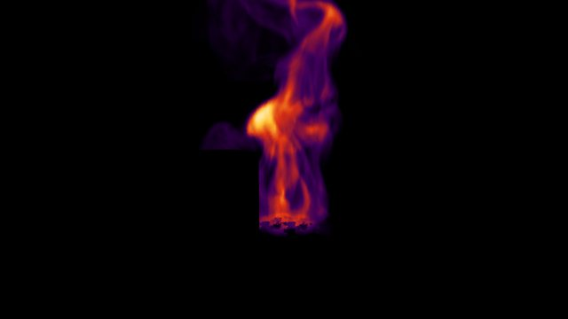 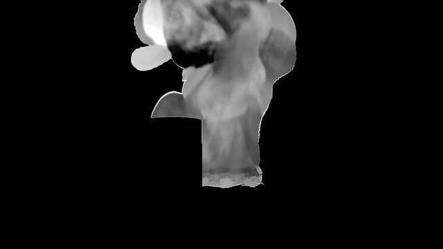 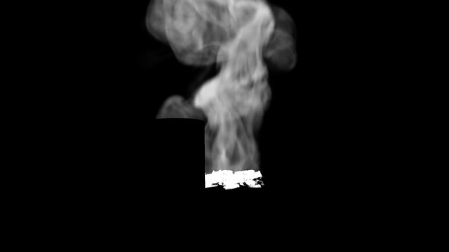 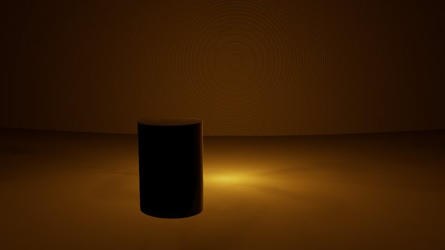 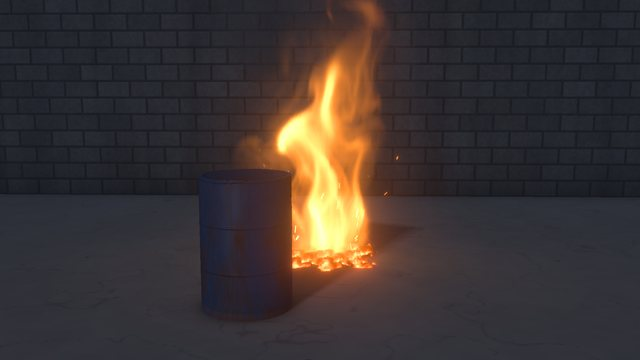
<sub>Emission, heat, depth, alpha, fire light and the beauty, from one render. See [Outputs](docs/outputs.md).</sub>

## Get started

You need Python 3.10 or newer and a GPU with Vulkan, Direct3D 12 or Metal (most cards from the last eight years).

```bash
git clone https://github.com/gjnail/blackbody.git
cd blackbody
```

Then double-click `Blackbody.bat` on Windows, or run `./blackbody.sh` on macOS or Linux. The first run creates a private Python environment and installs the dependencies (about 400 MB). [Install and first steps](docs/getting-started.md) has the details, including how to build a standalone Windows app.

**Build something:** put a thing in from the card on the empty stage or from Create, move it with the gizmo, right-click it to make it do something, press Space to play. **Or put an effect in your footage:**

1. **Import your footage** (Ctrl+I). Video, image sequences and stills all work, and the Shot workspace shows it.
2. **Line up the ground** (Ctrl+Shift+L) and, if the camera moves, **track it** (Ctrl+T). A card in Shot walks you through the steps.
3. **Pick an effect** in Effects, or drop a building block onto the footage where you want it.
4. **Match it** in Composite: exposure, heat haze, light on the footage, glow and grain.
5. **Render** (Ctrl+M) any combination of outputs in one pass.

The [tutorial](docs/tutorial.md) takes a shot from footage to final render in about 30 minutes.

## Documentation

| Guide | What is in it |
|---|---|
| [Install and first steps](docs/getting-started.md) | Requirements, install, the window, building anything, putting an effect in your shot, text and logos, layers, animation |
| [Tutorial: your first shot](docs/tutorial.md) | Footage, placing, matching, tracking, keyframes, rendering |
| [Presets](docs/presets.md) | All 97 built-in effects |
| [Fire, smoke and sparks](docs/fire.md) | Puffing, swirl, sparks, colour, steam, spreading fire, rooms, flame fronts, meshes |
| [Fabric and burning cloth](docs/fabric.md) | Real fabrics, burning through, soaking, dripping and steaming |
| [Things that fall](docs/physics.md) | Rigid bodies, materials, breaking, ropes, springs and hinges, explosions, lightning, tilted objects, motors, the CG stage, CG objects in footage |
| [Sand, snow and mud](docs/matter.md) | Sand, wet sand, snow, mud, jelly and clay: bodies and pours, what moves them, how they look |
| [Grass and plants](docs/grass.md) | Lawns, long grass, wheat and reeds: what moves them, fire running through them, how they look |
| [Liquids](docs/liquids.md) | Sources, floating objects, viscosity, dye, whitewater, the look, rain, underwater |
| [The sea, surf and rivers](docs/ocean.md) | The FFT ocean, whitecaps, beaches and surf, tsunamis, bores, currents |
| [Lava, and fire with water](docs/lava.md) | Molten liquids and crust, and fire, water and lava together |
| [Ice, boiling and steam](docs/heat.md) | Freezing, melting, boiling, evaporating |
| [Weather and clouds](docs/weather.md) | Snow, sleet, freezing rain and hail, and clouds and storms |
| [Lume lighting](docs/lume.md) | The path-traced lighting engine for the CG set: light that bounces, shadows as soft as each light is big, an HDRI's sun, glass that bends light, the denoiser |
| [Fitting it into your footage](docs/compositing.md) | Lining up the ground, tracking, surfaces, holdouts and roto, fire light, lens, haze, noise, lights in the set, OCIO |
| [Moving shots and scene import](docs/scene-import.md) | Camera tracking, camera solves, USD scenes, VDB volumes |
| [Outputs](docs/outputs.md) | EXR layers, deep EXR, ProRes, PNG, composites, OpenVDB, meshes |
| [Command line and render farms](docs/command-line.md) | Batch renders, wedges, a shared cache, frame ranges on many machines |
| [Performance and memory](docs/performance.md) | Resolution, memory, speed, the growing box, detail upres |
| [How it works](docs/how-it-works.md) | The solvers and renderers, and the tests |
| [Troubleshooting and limits](docs/troubleshooting.md) | Common fixes, and what it does not do yet |

The same guides, with full-quality video, are on the [website](https://gjnail.github.io/blackbody/).

## Command line

```bash
blackbody render shot.bbfire -o renders/fire.####.exr
blackbody render --preset campfire --footage plate.mov -o comp.mp4 --content composite
blackbody simulate shot.bbfire --cache //server/cache/shot
blackbody render shot.bbfire --from-cache //server/cache/shot --frames 1001-1050 -o fire.####.exr
```

From source, `blackbody` is `python -m blackbody`. See [Command line and render farms](docs/command-line.md).

## How it works

Fire is an incompressible, buoyant, reacting gas on a staggered grid, solved with MacCormack advection and a geometric multigrid pressure solve. Liquids are FLIP/APIC particles with a free-surface pressure solve. Sand, snow, mud, jelly and clay are MLS-MPM particles with elastoplastic materials. Cloth uses XPBD with multigrid bending. Rigid bodies, joints and breaking run in MuJoCo, coupled both ways to the gas, the liquid and the matter. The sea is an FFT ocean spectrum, and the sky is a Boussinesq atmosphere with bulk cloud microphysics. Volumes are ray-marched with Planck emission and multiple scattering, liquids are ray traced as dielectrics, and objects, pieces and grains are drawn on a CG stage with soft shadows, or lit by Lume, a path tracer. It all runs in WGSL compute shaders through [wgpu](https://github.com/pygfx/wgpu-py), driven from Python and a Qt (PySide6) app. [How it works](docs/how-it-works.md) has the details.

More than 300 tests check the physics against textbook values and measurements, such as flame heights, plume speeds, wave spectra, whitecap cover, boiling rates, fall speeds, angles of repose and blast impulses:

```bash
pip install pytest
pytest -q
```

## Contributing

Bug reports, footage that breaks it, physics checks and pull requests are welcome. [CONTRIBUTING.md](CONTRIBUTING.md) has the rules for changes to the simulation, how to build and test, and the source layout. The guides live in [`docs/`](docs) as Markdown, and the website is built from them, so a change to a feature and to its guide can go in the same pull request. Questions and finished shots go in [Discussions](https://github.com/gjnail/blackbody/discussions).

Please report anything that could make Blackbody run code from a file, or write or delete files it shouldn't, privately. [SECURITY.md](SECURITY.md) says how. Participation is covered by the [Code of Conduct](CODE_OF_CONDUCT.md).

## Support

Blackbody is free. If it saved you a shot and you'd like to say thanks, you can
[buy me a coffee on Ko-fi](https://ko-fi.com/gnail).

## License

[MIT](LICENSE). The [Barlow](https://github.com/jpt/barlow) font used on the website is under the SIL Open Font License. The lava-field photograph in `tools/plates` is a public-domain USGS photo (see `tools/plates/SOURCES.txt`).
