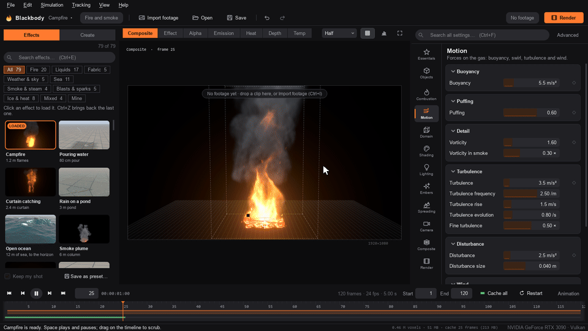
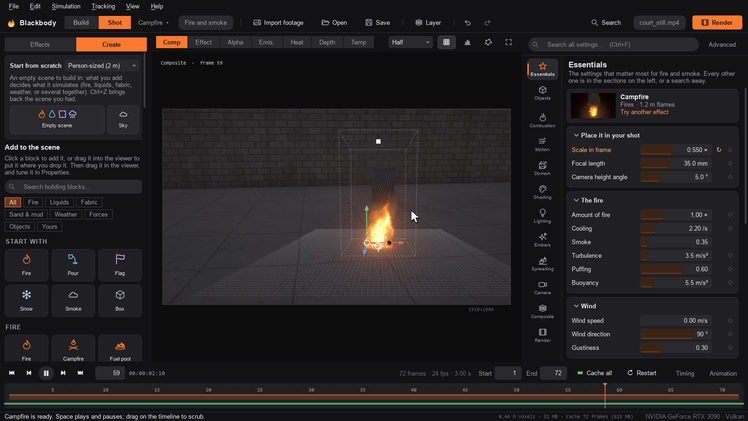
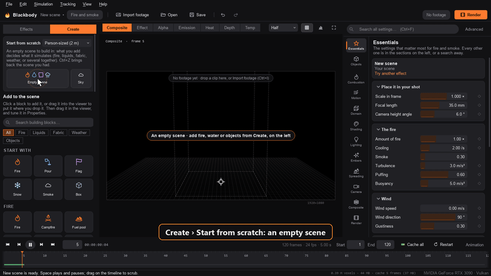

<p align="center">
  
</p>

<h1 align="center">Blackbody</h1>

<p align="center">
  <b>GPU fire, smoke, water, lava and weather simulation for live-action footage.</b><br>
  You simulate the effect inside your shot, match it to the camera, and render a finished composite or the passes your compositor wants.
</p>

<p align="center">
  <a href="https://gjnail.github.io/blackbody/"><b>Website</b></a> ·
  <a href="docs/getting-started.md"><b>Install</b></a> ·
  <a href="docs/tutorial.md"><b>Tutorial</b></a> ·
  <a href="https://gjnail.github.io/blackbody/guides.html"><b>Guides</b></a> ·
  <a href="docs/presets.md"><b>Presets</b></a>
</p>

<p align="center">
  <a href="https://ko-fi.com/gnail"></a>
  <a href="LICENSE"></a>
  
  
  
</p>

<p align="center">
  <a href="https://gjnail.github.io/blackbody/#showreel"></a><br>
  <sub>From the 30-second showreel. Blackbody simulated and rendered every fire, splash and wave in it. <a href="https://gjnail.github.io/blackbody/#showreel">Watch it with sound</a>.</sub>
</p>

Blackbody simulates fire as a real gas: fuel burns into heat, soot and flame, hot gas rises, swirls and expands, and smoke drifts. It renders the result physically. Flame colour and brightness come from blackbody radiation, so thick flame saturates the way real flame does. It simulates liquids too: water that pours, splashes and breaks into drops, an ocean to the horizon, lava that crusts as it cools, ice that floats, and snow and hail decided by the air above. You can also simulate the sky itself, as clouds that build into storms.

You place the effect in your shot, match it to the footage, and render any of these:

| Output | For |
|---|---|
| A finished composite (ProRes, H.264, H.265, DNxHR) | delivery and review |
| An element with alpha (ProRes 4444, PNG) | any editor |
| Multi-layer and deep OpenEXR | Nuke, After Effects, Fusion, Resolve, Flame |
| OpenVDB volumes, and USD or OBJ meshes | Blender, Houdini, Maya, Cinema 4D, Unreal |

## A tour

### Fire and smoke

 

Each fire is measured against real ones: its flame height, its gas speed, and the rate at which a fire of its size puffs. Fire can spread over the ground and burnable objects, start spot fires from blown embers, and flash back through spilled vapour. A closed room runs out of air, and a hose puts the fire out into steam. [The fire guide](docs/fire.md)

 

Metal salts colour the flames, and sparks fly with full gravity and bounce off the ground. Fireworks, flares and steam each take a few settings.

### Burning fabric

 

Curtains, flags and towels are made from real fabrics with their measured weight, stretch and stiffness. They blow in the fire's own air and catch at their ignition temperature. They then burn the way cloth does: toasting, a glowing line, char, and holes that spread. Wet cloth holds at 100 °C and steams until it dries. [The fabric guide](docs/fabric.md)

### Things that fall

 

Any object can fall: it tumbles, slides, bounces, stacks and knocks things over, in real materials (wood, stone, brick, steel, glass, rubber and more), and the smoke, the water and the wind push it about. Things break, too: a brick wall comes apart at the mortar, a window shatters round the stone thrown through it, a vase smashes on the tiles, in a puff of dust. Burning ones keep burning as they tumble, and lights or flames attached to them go along. Without footage they are drawn in CG on a stage, a floor out to the horizon lit by the fire. In your footage they go in with their shadows on the real ground. [The guide](docs/physics.md)

 

### Water

 

FLIP particles on the GPU produce splashes, sheets, drops, spray, foam and bubbles. The surface is ray traced as a real dielectric, so your footage refracts through it and reflects in it. Floating objects behave as rigid bodies, and viscosity ranges from olive oil to honey. Dyes, two liquids that don't mix, rain, caustics and an underwater camera are all built in. [The liquids guide](docs/liquids.md)

### The sea

 

A real ocean spectrum of waves runs on to the horizon. Whitecaps and foam streaks match the wind. Surf spills, plunges and throws a barrel over a reef, and there are tsunamis, tidal bores, tides and rivers. [The sea guide](docs/ocean.md)

### Lava, and fire with water

 

Lava glows as a blackbody, crusts over as it cools and lights everything around it. Fire, water and lava can share one box: water soaks the fuel and boils off in a plume of steam, and lava boils the sea while its skin chills black. [The lava guide](docs/lava.md)

### Ice, boiling and steam

 

Liquids carry a temperature, with water's real heat capacities and latent heats. Water freezes into ice that floats a tenth out of the water, boils in streams of bubbles, skates on its own vapour on a hot plate, and evaporates into steam. [The ice and steam guide](docs/heat.md)

### Weather and clouds

 

Snow, sleet, freezing rain, graupel and hail fall as the column of air above decides. Each piece melts and refreezes on the way down and settles where it lands. Clouds build from the sun-warmed ground into storms that rain and hail. [The weather guide](docs/weather.md)

### Into your footage

 

The effect goes behind real objects, using stand-in colliders, roto mattes or the footage's depth pass. It lights the ground and walls in the footage, shadowed by its own smoke. It also picks up the lens's blur and distortion, heat haze, and the footage's own noise. You can follow a handheld move with the built-in tracker, or import a camera solve or a whole USD scene. [Fitting it into your footage](docs/compositing.md)

     
<sub>Emission, heat, depth, alpha, fire light and the beauty, from one render. See [Outputs](docs/outputs.md).</sub>

## Get started

You need Python 3.10 or newer and a GPU with Vulkan, Direct3D 12 or Metal (most cards from the last eight years).

```bash
git clone https://github.com/gjnail/blackbody.git
cd blackbody
```

Then double-click `Blackbody.bat` on Windows, or run `./blackbody.sh` on macOS or Linux. The first run creates a private Python environment and installs the dependencies (about 400 MB). [Install and first steps](docs/getting-started.md) has the details, including how to build a standalone Windows app.



1. **Import your footage** (Ctrl+I). Video, image sequences and stills all work.
2. **Pick an effect.** Click it in the Effects panel, and it simulates live.
3. **Place it.** Drag the ring onto the ground and the square to scale it, and Alt-drag to orbit.
4. **Match it** in Composite: exposure, heat haze, light on the footage, glow and grain.
5. **Render** (Ctrl+M) any combination of outputs in one pass.



**Or build anything.** Blackbody opens in Build, on an empty stage with a camera of your own. You can put in fire, water, cloth, smoke, weather, forces (fans, updrafts, suction, vortices, wind) and objects, and move them with a 3D gizmo. Then right-click to set things on fire, make them float, soak them, attach them to each other or send them along a path. Fire and water in one scene simulate together. When it works, Shot puts it into your footage. [Build your own](docs/getting-started.md#build-your-own)



**Animate it.** Click the ◆ next to a setting to keyframe it. An animation editor lists every animated setting with its keys. You can drag keys in time, add and delete them, and set how each eases into the next.

**Layers and roto.** Layers put several effects in one shot, such as a campfire in front and a waterfall behind. Each is its own simulation, and they're composited back to front ([Layers](docs/getting-started.md#layers)). Roto shapes drawn around what's in front of the effect, and keyed over the shot, put the effect behind them ([Roto](docs/compositing.md#roto)).

The [tutorial](docs/tutorial.md) takes a shot from footage to final render in about 30 minutes.

## Documentation

| Guide | What is in it |
|---|---|
| [Install and first steps](docs/getting-started.md) | Requirements, install, the window, putting an effect in your shot, building your own, layers, animation |
| [Tutorial: your first shot](docs/tutorial.md) | Footage, placing, matching, tracking, keyframes, rendering |
| [Presets](docs/presets.md) | All 84 built-in effects |
| [Fire, smoke and sparks](docs/fire.md) | Puffing, swirl, sparks, colour, steam, spreading fire, rooms, flame fronts, meshes |
| [Fabric and burning cloth](docs/fabric.md) | Real fabrics, burning through, soaking, dripping and steaming |
| [Things that fall](docs/physics.md) | Rigid bodies, materials, what pushes them, the CG stage, CG objects in footage |
| [Liquids](docs/liquids.md) | Sources, floating objects, viscosity, dye, whitewater, the look, rain, underwater |
| [The sea, surf and rivers](docs/ocean.md) | The FFT ocean, whitecaps, beaches and surf, tsunamis, bores, currents |
| [Lava, and fire with water](docs/lava.md) | Molten liquids and crust, and fire, water and lava together |
| [Ice, boiling and steam](docs/heat.md) | Freezing, melting, boiling, evaporating |
| [Weather and clouds](docs/weather.md) | Snow, sleet, freezing rain and hail, and clouds and storms |
| [Fitting it into your footage](docs/compositing.md) | Holdouts and roto, fire light, lens, haze, noise, lights in the set, OCIO |
| [Moving shots and scene import](docs/scene-import.md) | The tracker, camera solves, USD scenes, VDB volumes |
| [Outputs](docs/outputs.md) | EXR layers, deep EXR, ProRes, PNG, composites, OpenVDB, meshes |
| [Command line and render farms](docs/command-line.md) | Batch renders, wedges, a shared cache, frame ranges on many machines |
| [Performance and memory](docs/performance.md) | Resolution, memory, speed, the growing box, detail upres |
| [How it works](docs/how-it-works.md) | The solvers and renderers, and the tests |
| [Troubleshooting and limits](docs/troubleshooting.md) | Common fixes, and what it does not do yet |

The same guides, with full-quality video, are on the [website](https://gjnail.github.io/blackbody/).

## Command line

```bash
blackbody render shot.bbfire -o renders/fire.####.exr
blackbody render --preset campfire --footage plate.mov -o comp.mp4 --content composite
blackbody simulate shot.bbfire --cache //server/cache/shot
blackbody render shot.bbfire --from-cache //server/cache/shot --frames 1001-1050 -o fire.####.exr
```

From source, `blackbody` is `python -m blackbody`. See [Command line and render farms](docs/command-line.md).

## How it works

Fire is an incompressible, buoyant, reacting gas on a staggered grid, solved with MacCormack advection and a geometric multigrid pressure solve. Liquids are FLIP/APIC particles with a free-surface pressure solve. Cloth uses XPBD with multigrid bending. The sea is an FFT ocean spectrum, and the sky is a Boussinesq atmosphere with bulk cloud microphysics. Volumes are ray-marched with Planck emission and multiple scattering, and liquids are ray traced as dielectrics. It all runs in WGSL compute shaders through [wgpu](https://github.com/pygfx/wgpu-py), driven from Python and a Qt (PySide6) app. [How it works](docs/how-it-works.md) has the details.

The tests check the physics against textbook values and measurements, such as flame heights, plume speeds, wave spectra, whitecap cover, boiling rates and fall speeds:

```bash
pip install pytest
pytest -q
```

## Contributing

Bug reports, footage that breaks it, physics checks and pull requests are welcome. [CONTRIBUTING.md](CONTRIBUTING.md) has the rules for changes to the simulation, how to build and test, and the source layout. The guides live in [`docs/`](docs) as Markdown, and the website is built from them, so a change to a feature and to its guide can go in the same pull request. Questions and finished shots go in [Discussions](https://github.com/gjnail/blackbody/discussions).

Please report anything that could make Blackbody run code from a file, or write or delete files it shouldn't, privately. [SECURITY.md](SECURITY.md) says how. Participation is covered by the [Code of Conduct](CODE_OF_CONDUCT.md).

## Support

Blackbody is free. If it saved you a shot and you'd like to say thanks, you can
[buy me a coffee on Ko-fi](https://ko-fi.com/gnail).

## License

[MIT](LICENSE). The [Barlow](https://github.com/jpt/barlow) font used on the website is under the SIL Open Font License. The lava-field photograph in `tools/plates` is a public-domain USGS photo (see `tools/plates/SOURCES.txt`).
