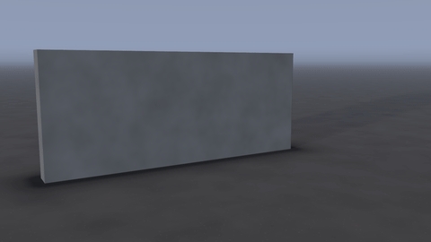
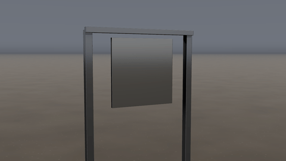
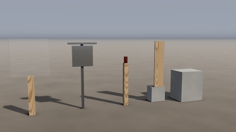
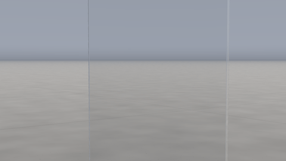
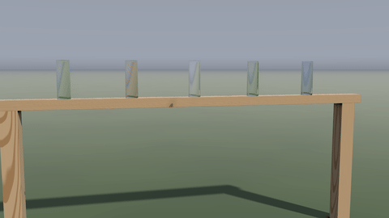

# Bullets

 

A *shot* is a gun firing: from its muzzle toward a point it is aimed at, a cartridge's bullets fly their real paths and do to everything they meet what real bullets do. They go through glass, wood, drywall and car doors and on, slower; flatten on steel in a splash of lead and sparks; chip craters out of concrete, brick and stone in a puff of dust; skip off water, concrete and steel when they come in flat; open a cavity in gel and water that swells and collapses; throw sand and snow up out of a crater; punch holes in cloth; and knock over, spin and shatter whatever they hit. Shots work in every kind of scene but the sky.

## Firing

Add a gun from the *Guns & bullets* group in Create: a pistol shot, a rifle shot, a shotgun blast or a machine-gun burst. It fires at the spot you put it on, from where a shooter would stand (the gun itself is outside the box: only what the bullets hit needs to be in it). Its settings, in Properties:

- *Cartridge*: what it fires (below).
- *Muzzle*: where the bullets leave the gun; *Aimed at*: the point they fly toward (and on past it). Both can be keyed, so a gun can sweep or track something.
- *Fires at*: when the first round goes off; *Rounds* and *Rate of fire* (rounds a minute) for more than one.
- *Scatter*: how far each round strays from the aim: a rifle 0.02°, a pistol at arm's length 0.1°, from the hip a degree or more.
- *Muzzle speed*: the bullet's speed out of the muzzle, if not the cartridge's (a short barrel is slower).
- *Tracer*: each round burns red along its path. *Muzzle flash*: a flash, and a puff of gun smoke where there is gas to carry it.

| Cartridge | Bullet | Speed | |
|---|---|---|---|
| Air rifle pellet (.177) | 0.5 g lead | 175 m/s | Dents and chips; stops in a few centimetres of gel. |
| .22 LR | 2.6 g lead | 330 m/s | A small, low-powered round. |
| 9 mm pistol (FMJ) | 8 g, jacketed | 360 m/s | Through a board or two, through glass and car doors; flattens on steel. |
| 9 mm pistol (hollow point) | 8 g | 360 m/s | Mushrooms in anything wet: stops in half the depth of gel. |
| .45 ACP (FMJ) | 15 g | 260 m/s | Heavy and slow. |
| 5.56 mm rifle (M193) | 3.6 g | 990 m/s | Fast and light: turns sideways and breaks up in gel and water after a hand's depth. |
| 7.62x39 mm rifle | 7.9 g, steel core | 715 m/s | Hard core: skips more than it digs, and sparks. |
| .308 / 7.62x51 mm rifle | 9.7 g | 850 m/s | Through a brick, several boards, thin steel. |
| 12 gauge slug | 28 g lead | 470 m/s | A heavy lump of lead: hits hard, does not go far into hard things. |
| 12 gauge 00 buckshot | nine 3.5 g pellets | 400 m/s | A cone about 2.5 cm across for every metre. |
| .50 BMG rifle | 42 g, hard core | 900 m/s | Through 2.5 cm of steel. |

## What a bullet does

A bullet meeting a surface either glances off it, stops in it, or goes through and on. It glances off when it comes in flatter than the surface's critical angle: about 7° for water, 20° or so for concrete, 30° for steel; it leaves at a shallower angle off hard flat things (it skims them) and a steeper one off soft ones (it digs in and is thrown up), having lost some of its speed and flattened. Otherwise it goes in, slowed as ballistics has it (Poncelet's law: by the surface's strength and by its density times its speed squared), and changes as it goes: soft lead flattens, a hollow point mushrooms in anything wet, a jacketed bullet flattens only on steel, stone and concrete, a long rifle bullet turns sideways after a depth and, still fast, breaks up. Going out of the far side, the last of the thickness gives way early: a plug pushed out of a plate, the back of a wall scabbing off, splinters torn out of a board. How far each round goes into each surface is held to typical published figures (gel, water, pine boards, mild steel, concrete, brick, sand, snow: within about a third; the test lists them).

| Surface | What it does |
|---|---|
| Glass, ice | A hole ringed with glass crushed to a white frost that glints and lets little light through; cracks radiating from it, some forking, joined ring by ring by arcs from one to the next, each catching the light along its length; a cone of glass spalled out of the back, frosted. A breakable pane cracks in its web round the hole and stays up; a bottle or a vase bursts. |
| Wood (every species) | A hole going in, its fibres crushed in round it and wiped grey. Going out, a scoop torn out of the back along the grain, its ends a brush of fibres torn to different lengths, and real splinters standing out of it round the split: strips of the face, held at their far end, lifted and curling, each casting its shadow. Splinters fly. A thin board splits along its grain. MDF, which has no grain, breaks out round about, fuzzy. |
| Steel, aluminium | Thin: holed, its exit petalled out. Thick: a polished dent and the bullet's lead splashed over the plate: a matte grey smear round the dent, fine streaks sprayed out from it, droplets beyond; a painted target loses its paint round it. A flash and a spray of sparks along the plate. A hinged steel target swings. |
| Painted metal (a car) | Holed through each panel, the paint flaked off round the hole to dull bare steel and crazed beyond it, the lip pushed in going in, out going out. A car's windows: holed, and through into the cabin. |
| Concrete, stone, brick, plaster | A crater about as wide as the energy left there breaks out (3.5 cm from a pistol, 8 to 9 cm from a rifle): a shallow cone of flat facets with sharp creases between them, its walls freshly broken (concrete's cement, its stones cut through and its air holes; brick's fired clay, its mortar grey; plaster's chalk), at its floor the bullet's own pocket with its lead smeared grey; powder thrown out round it in streaks; a hairline crack or two; dust puffs out of it. A bullet that goes through scabs a wider crater off the back. |
| Earth | A crater and a spurt of dirt. |
| Plastic, rubber, cardboard, foam, fabric | A hole, the grey wipe of the bullet's lead round the way in. |
| Gel, jelly | The bullet slows through it and opens a temporary cavity along its track that swells and collapses (a rifle's widest where it turns sideways), leaving its track; seen through clear gel, a bullet that stops stays where it stopped. |
| Water | A crater opens where it goes in, a cavity behind it that closes and throws up the splash; it slows within a metre or so (a rifle bullet breaks up sooner). Shallower than about 7° it skips. In water with a narrow band (only its surface carried by particles) its way through the deep water is kept in the band while its cavity lasts, so the cavity opens there too. |
| Sand, snow, mud | It stops within a few hand's breadths (sand is very good at stopping rifle bullets), throwing a crater's worth up and back out of the hole. |
| Cloth | A hole through the weave where it went through, a little smaller than the bullet however coarse the cloth's mesh, its edge frayed at the threads' scale, a thread or two left across it; it moves with the cloth. A flick round it. A slug or a load of shot close up tears the cloth itself. |

Holes and craters are real: they are carved out of what they are in, so you see through a hole in a board or a door, light shines through it, and a crater's walls take the light and shade themselves (lit as the light is at the hole's mouth). Splinters round a hole out of wood are real too. They stay with what they are in: a hole in a falling crate falls with it.

What is hit is pushed by the momentum the bullet left in it (a bullet's momentum is small: a can jumps off a post, a gong swings, a person or a car hardly moves). What flies off a hit is real debris: chips of stone and concrete, splinters of wood, shards of glass, flakes of paint, clods of earth, lead splashed off steel, and sparks that cool from white through orange to red as they fly; each bounces and settles. In a scene with gas (fire, or fire and liquid), each hit throws up dust as its material does (a cloud off plaster, a wisp off wood, none off steel), and each round fired puffs gun smoke.

## Slow motion

A bullet crosses a room in a hundredth of a second: in real time a frame sees it pass and its effects begin. To see it fly, set *Domain › Time scale* low: 0.01 to 0.002 shows a bullet in flight, glass cracking round it, a cavity opening in gel. In slow motion the bullet is drawn going through what it goes into, as long as that takes.

## Presets

  

- *Shooting range*: a pistol along a row of targets (a pane, a steel gong, a can on a post, a pine board, a concrete block).
- *Bullet through glass*: a 9 mm through a window pane, slowed 400 times.
- *Bottles on a fence*: a .22 rifle picks off five glass bottles.
- *Steel gong*: six rounds into a hanging steel plate: lead stars, flashes, sparks, the plate swinging.
- *Machine gun at dusk*: a burst of tracers across a concrete wall and the dirt.
- *Bullets through boards*: a pistol and a rifle into six spaced pine boards (see [Wood](wood.md)).

A bullet meets the matter and the water on its way, looked ahead on at the start of each frame and again the moment it turns (a ricochet off a steel plate into a sand heap meets the sand in the same frame).

## Limits

- Bullets do not wound: a crash-test figure is plastic.
