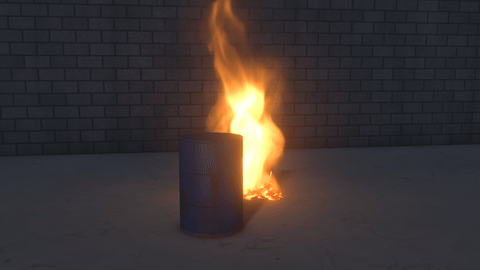

# Fitting it into your footage

Everything that makes the effect sit in the plate: what hides it, how it lights the footage, how the camera and lens saw it, and the colour pipeline.

## Objects in front of the effect

### Objects in front of the fire

A collider marked *Hides fire* (on by default) hides the fire, smoke and embers behind it, as the real object in the shot would. Put a collider over the car, wall or chair in your footage and the fire goes behind it. Turn it off for helper colliders that are not in the shot.

### Holdouts from the footage

Composite › *Holdout matte* takes a matte sequence of whatever is in front of the fire (any roto or keyed matte, numbered like the footage): the fire, smoke and embers go behind it. *Depth pass* takes the footage's depth (from a 3D scene, a lidar camera or a depth estimator; Z, distance or inverse depth, in any units): the fire is hidden only behind the footage's surfaces, so it can burn in front of an object and behind it, and the fire light lands on the footage's own surfaces, shaped from the depth pass.

### Roto

For something in front of the effect that you have no matte for, draw one: click **Roto** in the view bar (or press **R**) and click around the object in the picture, then click the first point again (or press Enter) to close the shape. The fire, smoke and embers go behind it.

- Drag a point, or drag inside the shape to move all of it. A change on a frame keys the shape there, so you follow a moving object by stepping through the shot and adjusting it; between keys the points move in a straight line. The keys show on the timeline.
- Ctrl+click an edge to add a point; right-click a point to remove it. Delete removes the selected shape.
- The bar over the viewer picks the shape, softens its edge (*Feather*, in pixels of the output frame), turns it off, or inverts it (the effect then shows only inside it).

Roto shapes are saved with the scene and work in renders and on the command line, alongside a holdout matte if you also have one. They hide fire and smoke; in a liquid scene, put a collider over the object instead (with *In the shot* on).

## Light from the fire

### Fire light on surfaces

Composite › *Fire light on surfaces* lights the ground, every collider in the shot and (with a depth pass) the footage's own surfaces the way the fire lights the real ones: brightest where they face the flames, falling off with distance, and shaded by colliders and smoke between them and the fire (*Shadows from the fire*). It has a soft shoulder, so a big fire brightens the footage at most about four times.

### Scorch

With spreading fire, Composite › *Scorch* darkens the ground and objects where they have burnt.

### Lights in the set

*+ Light* (in the Outliner) adds a point, spot or area light: a street lamp, a stage spot, a lit window. Up to 8 of them light the smoke and steam, and the smoke shadows them (*Smoke shadows*), so a spot's beam shows in the smoke and a lamp behind the smoke glows through it. Set its *Position* (and *Aim* for a spot or area light), *Colour*, *Colour temperature* and *Intensity at 1 m* (in lux: a 100 W bulb is about 130, a street lamp a few thousand, a stage spot tens of thousands); *Size* softens the light close to it, and a spot's *Cone angle* and *Cone edge* shape its beam. A beam is as sharp as its cone however narrow, and it glows brightest looking into it, as a beam in haze does.
- An area light is a flat panel (*Panel width* and *Panel height*, turned about its aim by *Turn*): a window, a softbox, an LED panel. Lume traces the panel itself, so its shadows are as soft as it is big from where they fall (sharp where an object meets the floor, wide further off) and glossy things show its shape; the classic engine lights by it as by a disc as big.
- *Light profile (IES)* takes a photometric file from the maker of a real light (a downlight, a street light, a wall washer, a stage profile): how bright it is in each direction, in candela, aimed along the light's *Aim*. Its pattern takes the place of a point light's even spread or a spot's cone, on the set, the smoke and the liquid (the liquid's own renderer takes its light along its aim). With *Brightness from the profile* the light is as bright as the real one; off, *Intensity* sets its peak.
- *Output* sets the light's brightness in lumens, as on the box (an LED bulb like a 60 W one is 800 lm), for its kind: spread every way, over its cone, from its panel or by its profile.
- *In the footage* (on) is for a real light on the set. The footage already shows its light on the real ground and objects, so Blackbody only takes away the light the simulated smoke shadows: the ground darkens under smoke that drifts in front of a street lamp.
- Turn it off for a light added in CG. It then lights the ground, the colliders in the shot and (with a depth pass) the footage's own surfaces too, shadowed by colliders and smoke.

Blackbody judges how much a light changes the footage against the light the footage already has there, the key light and sky from Lighting, so set those to match the shot. EXRs get a `lamps` layer (multiply the plate by 1 + lamps). Lights can be keyframed, and USD lights come in as lights (see [Scene import](scene-import.md#scene-import-usd)).

## Matching the camera

### Lining up the ground

Tracking › *Line up the ground* (Ctrl+Shift+L) gives the effect the footage's camera from something rectangular lying on the ground: drag the grid's four corners onto it. Each pair of opposite sides meets at a vanishing point; the two directions lie in the ground and are square to each other, which gives the ground's tilt and roll and, unless the lens is known, the focal length. Untick *Lens from the picture* to give the lens instead (it is needed when a pair of sides runs parallel in the picture, as with a rectangle seen square-on); a lens recorded in the footage's file is used by itself. The scale comes from the camera's height, or from the real length of the grid's first side (between corners 1 and 2). The bar reports the camera's height, tilt, lens and roll and the rectangle's size, so wrong numbers stand out. The matched camera is a free camera in metres at the ground's origin (the middle of the grid), the same in every layer, and every number of it is in the Camera settings. Lining up again, on another frame or with a better rectangle, keeps where the effect stands.

*From the horizon* lines up with no rectangle at all: the horizon and the lens give the ground's tilt and roll, and the camera's height the scale. *The ground slopes* adds two upright lines; their vanishing point is true vertical, so the world stays level (gravity straight down, flames rising straight up) while the lined-up ground is a slope in it. Done makes the slope a solid surface.

### Surfaces

Tracking › *Add a surface* lines up a real thing in the footage once the ground is lined up. The four kinds:
- **A wall, or anything upright:** its bottom edge on the ground.
- **Something flat and raised:** a table, a step or a platform, at a height you give, either solid to the ground or a slab.
- **A ramp or slope:** its bottom edge on the ground and its sides running up it.
- **Stairs:** the grid on the lowest step, with the step height and how many steps.

Each becomes a mesh collider where it stands in the world, the same in every layer and kept in place when the effect moves. It hides the effect behind it (*Hides fire*), and like any collider it can be made burnable, hot or freezing, or hidden from the render. Blocks dropped onto the footage, and the effect's base when dragged, land on whatever ground or surface is under the cursor.

### Following the camera move

With the ground lined up, Tracking › *Track* (Ctrl+T) works out the camera on every frame from the frame you lined up on, forwards and backwards. It follows about 60 well-textured spots spread over the footage. Spots that look like their neighbours (tiles, bricks) are skipped, and new ones replace those that leave the frame. Each spot is placed to a fraction of a pixel by warping its first look onto the frame (an affine Lucas-Kanade match), so a patch of ground that grows and leans as the camera moves on it is followed without drift. Two solves are tried and the better one kept:
- **The camera only turns** (a tripod, someone standing still): its pan, tilt and roll on every frame.
- **The camera travels** (a dolly, a walk, a car, a drone): spots on the ground are placed where their rays meet the lined-up ground. Each frame's camera is found from them (RANSAC against spots that are not on the ground). Then every camera and every spot are refined together (a bundle adjustment), so errors do not pile up along the move. The ground gives the move in real metres.

 

Spots that disagree with the rest (people, cars, flags) are dropped, and the fit is reported in pixels. Tracking › *Clear track* goes back to the lined-up camera. For moves with no ground in view, or a zoom, import a solve from a matchmover ([Moving shots](scene-import.md#moving-shots)).

### Highlights like a camera's

In the Standard view, Composite › *Highlights to white* makes over-bright flame behave as it does on a camera sensor, where each colour channel catches some of the others' light: it goes from orange through yellow to white at the hottest cores, instead of clipping to a flat yellow. Footage below the roll-off is never changed. 0 gives the old per-channel roll-off. If whole flames go white, lower *Fire exposure*: real flames are rarely more than a few stops over.

### Haze

Composite › *Visibility* is how far you can see through the air in the shot: about 50 m in fog, a few hundred metres in mist, smog or dusk haze. The fire and smoke then fade into the haze over their distance from the camera, as everything in the footage has, so dark smoke is no darker than the footage's own distant shadows. The haze colour is taken from the footage (its haziest bright spots, usually the sky near the horizon) unless you turn *Haze colour from footage* off. Leave it at 0 for clear air.

### Footage noise

Composite › *Match footage noise* (on by default) measures the footage's noise in every frame: how strong it is at each brightness, how coloured and how coarse. Wherever the fire, its glow or its light change the picture, it adds noise until each pixel is as noisy as footage of that brightness, so the fire is no cleaner than the picture around it. *Grain* adds film grain on top.

### The footage's lens

Composite › *Lens* gives the fire what the camera's lens gave the footage. *Aperture* (the f-number it was shot at) and *Focus distance* (0 focuses on the fire) blur the fire by how far out of focus it is, using the camera's focal length and sensor. *Softness* blurs it as softly as the footage is: compare an edge in the footage with the fire's edges. *Lens distortion* bends the fire with the picture toward the frame edges (negative for the barrel distortion of wide lenses), *Colour fringing* adds the red and blue fringes lenses give bright edges near the corners, and *Halation* the red glow film puts around the brightest light.

### Heat haze

Composite › *Heat haze* is traced through the simulated heat: hot air is thinner than the air around it, so light from the footage behind bends by how much the path through the hot air changes across the picture. The shimmer rises with the plume and ends where the hot air ends. At 1 it has its physical strength, which is subtle for a campfire seen through a normal lens; it grows with focal length.

## Colour management

### Colour management with OCIO

Composite › *View transform: OCIO display and view* uses a display and view from an OpenColorIO config (Composite › *OCIO config*, or the `OCIO` environment variable, or the ACES CG config built into OpenColorIO): ACES, AgX, a show LUT, with an optional *Look*. The viewer uses it through a 65³ LUT; renders written to disk go through OCIO exactly. *Footage colour space: OCIO colour space* reads camera log or any other space of the config, and *EXR colour space* writes EXRs in ACEScg, ACES2065-1 or another scene-linear space.
