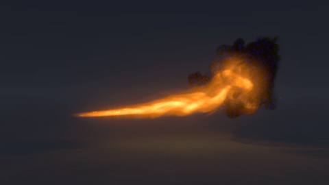
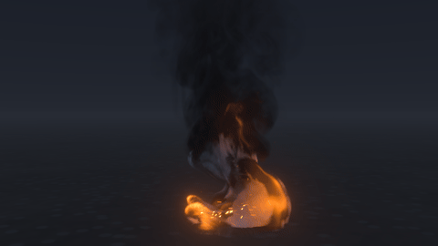
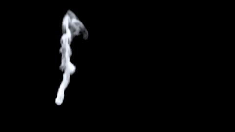
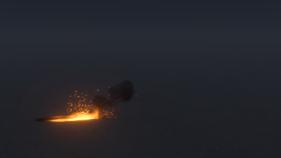

# Fire, smoke and sparks

Blackbody simulates fire as a real gas: fuel burns into heat, soot and flame, hot gas rises, swirls and expands, and smoke drifts. Each feature below is a few settings on an emitter or a collider, or a section of Properties, and a preset shows each one working.

## Fire presets

| Preset | Size | Notes |
|---|---|---|
| Campfire | 1.2 m flames | Crossed logs, grey smoke, embers |
| Bonfire | 5 m flames | Big pile, smoke column, heavy ember shower |
| Torch | 40 cm flame | Hand-held torch head in mid-air |
| Candle | 4 cm flame | Calm teardrop with a blue base |
| Gas burner | 10 cm flames | Blue, almost smokeless ring |
| Fuel spill | 3 m flames | Petrol pool fire with black smoke |
| Fire line | 6 m long | Burning trail or grass-fire front |
| Fireball | 8 m ball | Burst, rolling fireball, smoke column |
| Flamethrower | 7 m jet | Burning jet that curls upward |
| Vehicle fire | car-sized | Flames over a car body collider, black smoke |
| Smoke plume | 6 m column | Smouldering smoke, no flame |
| Fire whirl | 8 m column | Pool fire drawn into a spinning column of flame (emitter swirl) |
| Waved torch | 40 cm flame | Torch swung back and forth; flame and embers trail behind (keyframed emitter) |
| Fire put out | 1.2 m flames | Campfire hit by a hose: flames collapse into steam (dousing emitter) |
| Grass fire | 14 m patch | Dropped torch lights dry grass; wind drives the front (spreading fire) |
| Curtain catching | 2.4 m curtain | Small flame climbs a curtain (burnable collider) |
| Burning curtain | 2.4 m curtain | A lighter at the hem of a real cotton curtain: flames race up it, it chars, burns through and falls apart (fabric) |
| Wet and dry towels | 70 cm towels | Two tea towels over a fire: the dry one burns away; the soaked one drips, steams and holds at 100 °C, and outlasts it (wet fabric) |
| Burning armchair | 1 m mesh | Fire spreads over an armchair mesh (burnable mesh collider) |
| Starved room fire | 2.6 m room | Closed-room fire runs out of air; flames roll out when the door opens (tracked air, moving collider) |
| Backdraft | 1.6 m room | A shut room starves and fills with fuel-rich smoke; the door opens and it ignites at the doorway and burns back in; soot on the ceiling (tracked air, flame speed, soot stains) |
| Fuel spill flash fire | 3 m spill | Petrol vapour creeps along the ground; a spark lights its edge and a flame front runs back to the puddle (flame speed, fuel vapour weight) |
| Gas cloud ignition | 5 m cloud | A propane cloud drifts onto a pilot flame and burns through in half a second into a fireball (flame speed, heat expansion) |
| Fire running uphill | 8 m slope | Grass fire climbs a hillside (a heightfield image as a burnable mesh collider) |
| Spot fires | wind-driven embers | Hot embers blown ahead of a grass fire start new fires where they land (spot fires) |
| Coloured flames | 3 burners | Copper green, strontium red, sodium orange (colourants) |
| Road flare | 20 cm flame | Strontium-red flare, white smoke, red sparks |
| Grinder sparks | angle-grinder cut | Hot metal sparks in a cone, full gravity, skittering off the floor |
| Firework bursts | 20 m bursts | Red, green and gold stars (sparks coloured by colourants) |
| Car through smoke | car at 30 km/h | A car drags a smoke column along in its wake (moving collider) |
| Flag in smoky wind | 1.5 m flag | A nylon flag streams and flutters in the wind while a fire's smoke rolls past it (fabric) |
| Kettle steam | spout plume | Clear at the spout, clouding as it cools, evaporating as it mixes (steam) |
| Steam vent | 6 m plume | Dense white column venting into freezing air (steam) |

## Fire that moves like real fire

### Puffing, and fire that moves at the speed of real fire

Real fires puff: every fraction of a second a bulge swells at the base, rolls up and pinches off the top of the flame, about 1.5/√D times a second for a base D metres across (twice a second for a campfire, under once for a bonfire). The grid is too coarse to form these eddies itself, so Motion › *Puffing* makes the heat and the rise of the gas over each emitter surge at the rate for its size. `tools/fire_check.py` simulates a fire and measures its puffing, flame height and gas speed against measurements of real fires (Cetegen and Ahmed's puffing law, Heskestad's flame height, McCaffrey's plume speeds). Measured this way the pool-like presets ran at half to two thirds of real gas speed and puffed three times too slowly, so the Campfire, Bonfire, Torch, Fuel spill and Vehicle fire presets now have a Domain › *Time scale* of 1.5–2.2, puffing and faster emitter patch drift, and match real fire to within about 20%. A time scale packs more simulated time into each frame, so the solver may take that many more substeps (Domain › *Max substeps* is raised with it); those presets also allow 12.

### Swirl (fire whirls)

Emitter › Swirl spins the air around the emitter's vertical axis. The spin is driven near the base and the rising gas carries it up, so a pool fire twists into a column. About 2–3 m/s suits a 2 m pool; much more makes the column break down into a spinning carpet of flame. *Swirl width* sets how far out the spin reaches.

## Moving emitters and colliders

### Moving emitters

Keyframe an emitter's *Position* to wave a torch, run a burning stuntman through the shot or drop burning debris. The emitter drags the air and its embers along (*Motion inheritance*), and emitters move smoothly within each frame, so fast ones leave a continuous trail.

### Moving colliders

Keyframe a collider's *Position*, *Size* or *Rotation*. It pushes the gas out of its way and drags it along: a car through smoke, a door swinging open.

### Rooms, walls and doors

A collider can be *Hollow* (walls of that thickness, for a room, tank or pipe) and have an *Opening* cut out of it (a door, window or vent; keyframe its size to open it). One hollow box with an opening replaces a room built from separate walls. A scene can have up to 16 emitters and 16 colliders.

## Putting fire out, sparks, colour and steam

### Putting fire out

Emitter › *Put out* cools the gas toward 100 °C, smothers fuel and flame, and puts out burning surfaces: a hose, an extinguisher, rain. The heat it takes turns to steam (Combustion › *Steam from dousing*). Give the emitter a *Start* time to turn the hose on mid-shot.

### Sparks

Embers › *Launch direction* and *Launch cone* aim the particles; *Gravity* 9.81 and low *Air drag* make them fall like hot metal. Particles bounce off the ground and colliders (*Bounce*, *Friction*, *Hit colliders*). An emitter with no fuel still throws sparks, so they work without any fire.

### Coloured flames

Emitter › *Colourant* releases a metal salt with the fuel. It glows in its own colour wherever the gas is hot: copper green, strontium red, sodium orange, potassium lilac. The same colour tints that emitter's embers, which is how the firework stars are coloured. Shading › *Base glow colour* changes the blue base of gas flames to any colour, for the whole fire.

### Steam

Emitter › *Steam* releases water vapour (about 600 g/m³ for steam straight off boiling water) and the gas needs a little *Heat* to rise (0.055 is 100 °C at the default flame temperature). The vapour stays clear while hot and condenses into visible steam as it cools and mixes, then evaporates at its edges. Colder, more humid air (Shading › *Air temperature*, *Air humidity*) makes more of it. Combustion › *Water from burning* adds the water vapour flames make, for fires in freezing air. Condensing steam gives off its latent heat (Combustion › *Latent heat*), so it billows upward like a cloud. With a liquid in the same box, water puts fire out and boils to steam (Combustion › *Water on fire*; see [Fire, water and lava together](lava.md#fire-water-and-lava-together)).

## Fire that spreads

### Spreading fire

Turn on *Spreading fire* (its own section in Settings) and fire spreads by itself over the ground and over any collider marked *Burnable*; a burnable collider can move or fall while it burns, and its fire goes with it. A spot catches after sitting in hot gas for the *Catch time*, flames for the *Burn time*, smoulders, then is burnt out for good. Light it with any emitter, even one that burns for only a moment. Wind-blown flames carry the front downwind; *Creep speed* spreads it in still air. *Coverage* leaves bare patches.

### Spot fires

Wood (an object made of a wood that *Breaks* and is *Burnable*) burns as wood does, by its own figures rather than *Catch time*, *Creep speed* and *Burn time*: it catches where enough heat reaches it, fire climbs it fast and creeps over it slowly, and it chars at its real rate, through and falls in. Real wood takes minutes to catch all over and tens of minutes to char through, so Spreading fire › *Burn speed-up* time-lapses its burning while the flames and smoke move at their own speed (see [Breaking and burning](physics.md#breaking-and-burning)).

Spreading fire › *Spot fires* is the chance that a hot ember landing on something burnable starts a new fire there: the burnable ground, or any collider marked *Burnable* (a roof, a deck, a terrain heightfield). Embers blown ahead of a front start spot fires the wind then joins up.

### Wet surfaces

Water that puts a burning surface out also soaks it (Spreading fire › *Drying time*, 20 s by default): it cannot catch again until it has dried, faster in hot gas, and it shows darker in the composite (Composite › *Wet surfaces*). Scorch stays where a surface has burnt, even after it is put out.

### Soot stains

Combustion › *Soot stains* lets smoke leave soot on the floor, the box's closed sides and every collider it touches: heaviest where hot smoke pools under a ceiling or pours out of a doorway. A collider keeps its soot in its own frame and in proportion to its size, so soot on a car or a door that moves or turns goes with it, and soot on an object whose *Size* is animated grows and shrinks with it. Composite › *Soot* darkens the footage there, and EXRs get a `soot` layer.

## Closed rooms and flame fronts

### Tracked air (closed rooms)

Combustion › *Air supply* › *Tracked* makes burning use up the air's oxygen. A fire in a closed room (colliders for walls, with a gap to leak through) dies down, unburnt fuel builds up, and flames flare again when fresh air gets in. *Air use* sets how fast a room runs out. Combustion › *Heat expansion* makes gas swell as it heats and shrink as it cools, as real air does, so a hot closed room pushes smoke out of every gap.

### Flame fronts (flash fires, gas clouds, backdrafts)

Combustion › *Flame speed* lets fuel that has already mixed with air burn as a premixed flame front: it catches from any flame next to it and a front runs through it at that speed (2–8 m/s for hydrocarbon vapours in turbulent air), however cold the gas is. *Fuel vapour weight* makes unburnt fuel heavier than air, so petrol, propane or butane vapour sinks and spreads along the ground until something lights it. With both, a spill's vapour flashes back to the puddle, and a leaked cloud goes up in a fraction of a second.

## Meshes and terrain

### Meshes

Set an emitter's or collider's *Shape* to *Mesh* and choose an OBJ or STL file (metres, y up; it need not be watertight). A mesh collider blocks the gas like the real object; mark it *Burnable* to let fire spread over it. A mesh emitter releases fuel within *Surface depth* of its surface. *Size* scales the mesh on each axis. The mesh is converted to a distance field on the GPU the first time it is used (Domain › *Mesh detail*, advanced) and kept on disk, so it is only converted once per machine.

### Terrain

A greyscale image (PNG, 16-bit PNG, TIFF or EXR) chosen as a mesh is read as a heightfield: black is the bottom, white the top, and *Size* is its width, height and depth in metres. Mark it *Burnable* and turn Spreading fire's *Ground burns* off for a fire on a slope (the Fire running uphill preset).

### Deforming meshes

Choose one file of a numbered OBJ or STL sequence (`burning_man.0001.obj` …) and say yes to using the whole sequence: the mesh changes shape every frame, blending smoothly between frames, and pushes the gas as its surface moves. *Mesh frame offset* (advanced) slides it in time. USD prims with animated points work the same way (see [Scene import](scene-import.md#scene-import-usd)).

## The look of fire and smoke

### Coal bed

Shading › *Coal bed* heaps glowing coals on the ground where the flames burn down onto it, over charred ground, for footage with no real fire bed. They glow at *Coal temperature*, hottest deep in the bed, and slowly shift. *Coal bed height* sets how high they are heaped. The Campfire and Bonfire presets have one.

### Multiple scattering

Shading › *Multiple scattering* lets light bounce around inside smoke more than once. Pale smoke and steam glow white inside instead of going grey; dark smoke barely changes.

### Real-world brightness

With Shading › *Real-world brightness*, thick flame shines as brightly as a blackbody at the flame temperature does, against the footage's exposure: set *Scene light* to how brightly the scene was lit (EV at ISO 100: about 4 at night, 9 at dusk, 12 overcast, 15 in sun). Real flame is many stops over a night exposure and about level with full sun. Use it with realistic temperatures: the soot of a wood fire glows at 1100–1400 K, and at 1650 K the flame is far brighter than a real campfire.

### Camera colour

Shading › *Colour as seen by* colours flame as a typical camera sensor records it (the default: a touch more yellow than the eye sees, and always within the colours a display can show) or as the eye sees it. The sensor is a generic CMOS model, not any one camera.
