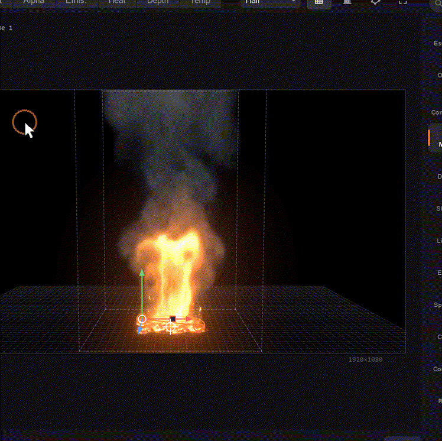
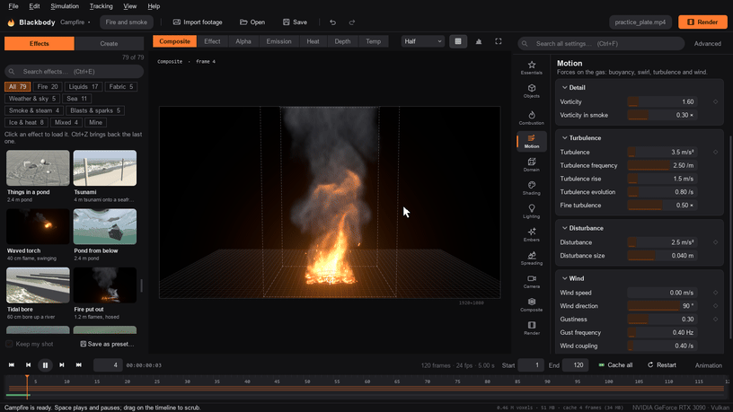
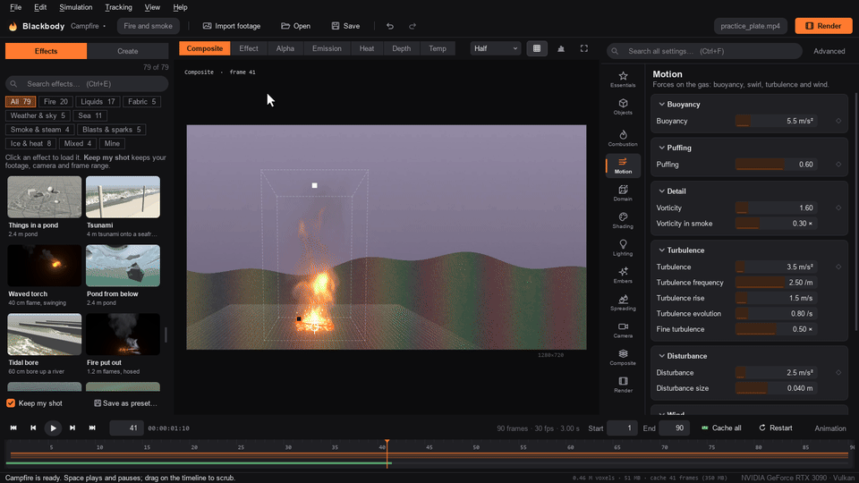

# Install and first steps

Install Blackbody, find your way around the window, and put an effect into your shot step by step. The [tutorial](tutorial.md) then walks through a whole shot, from footage to final render.

## Requirements

- A GPU with Vulkan, Direct3D 12 or Metal. Most cards from the last eight years qualify: NVIDIA, AMD, Intel, and Apple Silicon.
- 4 GB of GPU memory for everyday work; 8 GB or more for high-resolution final renders and big liquid shots.
- Windows 10/11. macOS 12+ and Linux run from source too, but have not been tested yet (see [limitations](troubleshooting.md#limitations)).
- Python 3.10 or newer, to run from source.

## Install and run

Get the source, either with Git:

```bash
git clone https://github.com/gjnail/blackbody.git
cd blackbody
```

or as a ZIP (on GitHub: **Code › Download ZIP**), unpacked anywhere.

Then start it:

- **Windows:** double-click `Blackbody.bat`.
- **macOS and Linux:** run `./blackbody.sh`.

The first run creates a private Python environment in `.venv` and installs the dependencies into it (about 400 MB, a few minutes). After that it starts straight away. The first time each kind of simulation runs, its GPU shaders are compiled, which takes a moment for fire and a few minutes for liquids; a card in the viewer says what it is doing.

Or set it up yourself:

```bash
python -m venv .venv
.venv/bin/pip install -r requirements.txt   # Windows: .venv\Scripts\pip ...
.venv/bin/python -m blackbody               # the app
.venv/bin/python -m blackbody render --help # the command line
```

**A standalone Windows app.** `pip install pyinstaller`, then `pyinstaller blackbody.spec`, builds `dist/Blackbody/` with `Blackbody.exe` (the app) and `blackbody-cli.exe` (the command line, for batch and render-farm use). The folder runs on machines without Python.

## The window


Across the top, the header holds what you do most: **Import footage**, **Open**, **Save**, undo and redo, and **Render**.

1. **Effects and Create.** Two tabs. *Effects* has the built-in fires, smoke, sparks, steam, liquids, seas and skies, in categories (Fire, Blasts, Smoke, Water, Sea, Ice & heat, Sky, Fire + water, and Mine for your own presets) with a search box (**Ctrl+E**). One click loads an effect; **Ctrl+Z** brings back the one before. *Create* (**Ctrl+N**) is for making your own: start an empty scene, and add building blocks to it (see [Build your own](#build-your-own)).
2. **View bar.** What the viewer shows: the composite, the fire over black, its alpha, and passes such as heat and depth (keys **1** to **7**). *Preview* sets the resolution of the live preview, *Guides* shows or hides the handles and the simulation box (**G**), and *Stats* shows the simulation grid, cell size and timings over the picture.
3. **Viewer.** Your frame. Drop a clip, an image sequence or a scene file anywhere on the window to open it.
4. **Properties.** A bar of pages down its left side. **Essentials** has the dozen or so settings that matter most for the kind of effect loaded. **Objects** lists what is in the shot (emitters, colliders, lights, fabrics), with an *Add* menu, and the settings of the one selected. Below those, every section of settings has its own page. The search box at the top (**Ctrl+F**) finds any setting by name, across all the pages, and lets you change it right there. Tick *Advanced* for expert settings.
5. **Timeline.** Play controls, the frame range, and a bar that turns green as frames are simulated and cached.

## Put an effect in your shot

In **Shot**, a card at the top right of the viewer walks you through these steps, ticking each one off; fold it with ▾, or hide it from View › Shot steps.

1. **Import your footage.** File › Import footage (Ctrl+I), or drop it on the window. Video files, image sequences (EXR, DPX, TIFF, PNG) and stills all work. The frame size, frame rate and length follow the footage, and so does the lens when the file records it (photos, and most phone video).
2. **Line up the ground** (Tracking › Line up the ground, **Ctrl+Shift+L**, or the card's button). A grid appears over the footage: drag its four corners onto something rectangular lying on the ground, such as floor tiles, a rug, a road marking, a parking bay or a table top. Its sides can run any way, and a rough fit is enough to start. Blackbody works out the lens from how the sides converge, and the camera's tilt and roll, then draws the ground grid and the horizon across the footage so you can see that they sit right. Give the camera's height (*Typical…* has eye level, a tripod, a balcony and a drone), or the real length of the grid's first side if you know it. The 1.75 m figure shows the scale: drag it next to a person in the shot to check. From then on the camera matches the footage's, so effects stand on the real ground at their real size.
   - **No rectangle in view** (a field, a beach, the sea)? Choose *From the horizon*: drag a line along the horizon and the cross to where the effect goes, and give the lens and the camera's height.
   - **The ground slopes** (a hillside, a steep street)? Tick *The ground slopes* and drag the two blue lines along upright edges (poles, door frames, wall corners): the world stays level, with fire rising straight up, and the slope becomes solid ground that water runs down.
   - **Walls, tables, steps, ramps, stairs:** *+ Surface* on the card (or Tracking › Add a surface) lines one up the same way: drag a grid onto it in the footage. It becomes a solid where it is in the world: water splashes off it and runs down it, smoke flows round it, fire spreads over it if you set it on fire, and it hides the effect behind it. Things dropped onto the footage land on table tops, steps and slopes too.
3. **Put the effect where it goes.** Pick one in Effects (*Keep my shot* keeps your footage and lined-up camera), or build one in Create: it stands in the middle of the grid. Drag the ring at its base to move it over the ground, and its knob to turn it. Blocks dragged from Create onto the footage land on the ground where you drop them.
4. **Follow the camera move.** If the camera moves at all, choose Tracking › Track (**Ctrl+T**). Blackbody follows spots all over the footage and works out where the camera is and where it looks on every frame. That works for pans, tilts and handheld shake, and for a camera that travels: a dolly, a walk, a car, a drone. Spots on the ground give the move in real metres. Spots that move by themselves (people, cars) are dropped, and the result reports how closely it fits, in pixels. The effect then stays put on the ground in perspective. For a locked-off shot, tick *It holds still*.
5. **Anything in front?** Draw roto round what passes in front of the effect (**R**): it goes behind it. See [Roto](compositing.md#roto).
6. **Make it sit in the footage.** Essentials has the main controls under *Blend with the footage*; Composite has all of them: fire exposure (Shading), heat haze, the effect's light on the footage, glow, grain and the lens. Smoke is lit by the average colour of the footage automatically (Lighting › Match ambient to footage). [Fitting it into your footage](compositing.md) has every tool for this.
7. **Render** (Ctrl+M). Pick one or more outputs: a finished composite, an element with alpha, multi-layer or deep EXRs, or OpenVDB volumes. See [Outputs](outputs.md).

   

**No ground in view** (a close-up, the sky, a wall)? Choose *No ground in view* on the card, or *Pin in 2D instead* while lining up: the effect is pinned to a point of the frame instead. Drag the ring at its base onto the spot and the square above it to scale it; Alt-drag orbits the camera around it, Alt + right-drag changes its distance, and Tracking › Track (Ctrl+T) follows that point through a moving shot.


Space plays. The simulation runs live, so you can change settings while it plays. Frames are cached (the green bar in the timeline): scrubbing back, and changing anything about the look, camera or composite, re-renders from the cache without re-simulating.

## Build your own

Blackbody opens in **Build**: an empty stage you look at with a camera of your own (drag empty space to look around, right- or middle-drag to pan, the wheel to move closer, **F** to frame everything). **Shot**, next to it in the header, is where an effect goes into your footage: the shot's camera, placement on the plate, roto, layers and the render. **Tab** or **W** switches between them; nothing you do in Build moves the shot's camera.

1. **Put something in.** The card on the empty stage starts you with fire, water, cloth, smoke, snow or a solid object. After that, **Create** (the second tab on the left, **Ctrl+N**) has everything: fire sources (a fire, a campfire, a fuel pool, a fire line, a torch, a gas burner, a fireball, a flame jet, a fire whirl, coloured flame, burnable things), smoke, steam and sparks, **liquids** (a pour, a hose jet, a fountain, a block of water, thrown water, a waterfall, a pond, ink, lava), **fabric** (a curtain, a flag, a banner, a canopy, a tablecloth, a falling sheet, a wet towel, your own cloth mesh), **weather** (rain, snow, sleet, hail, freezing rain), **forces** (wind, a fan, an updraft, suction, a vortex: air that pushes smoke, flame, embers and cloth around), **objects** (boxes, balls, pillars, walls, a room with a door, a car, floating crates, terrain, 3D text, your own meshes) and **lights**. Click one, or drag it into the viewer and drop it where it should stand.
2. **Move and shape it.** The selected thing has a gizmo: drag an arrow to move it along X (red), Y (green) or Z (blue), a square to stretch it along that side, the ring's knob to turn it, and its middle to slide it over the ground. Hold **Ctrl** to snap to a grid sized for the scene. The size or place shows by the cursor as you drag.
3. **Make things happen.** Right-click anything in the viewer (or in the object list, or use the buttons on its page) for what it can do:
   - **Set it on fire**: a box, a chair or a curtain catches at its base and the fire spreads over it.
   - **Make it breakable**: it is cut into pieces beforehand (bricks for brick, shards for glass, splinters for wood, chunks for the rest) that come apart where something hits it hard enough. *Make it break into* picks the pattern. See [Breaking](physics.md#breaking).
   - **Make it fall**: a real object that falls, tumbles, bounces and knocks into other things, pushed by the smoke and the water (*Drop it at this frame* holds it until then). Things attached to it go with it. Create › *Things that fall* has ready-made ones: a falling box, a bouncy ball, a boulder, dominoes, a tower. See [Things that fall](physics.md).
   - **Make it float**, **make it sink**: in the water, or in a pond put under it if there is none. **Make it hot** (water on it boils) or **freezing** (water on it freezes). **Make it hollow**: a tank, a room or a pipe.
   - **Soak** a cloth (it drips, steams in the heat and will not burn until it dries), **let it go** at this frame, choose what it is **held** by and what it is made of.
   - **Turn into**: any source becomes fire, smoke, steam, water, lava, a fan, an updraft, suction or a vortex, keeping its shape and place.
   - **Start** or **stop** a source at this frame, or give a **short burst** from it.
   - **Attach to** another thing: it then goes wherever that goes (a torch in a moving hand, a flag on a moving pole, fire on a driving car). Moving it by hand keeps its new place relative to what it is attached to.
   - **Move along a path**: click points on the ground where it should go, set how long it takes, and press Enter.
   - **Drop to the ground**, **look at it** (the Build camera turns to it), duplicate, delete.
4. **Tune it** in Properties: everything about the selected thing, the Essentials of the scene, and every other setting a search away.

Generic blocks are sized for the scene; real things (a torch, a car, a curtain) keep their real size. If a block does not fit, the simulation box grows to take it. Whatever you put in simulates together: water puts fire out, fire burns cloth, wind blows the smoke and the flags, lava boils the sea. The header shows what the scene simulates. Every change is one step of undo.


### Words on fire

Type text and it becomes solid 3D letters, in any font on your computer, that work like any other object:

- **Burning text** (Create › Fire): letters with fire all over them, burning steadily. Type the words, pick a font, bold or italic, the letter height and depth (new text is sized to fit the scene), and press **Add**. The letters hide the fire behind them, so they read as dark shapes wreathed in flame. The fire stays on the letters when you move, stretch or turn them.
- **Text** (Create › Objects): solid letters. Right-click them and **Set it on fire**: every letter catches at once, flares up and burns out. Or **Make it float**, put them under a pour of water, or blow smoke around them.
- **Water letters** (Create › Liquids): words made of water that hang in the air for a moment, then fall and splash.

Right-click any of them, or use **Edit text** on its page, to change the words, font or size; the fire on them changes with them. The letters are kept in Blackbody's data folder on this computer (the project refers to them there; **File › Pack project** copies them beside the project).

Logos and pictures work the same way: **Burning logo** (Create › Fire), **Logo or picture** (Objects) and **Water shape** (Liquids) ask for an SVG, PNG or JPG and trace its shape: its transparency if it has any, else whatever stands out from its background. **Invert** takes the other part of the picture, and **Threshold** how faint a part may be and still count. **Edit shape** changes the picture or its size later.

### Several things at once

**Ctrl+click** things in the viewer (or Ctrl- or Shift-click them in the object list) to select several; **Shift+drag** on empty space draws a box around them; **Ctrl+A** selects everything. Drag one of them, or the gizmo's arrows, and they all move; turn the ring and they turn together about the one whose settings show. Right-click for what you can do to all of them:

- **Group** (**Ctrl+G**): the others are attached to the one you right-clicked and go wherever it goes. **Select its group** and **Ungroup** (**Ctrl+Shift+G**) are on the menu of anything grouped.
- **Repeat…** (**Ctrl+R**): copies in a row (torches down a path), a ring (flame jets around a stage, each turned to face out) or scattered over the ground (spot fires, debris), with a sketch of where they go. Attached things come along, and each copy of a fire flickers in its own way.
- **Duplicate** (**Ctrl+D**), **Delete** (**Delete**) and **Save as a block**.

### Your own blocks

Right-click anything you built and **Save as a block…**: it and everything attached to it go under **Yours** in Create, to add to any scene with a click or a drag like the built-in blocks. A block is one `.bbblock` file with its meshes inside: right-click it in Create to save a copy to share, and drop a block someone sent you on the window (or **Import…** under Yours) to add it.

### The shot's camera

In Build, the bar under the viewer sets the shot's camera from the view you have: **Use this view** makes the shot see exactly what you see (Tab shows the shot), and **Key here** keys it at this frame; key it at another frame from another view and the camera moves between them, the short way round. **Look through it** starts the Build view from where the shot's camera is, to change it from there. When the shot has footage its camera matches the footage, so it is not moved from Build.

### Timing

**Timing** at the right of the timeline shows when each thing does what it does, as a bar over the shot: a source's bar runs from when it starts to when it stops, faded in and out at its ends. Drag a bar to move it in time; drag an end to start or stop it there (past the first frame: already going; past the last: going to the end). A cloth shows when it is let go and a pour that fills once when it fills; each thing's keys show as diamonds on its row, to drag in time. Right-click a row to start, stop or burst at the current frame.

## Layers

A shot can hold several effects, each its own simulation with its own box, scale and settings: a campfire in the foreground and a waterfall in the distance, smoke from a chimney behind a burning car. Click **Layer** in the header (**Ctrl+L**) to add one in front of the others, then load an effect into it from **Effects** or build one in **Create**.

The strip over the viewer lists the layers from back to front; the lit one is the layer you are editing, and Properties, Effects and Create all work on it. Click a layer to edit it, double-click to rename it, and right-click to hide it, move it back or forward, duplicate it or delete it. Each layer is placed in the shot by its own ring and square.

Every layer is drawn over the ones behind it as if they were its footage, so its heat haze, glow and light land on them too. The layers share the shot: the footage, the frame size, rate and range, the output look, the holdouts and roto, and the camera track (each layer keeps its own place on it). Renders, the command line and *Export this frame* draw all the layers; element outputs merge them, with the extra passes (emission, depth and so on) from the base layer. Effects that have to touch, such as a hose on a fire, belong in one simulation, not in two layers.

## Animate

Any setting with a **◇** next to it can be keyframed: click the ◇ to key it at the current frame, then change the frame and the value. **Animation** at the right of the timeline opens the animation editor: every animated setting is a row, with its keys on a track and a trace of its value. Drag keys to move them in time (Shift-click to select several), double-click a track to add a key, press **Delete** to remove the selected ones, and right-click to choose how a key eases into the next (*Smooth*, *Linear* or *Hold*). Click a setting's name to bring it up in Properties.

## Working in the app

**Search** in the header (**Ctrl+K**) finds anything: what you can do to the selected thing (*set on fire*, *float*), building blocks, menu commands, every setting of the scene, the ready-made effects and the things in the scene. Type a few letters and press Enter.

**File › Pack project** copies every file the project uses (meshes and their sequences, text and logo shapes, VDB volumes, the HDRI, holdout passes and, if you want, the footage) into a folder beside it, and points the project at the copies: move or send the project and that folder together and it opens anywhere.

Every setting has a tooltip. A number is a bar: drag it sideways to change it (Shift for fine steps), or click it to type a value (sums such as `1/24` work too). You can also drag a setting's name to scrub it, and double-click the name for its default. A setting you have changed from the effect you loaded shows its name in orange with a ↺ button that puts the effect's value back. Tick *Advanced* in Properties for expert settings. **Save as preset** (under Effects) keeps your own fires and liquids under *Mine*.



In the viewer, click a source, an object, a light or a piece of fabric to select it and drag it along the ground (Shift: up and down). A selected source or object shows a ring with a knob to turn it and a square to resize it (Shift snaps the turn to 15°).

In **Build** you look at the scene with a camera of your own; the shot's camera is drawn as a yellow frustum so you can see what the shot sees. Only the viewer changes: the shot, its camera and every render stay as they are, and turning the view re-draws cached frames without simulating again. **Shot** (or **Tab**) goes back to the shot's camera over your footage.

**Roto** (in the view bar, or **R**) draws shapes around what is in front of the effect in your footage, and the effect goes behind them: see [Roto](compositing.md#roto).

The view bar switches what the viewer shows, the way a compositor checks an element: the composite, the effect alone over black, its alpha, emission, heat (the haze driver), depth and temperature. In a liquid scene the last views show what the liquid does to the footage (wet ground, shadows, caustics) and how fast it moves.



## Where next

- [Tutorial: your first shot](tutorial.md): a whole shot, from footage to render, in about 30 minutes.
- [Presets](presets.md): all the built-in effects, each a starting point.
- The guides for [fire](fire.md), [liquids](liquids.md), [the sea](ocean.md), [lava](lava.md), [ice and steam](heat.md), [fabric](fabric.md) and [weather and clouds](weather.md).
