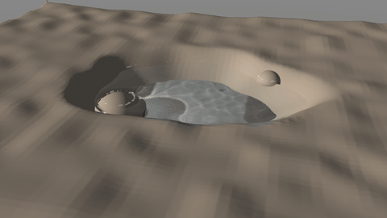
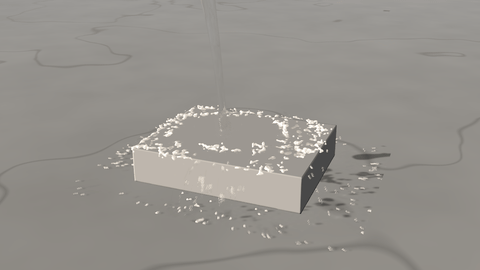
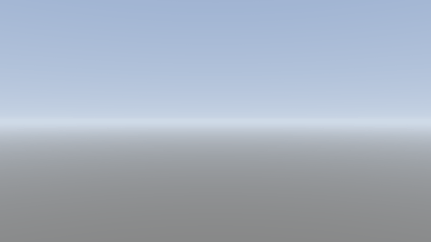

# Ice, boiling and steam

Liquids with a temperature: water that freezes into floating ice, boils on a hot plate or skates on its own vapour, and evaporates into steam that condenses in cold air.

## Ice and steam presets

| Ice and steam preset | Size | Notes |
|---|---|---|
| Ice cubes in water | 4 cm cubes | Freezer cubes dropped into room-temperature water: they plunge trailing bubbles, bob up and float a tenth out of the water, clear rims and milky cores |
| Ice melting | 4 cm cubes, time-lapse | Cubes standing in a tray of warm water, heat sped up 40 times: their edges round off, they shrink and settle into their meltwater, wet and glossy |
| Pond freezing over | 1.6 m pond | A frosty night as a time-lapse (a second is 50 minutes): in a hollow of frozen earth, clear ice creeps out from the banks and rocks, joins up and thickens, stilling the ripples, over water that stays above freezing |
| Water on dry ice | 40 cm slab | Water poured onto a -78 °C slab: it freezes where it lands into a growing mound of white, rimed ice |
| Boiling pot | 20 cm pot | A rolling boil: bubble streams from the hot bottom, bursting bubbles spitting drops, steam rising and clouding in the kitchen air |
| Water on hot steel | 150 °C and 300 °C | Water splashed on two plates: on the cooler one it boils where it lands, sizzling and steaming; on the hotter one (past the Leidenfrost point) it glides on its own vapour and lasts far longer |
| Hot pool in frost | 2 m pool | 40 °C water in -12 °C air: evaporation that the cold air cannot hold condenses into a fog rising off the whole surface |
| Boiling water into -30 °C air | 5 litres | Boiling water flung into bitter cold: the spray evaporates as it flies into a roaring cloud of ice fog |

## Heat and phase changes

Tick *Liquid › Heat and phase changes* and the liquid has a temperature, with the real heat capacities and latent heats of water (every particle carries its enthalpy, so it knows both how hot it is and how much of it is frozen). Set *Liquid temperature*, the *Air temperature* and *humidity* round it, the *Ground temperature* (also the closed walls and the footage's surfaces), a temperature on each collider (*Heat › Temperature*: a hot plate, a stove, a block of dry ice) and, if a source pours something else, its own (*Heat › Own temperature*: boiling water, iced water; below freezing a source pours ice). Heat moves through the liquid by conduction and by the flow's churning, and in and out of it at the air (convection, radiation, evaporation), at solids and at fire and lava in the same box, each at its physical rate.

### Ice

Water freezes where it loses heat: onto cold surfaces, at the top of a pond on a frosty night (water is densest at 4 °C, so the pond turns over until then and freezes from the top). Still water can cool below freezing without freezing (*Supercooling*, advanced) until something seeds it: ice next to it, a surface, or supercooling past what it holds, then dendrites race through it and it flashes to slush. Frozen liquid moves as solid pieces: connected ice is one rigid body that falls, floats with a tenth of itself out of the water (ice is 917 kg/m³), tips, drifts and rolls, and ice frozen onto a surface below freezing stays put. It melts back as heat reaches it. Ice keeps its edges in the render (no smoothing, no ripples), catches the light on the facets of its crystals, and is clear where it froze slowly and milky where it froze fast (drops, spray, slush, the last-frozen core of a freezer cube); left below freezing it grows white rime and feathers of hoarfrost, melting it is wet and glossy (*Liquid look › Frost*, *Ice cloudiness*).

### Boiling

Past the boiling point the extra heat boils water off. A hot surface boils it the way water boils: nucleate boiling up to the critical heat flux (bubbles rising in streams from fixed spots, a rolling boil, spitting drops where they burst), the violent transition regime, and past the Leidenfrost point (about 210 °C) film boiling, where the water rides on a cushion of its own vapour, glides and skates across the surface instead of wetting it, and boils off far more slowly. Steam bubbles (*Steam bubble size*) rise at their real speed, zigzag, grow in boiling water and collapse in cooler water (the crackle before a kettle boils, heating it), and lift the liquid around them as they rise.

### Evaporation

Water evaporates into air drier than it is, at the rate its temperature, the air's humidity and the wind allow, and cools as it does (hot water loses most of its heat this way); humid air on cold water condenses onto it instead. Spray and thin sheets, with their large surface, evaporate far faster than a pool. Wet ground dries at the rate a film of water on it evaporates, in seconds on a hot plate. Real evaporation is slow: a puddle takes hours.

### Steam

With *Domain › Simulation: Fire and liquid* the box's gas is the air round the liquid: the vapour the liquid gives off goes into it, where it condenses into visible steam as it cools (clear right over boiling water, clouding as it rises; a fog rising off a hot pool on a frosty morning; a cloud of ice fog from boiling water flung into -30 °C air), and the gas's own heat (flames) boils and dries the water. Without fire the box then simply carries air and steam.

### Time and heat speed-up

Heat moves at its real speed: a pond takes hours to freeze and an ice cube many minutes to melt in a drink. *Heat speed-up* makes only the heat flow faster, as in a time-lapse, while the liquid still moves at its real speed (and so does the mixing its flow does: a still pond under its ice stays still, with its warmer water at the bottom).
