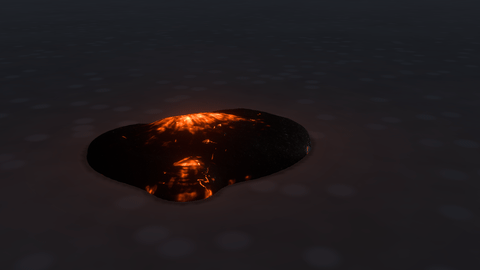
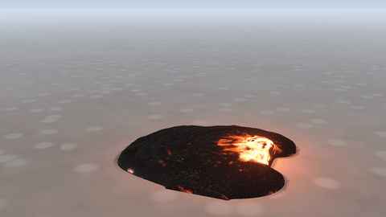
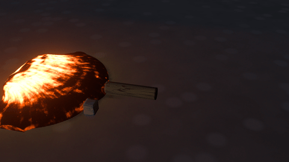
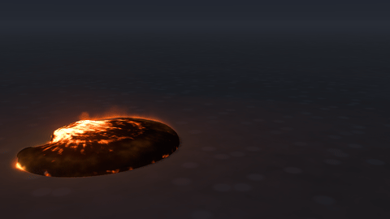

# Lava, and fire with water

Molten liquids that glow by their own heat and crust over as they cool, and fire, water and lava simulated together in one box: water that puts fire out in a plume of steam, lava that boils the sea.

## Molten liquids

### Glow

*Liquid look › Glow* makes it molten (lava, molten metal or glass): opaque, and lit by its own heat as a blackbody at *Glow temperature* (the fresh melt's temperature; it reddens and dims the way real lava does as it cools, so at 1100 K it is a thirtieth as bright as at 1300 K and at 900 K black beside it). 

### Cooling and crust

*Liquid › Cooling* lets it lose its heat where it meets the air and the ground: the older lobes dim, crust over and stiffen (*Setting*: how much thicker it is cold), while fresh melt from the source stays bright. Its skin darkens over *Crust forms in* once it is out in the air, and the crust is carried along by the flow, so it rides it. 

### Skin or plates

*Crust kind* picks what it grows. A *Skin* (pahoehoe): black glass when fresh, greying to *Crust colour* as it cools, thickening with its age, lumpy (its swells are in the surface itself, so they shape its outline) and glittering in the light (a rind of bubbly glass); the glow shows through it where it is thin, in stretch marks drawn out along the flow, longest in the troughs of its wrinkles, so a young flow glows orange through a grey veil and an old one is dark. Where the flow pulls it apart hard it tears into ragged glowing splits, where it is squeezed it ropes up (*Ropes*), and the foot of a lobe that is advancing glows in a broken seam where its front splits along the ground. *Plates* (a lava lake or channel): plates (*Crust plate size*) with glowing cracks between them, carried along whole, pulled apart where the lava spreads (those cracks open wide and show the hottest melt) and folding into ropes where it piles up. 

### Light and heat haze

The relief catches the key light and the sky. The glow lights what is around it (*Glow on surroundings*): the footage's ground and the objects in it, and stand-in colliders; and the air it heats shimmers (Composite › *Heat haze*), bending the footage behind it and the far side of the flow.

## Fire, water and lava together

*Domain › Simulation: Fire and liquid* runs them in one box. Each emitter *Emits* fire, liquid (water) or lava.

### Water on fire

Water that reaches a fire's fuel soaks it (Combustion › *Soaking*), and soaked fuel stops burning. The heat the burning fuel bed stored boils the water off (*Ember heat*: a bed of glowing charcoal holds about 150 times the air's heat), so a doused fire goes out in a thick white plume of steam that billows up through the smoke. The steam leaves the bed at 100 °C and mixes with the air as real steam does, clearing at its edges as it thins. Steam also smothers the flames round it (they starve once steam is about a quarter of the gas) and swells as it is made (*Steam burst*), blowing a gust of steam, smoke and sparks out where water hits the fire. What a smothered bed still gives off comes away as white-grey smoke. Wet fuel dries out again in the heat of the flames round it (*Drying in flames*), so a corner the water missed keeps burning and a fire only partly doused creeps back. Water in the flames themselves cools them to boiling (*Water on flames*); drops of spray flying through flames boil away.

- **The water moves the air.** Gas in and next to the water moves with it, so a hose stream drags a jet of air through the flames and smoke, and the air over a still pool stays still.

### Lava

Lava is a liquid of its own beside the water, with the *Lava flow* preset's behaviour and look (the *Lava* settings change it). To the water it is solid ground that moves: the water runs over and round it and is shoved aside where it advances. Where they meet, the water boils at about a megawatt per square metre of contact (*Boiling*) into a plume of steam, and the boiling line spits spray; lava under a deep sea makes little steam at the surface, because it condenses back into the water on its way up. The water chills the lava's skin (*Quenching*), so it crusts over black while the lava behind it keeps glowing. The air over hot lava heats up (*Heats the air*): it shimmers, rises, and sets grass and other burnable things alight as the lava reaches them. The lava's glow lights the steam, the smoke and the water round it (*Glow lights the steam*).

Lava meets the other things in the box too. Things that fall float in it by its density (2600 kg/m³: a log rides high on it, stone sinks slowly through it, steel goes down) and are dragged along by its slow, heavy flow. Broken objects' pieces and sand, snow and mud are solid to it, so it flows round and over them. It heats what it touches (objects, wax, chocolate, dry leaves, which catch), and its glowing surface radiates, some 200 kW a square metre where it is fresh, warming what lies beside it, scorching cloth hung near it and heating the objects in its way ([objects' heat](physics.md#heat)). Preset: *Log on a lava flow*.

### In the render

In the render, flames in front of the water hide it and flames behind it show through, refracted; lava under the water shows through it too. The water's wet ground and shadows land on the footage under the fire's light, and the fire and the lava light the water: orange glints on its surface and light on its foam and spray.
