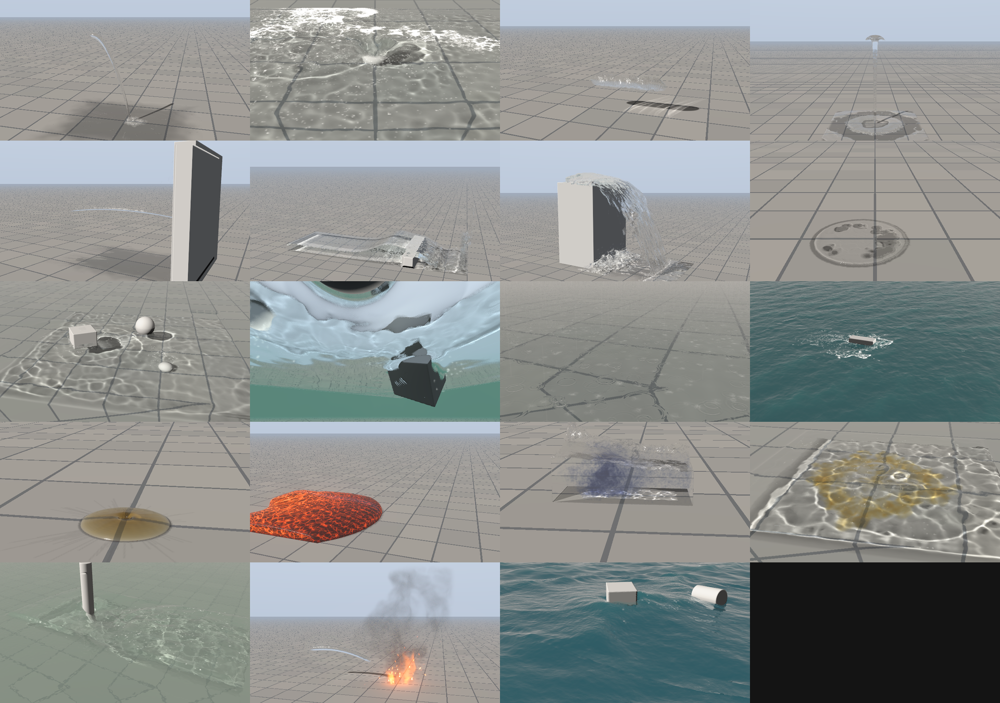
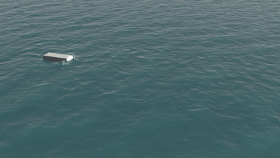
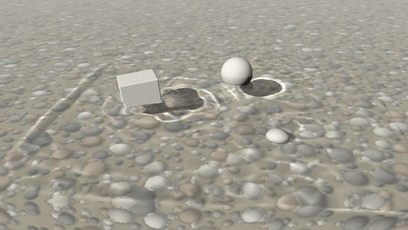
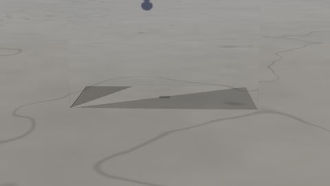
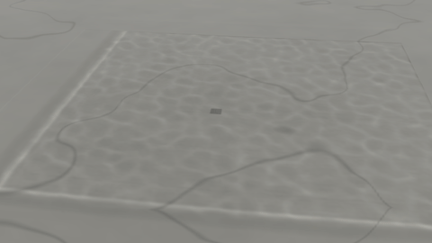
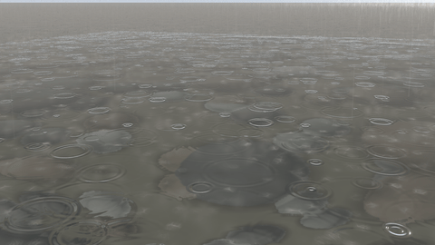
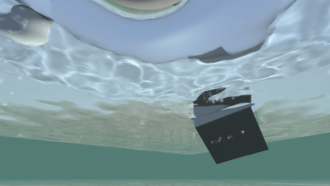

# Liquids

Water that pours, splashes, sheets and breaks into drops, with spray, foam and bubbles, rendered as a real dielectric that refracts and reflects your footage. Set *Domain › Simulation* to **Liquid**, or click a liquid in Effects. The Properties panel then shows the liquid sections (*Liquid* for how it behaves, *Liquid look* for how it looks); fire-only settings are hidden. Everything else works as for fire: placing it in the shot, tracking, keyframes, the cache, every output.

## Liquid presets

| Liquid preset | Size | Notes |
|---|---|---|
| Pouring water | 80 cm pour | A stream from knee height onto the ground, spreading into a puddle |
| Rock into a pond | 15 cm rock | Crown splash, cavity, rebound; the rock is a keyframed collider |
| Thrown bucket | 8 litres | A mass of water thrown forward, landing and fanning out |
| Fountain jet | 1.2 m jet | Rises, breaks up at the top and rains back down |
| Hose on a wall | 1.5 m jet | Hits a wall collider, fans out, throws up spray |
| Breaking wave | 4 m channel | A wall of water crashing over a step (glass-sided channel) |
| Waterfall | 1.5 m drop | A sheet off a ledge collider, white water where it lands |
| Spilled glass | 25 cl | A glass knocked over, spreading into a puddle |
| Things in a pond | 2.4 m pond | A crate, a ball and a stone dropped into open water: they float, bob and sink |
| Pond from below | 2.4 m pond | The same pond with the camera under the water: Snell's window, the surface a mirror, the floaters hanging from it |
| Rain on a pond | 3 m pond | Steady rain: rings from every drop, crowns of spray, streaks in the air |
| Towel dipped in water | 50 x 70 cm towel | A towel lowered into a tank and lifted out: it soaks, comes out heavy, streams and drips from its hem (wet fabric) |
| Boat wake | 1.2 m hull | A hull running across a lake: bow wave, spray, a V of wake spreading past the box |
| Honey | 45 cm pour | A thin stream building a thick, slowly spreading pool |
| Lava flow | 4 m flow | Pahoehoe lava welling up at a vent at dusk and spreading in a lobe that buds toes at its edge: fresh melt bright at the vent, glowing through a thin skin in stretch marks along the flow, the skin darkening to grey within seconds; glowing seams along the advancing foot, the air over it shimmering, its glow on the ground |
| Ink in water | 50 cm tank | Ink poured into a tank of still water, curling into clouds |
| Oil on water | 1.2 m pool | Oil poured onto water: it dives in, bobs up and spreads into a slick |
| River past a post | 3 m of river | A current flowing past a post: a bow wave, a wake of eddies |
| Hose on a fire | 1 m campfire | A hose swept across a campfire: the flames collapse, the soaked logs steam in a white plume through the smoke, a corner the water missed keeps burning |
| Lava into the sea | 4 m of shore | Lava running off a basalt bench into the sea: a steam plume off the waterline, the front chilling black, the glow on the water |
| Water on lava | 1.5 m lava pool | A hose turned on a pool of lava: steam bursts where the water lands, drops sizzle away, the lava crusts black under the stream |
| Lava into grass | 4 m flow | A lava flow creeping into dry grass: the grass ahead of the front catches and a line of flame runs ahead of the lava |
| Crates at sea | 6 m of sea | A swell to the horizon, two crates riding it: they bob, tilt and roll |

## Sources and colliders

### Sources

Emitters become liquid *sources*. A **stream** keeps pouring at its *Velocity*: the flow is speed times area, so a spout 3 cm in radius pouring at 1 m/s gives about 2.8 litres a second. A **volume** fills its shape with liquid once, at *Starts at*: a pond, a thrown bucket, a wall of water. Any emitter shape works, meshes included, and *Volume (VDB)*: the liquid fills where an OpenVDB volume (or a USD particle cache) is dense, moving at its velocity, so the water a FLIP sim from another program left can be carried on (see [Smoke from a volume](scene-import.md#smoke-from-a-volume-openvdb)). Keyframe *Flow* to open and close a tap, or *Position* to swing a hose.

### Colliders

Colliders are solid: the liquid flows around them, splashes off them and runs down them. Keyframe one to move it (a rock dropped in a pond, a paddle): it pushes the liquid out of its way. A collider *In the shot* hides the liquid behind it, the way the real object in your footage does (*Liquid look › Colliders: In the footage*), or is drawn as a grey stand-in so you can judge the scene before you have the plate (*Grey stand-ins*); turn *In the shot* off for helper colliders, which then hold the liquid but are never drawn.

### Floating objects

Tick a collider's *Floats* and give it a *Density*: the liquid moves it. A crate (550 kg/m³) plunges, bobs back up and drifts with the flow, a ball (150) barely dips, a stone (2600) sinks to the bottom, and each pushes the water as it moves. They move as real rigid bodies: a crate tips and rides the waves, a light cube floats edge-up, a barrel rolls onto its side, and they knock into each other, the ground and the other colliders. Its keyframes only set where it starts.

## How the liquid behaves

### Surface tension

Surface tension (*Liquid › Surface tension*, 0.073 N/m for water) smooths small ripples and beads small drops. It matters at centimetre scale; on big shots it has no visible effect. *Grip on surfaces* slows liquid sliding on the ground and colliders, so fast sheets slide on but spills settle into puddles. *Contact angle* sets how the liquid meets surfaces: below 90° it wets and spreads (clean glass, concrete), above 90° it beads up (a waxed car, a leaf).

### Thick liquids

*Liquid › Viscosity* makes it thick: olive oil 0.08 Pa·s, syrup 2–5, honey 10, lava 100 and up. Thick liquids pile up, spread slowly and stick to the ground and colliders.

### Dye and two liquids

Each liquid source can carry a *Dye* (ink, blood, paint, mud) with a *Dye strength* and *Cloudiness* (a clear tint like wine, or a cloud that scatters light like milk or mud): it colours the liquid it pours and clouds into the rest as the flow stirs it. A source's own *Density* makes it a different liquid: oil (900 kg/m³) poured on water dives in, bobs back up and spreads into a slick on top; brine or molten metal sinks under it. They do not mix (oil and water stay apart); dyes do.

### Wind

*Liquid › Wind speed* and *direction* blow spray downwind, drift foam, and drag the surface (*Surface drag*).

### Rain

*Liquid › Rain* (mm/h: drizzle 1, steady 5, heavy 20, downpour 50) and *Raindrop size*: streaks falling through the air, ring ripples spreading from every drop on the water, and crowns of spray where they land.

## Spray, foam and bubbles

### Whitewater

Where the liquid moves fast and traps air (plunging, colliding), churns or breaks at a crest, it releases spray, foam and bubbles. Spray flies in the air, foam rides the surface and pops after *Foam lifetime*, bubbles rise. *Liquid look › Foam / Spray / Bubbles* set how dense each looks. Spray is drawn as individual droplets (*Spray droplets*, *Droplet size*): motion-blurred streaks with a glint of the sun and a bright rim when backlit, over a fine mist. Foam breaks into a lace of bubble walls (*Foam lace*, *Foam bubble size*) that shows the water through its holes.

## The look

### Refraction, reflection and colour

The surface is ray traced as a dielectric (index of refraction 1.333 for water). Your footage is refracted through the liquid, reflected in it, and seen through it tinted by the liquid's *Colour* over its *Clarity* distance; *Murkiness* scatters light inside (muddy water, milk). *Background distance* says how far behind the liquid the scene is, which sets how strongly the footage bends. A key light (Lighting) adds sun glints, casts the liquid's shadow and focuses sunlight into rippling *Caustics* on the ground under it. The ground around the liquid darkens where it is wet (*Wet ground*) and dries slowly (*Liquid › Drying*). *Thin sheets* stretches the surface along sheets and streams so they stay whole and smooth instead of holed.

### Environment

*Lighting › Environment (HDRI)* takes a panoramic HDR of the set (latitude-longitude .hdr or .exr): the liquid reflects and refracts it, and with *Key light from environment* the key light's direction and colour are taken from its brightest spot. *Rotation* turns it to line up with your footage. With no HDRI, *Lighting › Sky: Physical* gives the liquid a sky worked out from the air for where the key light is (see [Lume › A physical sky](lume.md#a-physical-sky)): it reflects and refracts that, lit by the sun through the air.

### Calm water

*Calm surfaces* smooths the surface of the bulk of the liquid along the surface only, so a still pond is glassy without shrinking thin sheets and drops. A pond or tank filled at the start sloshes as it settles; *Liquid › Settle during pre-roll* calms it before frame 1.

### Lights

The lights in the set (point, spot and area, see [Lights in the set](compositing.md#lights-in-the-set)) light the liquid too: a glint of each on its surface, wider for a bigger lamp, and their light on foam, spray and murky water.

### Drops on the lens

*Liquid look › Drops on the lens* puts water on the camera's front element: soft, out-of-focus drops that bend the picture behind them, landing at random, clinging a few seconds and running down as they grow. It is applied to the whole composite, footage included.

### Rainbows

Spray and droplets show the rainbow sunlight makes in them, about 42° from the point opposite the sun (with the fainter second bow outside it), where the key light is behind the camera. *Liquid look › Rainbow* scales it; 1 is physical.

### Under water

Put the camera under the water level and the render looks out from inside: the sky only through Snell's window overhead, the surface a rippling mirror of the water outside it, shafts of sunlight where the waves focus it, everything fading into the water's colour with distance. Turn off Camera › *Place in frame* to aim it freely.

## In your footage

### The footage's own surfaces

With a depth pass of the footage (Composite › *Holdouts from footage*), the liquid is hidden behind the footage's surfaces and shows in front of them, as the fire is. Tick *Liquid › Hits the footage* and it also collides with them: water splashes against a real wall and runs along a real kerb (a slab just behind each surface the camera sees is solid).

The water shows the footage bent through it: what a ray through it reaches (the ground under it, the scene behind it) is looked up in the footage where that place is on screen. Where something stands in front of that place (a real rock that is a collider *In the footage*, an object drawn in CG on the set, a real wall in the depth pass, the matte), the footage there shows that thing, not the ground behind it, so the water would show a ghost of it beside it. Instead the footage there is filled in from beside the thing (the ground on either side of it carried on across it), and the water shows that. A ray that leaves the water for the backdrop rather than the ground (a reflection of the scene, or the scene seen through the water) gets the same for colliders and the matte, but a real wall in the depth pass is kept there: the ray may well meet it.

## Size, resolution and big shots

### Scale and resolution

Liquids need finer grids than fire: a feature needs a few cells across to hold together. Keep the box tight around the action, and aim for cells (shown in the viewer) a quarter of the size of the thinnest stream or sheet you want. Without a water level, water that leaves the box through an open side is gone; closed sides behave like glass walls.

### Big bodies of water

*Liquid › Narrow band* (Quality) keeps particles only in a band under the surface (*Band width*, 4 cells) and lets the grid carry the deep water: a 5 m wake or a pond costs particles for its surface, not its volume (5 to 8 times fewer). The band follows the surface down into troughs and craters.

### A box that follows

*Liquid › Box follows* (Quality): *The liquid* or *The first collider*. The box moves with the action in whole cells, so a small box covers a long run: a boat crossing the sea, a flood running down a street. The liquid keeps its place in the world as the box moves; what it leaves behind is dropped, and open water fills in ahead. Needs open sides; not with fire in the box.
