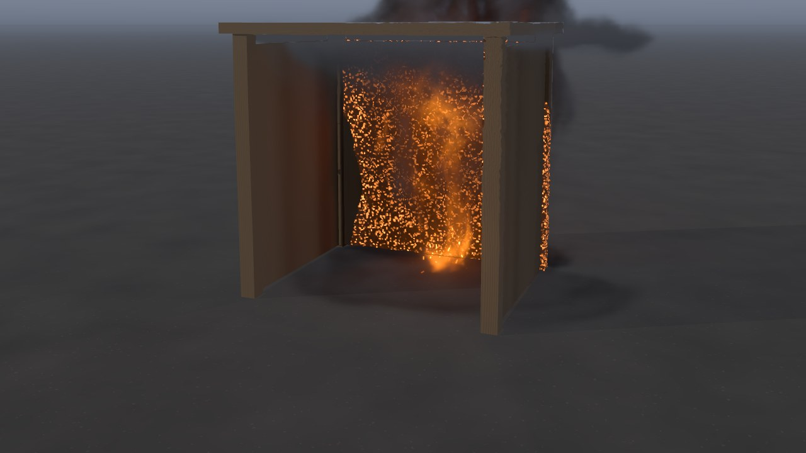
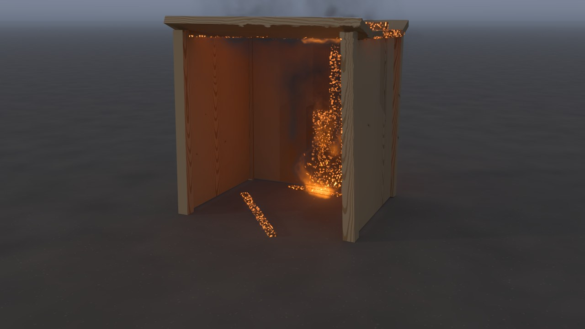

# Lume lighting

Lume is Blackbody's path-traced lighting engine. It lights the set drawn in CG (the floor, the objects, broken pieces, sand, snow and mud, ropes) by tracing light as it really travels, instead of adding up a few direct lights. Turn it on in Properties › *Lume* › *Lighting engine: Lume (path traced)*. It works in every kind of scene, with or without footage, and the fire, the smoke and the liquids are drawn over it as before.

 

*Shed on fire* at 6 s: the classic engine (left) and Lume (right), the fire's light bouncing round inside the shed.

## What it adds

- **Light that bounces.** Light reaches a surface after bouncing off others: a red brick wall tints the floor in front of it, the shaded side of a crate is lit by the sunny ground beside it, an object in a room is lit by the walls round it.
- **Shadows as soft as each light is big.** The key light's shadow sharpens where an object touches the ground and softens as it falls away, as the sun's disc makes it. Every fire light, glowing patch of hot metal and lamp casts its own shadow, through the objects and through the smoke.
- **The HDRI's own sun.** With an *Environment (HDRI)*, light is aimed at its bright parts, so a small sun in the HDRI lights the set and casts sharp shadows at once (the classic engine only takes the HDRI's average colour).
- **Glass, ice and jelly that bend light.** A ray goes in, bounces inside while it cannot get out, and leaves through the far side, tinted by how far it went through. Clear things refract what is behind them and reflect the sky by the true Fresnel term.
- **Caustics.** The light a glass ball, an ice cube or a jelly focuses, and the light a mirror (bare polished metal: a chrome ball, a steel plate) throws, is traced from the lights themselves, through the glass or off the metal, to where it lands and on to the camera: the bright spot in a glass ball's shadow, the patch of lamplight a chrome ball throws onto the floor, and the light those throw on round them. A pane, a box or a shard (flat faces) casts its exact straight-through shadow instead.
- **Even grain.** Each pixel's light paths are spread evenly over the pixel, the lights and the directions a bounce can take (a low-discrepancy sequence: Owen-scrambled Sobol), not at random, so the grain falls away much faster as samples are added: on the benchmark's room lit straight by a lamp, after 1024 samples, a five-hundredth of the mean squared error of random paths.
- **Physically based highlights.** A GGX microfacet highlight with height-correlated shadowing and Fresnel at the facet's angle. Rough floors no longer flare toward the horizon.
- **The fire lighting the set.** Each of the fire's point lights is picked by how much light it brings to a surface, and its shadow is traced through the objects and the smoke.

## Settings

| Setting | What it does |
|---|---|
| Lighting engine | *Classic (fast)*: direct light with soft shadows. *Lume (path traced)*: the light traced as it travels. |
| Bounces | How many times light bounces from surface to surface: 3–4 for most shots, more for rooms and glass. |
| Samples (final) | Light paths per pixel in final renders: 128 for a preview, 256–1024 for hero shots. |
| Samples (viewer) | Light paths per pixel the viewer gathers once you stop moving or editing. |
| Denoise | Smooths away the grain that is left, keeping edges, textures and shadow edges. |
| Clamp bright paths | (Advanced) Caps a bounce's light at this many times the sky's brightness, to clear stray sparkles sooner. 0 keeps every path exact. |

## In the viewer

While you drag or play, Lume shows one light path per pixel (denoised). Once you stop, it keeps adding paths, two at a time, until *Samples (viewer)* is reached. The stats overlay shows how far it has got (*Lume · 24/64 light paths per pixel · sharpening*). Any edit starts it afresh.

## Accuracy

Lume is measured against ground truth: the same scenes rendered by Mitsuba 3, a research path tracer, with Lume's own material (`tools/lume_bench`). On every scene it is within 0.15% of the truth in mean brightness (0.01% to 0.15%), glass, metal and their caustics included. What it does not yet trace: a caustic seen through the glass that made it (light focused by a glass ball onto the floor, seen through the same ball), which comes straight through the glass, unfocused; and the fire's own light focused by glass or thrown by a mirror (its shadow through curved glass is straight through, and its light off a mirror is found by bouncing). See `tools/lume_bench/README.md` for the scenes, the measures and the latest results.

## Speed

Plain spheres, boxes and cylinders, the floor and broken pieces are hit exactly by each ray; meshes, hollow things and sand, snow and mud are found by marching toward them. On an RTX 3090, a simple set at 1920x1080 takes a few tenths of a second for 64 paths per pixel with 4 bounces. Against Mitsuba, which traces with the GPU's ray-tracing cores, Lume is closer to the truth after the same time on every test scene but one, against whichever of Mitsuba's samplers does best there: 0.2 to 0.7 times its error on the rooms, the metal and the glass ball, about the same under an even sky, and 1.6 times on the simplest scene of all (a white ball under an even sky, a few milliseconds a frame, where Lume's time to set up a frame counts). Against Mitsuba's plain random samples, from two-thirds of its error (shiny metal) to a two-hundredth (a room lit straight by a lamp). A frame with fire light and smoke shadows takes a few times longer. Final renders trace their samples in passes (four paths per pixel at 1080p, up to sixteen on smaller pictures, each pass no longer than one at 1080p), submitted a few at a time, so long renders do not stall the GPU.

## How it works

Every pass traces a path per pixel from the camera (four in a final render). At each surface, Lume:

1. takes the light coming straight from one of the lights (next-event estimation), picked by how much light each brings there (and a share evenly): a direction in the sun's disc; a fire light or a hot-matter light, itself picked by how much light it brings; a direction within the solid angle a lamp covers; or a direction in the HDRI picked by its brightness; weighed against finding it by bouncing (multiple importance sampling, power heuristic);
2. bounces on, by the material (a GGX highlight sampled by its visible normals, or diffuse by the cosine), or through glass by its Fresnel term;
3. ends the path by Russian roulette (from the fourth bounce) once it carries little light.

The random choices are made with a low-discrepancy sequence: a pixel's samples are points of an Owen-scrambled Sobol sequence (Burley's hash-based scrambling), each choice (the place in the pixel, which light, its direction, the bounce) with its own dimension, scrambling and shuffle, kept for the camera and the first four surfaces; one number both picks a light and, rescaled, samples it, so each light's samples keep their spread.

Each pass also traces light paths from the lights for caustics (one per sixteen camera paths): from a lamp, the key light or an HDRI with a sun in it (an even sky's light is found well by bouncing), aimed at the curved clear things and the mirrors, through the glass by its Fresnel terms and off the metal by its highlight, and where one lands, its light is sent along a straight line to the camera and added to the pixel it is seen in (light tracing), and followed two bounces on. The camera's paths leave exactly that light to these (the lights found by way of the glass and the mirrors from surfaces the camera sees straight), so nothing is counted twice; from surfaces seen through glass or in a mirror, the shadow rays go straight through the glass instead.

The passes are added up, with each pixel's first surface (albedo, normal, distance) and how noisy it still is. The denoiser divides out the albedo so textures stay sharp, filters the light with an edge-avoiding à-trous wavelet filter (five passes, guided by facing, distance and noise), and multiplies the albedo back.

The engine is in `blackbody/engine/lume.py`, `blackbody/engine/wgsl/lume.wgsl` and `blackbody/engine/wgsl/lume_denoise.wgsl`.

## Coming next

Lume grows in stages. Next: lighting the fire, smoke, water, cloth and grass with Lume too; a physical sky and sun, area lights and light-profile (IES) files in physical units; multiple scattering in smoke and clouds, with the fire as a volumetric light source; refraction with full bounce light in water; per-light passes for compositing and matching the light in your footage; and a spectral mode that traces each wavelength, as a blackbody emits it.
