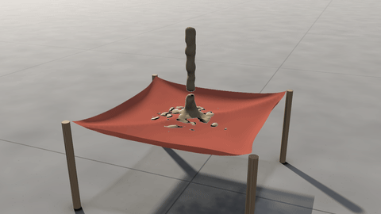
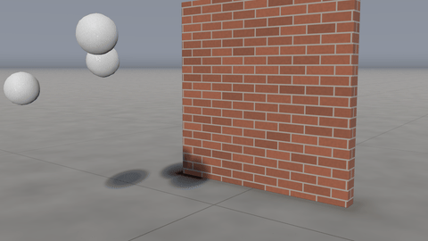
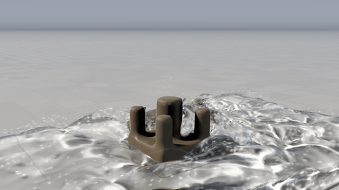
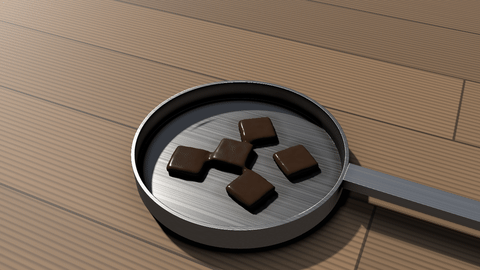
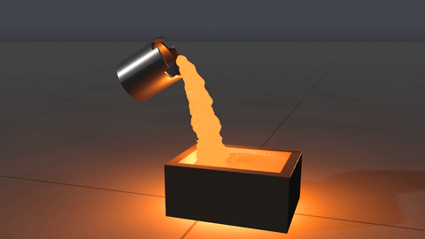
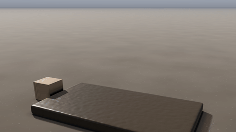

# Sand, snow and mud

Sand, snow, mud, jelly and clay are *matter*: a body of it is made of tens or hundreds of thousands of particles that each carry how they have been squeezed and stretched, so it piles, pours, packs, slumps, wobbles and squashes as the real thing does. It works in every kind of scene but the sky: sand poured from a hopper on an empty stage, a snowball thrown at a wall, a crate dragged through mud.

## Making some

Add a block from the *Sand, snow & mud* group in Create: a sand pile, a sand pour, a column of sand let go, a sand castle, a snowball, a snow drift, mud, a block of jelly, a lump of clay, chocolate letters in any font, or a mesh of your own filled with clay (*Matter shape*). Each is a matter object in the scene, with its settings in Properties:

- *Made of*: what it is (below).
- *Shape*, *Position*, *Size*, *Rotation*: the body of it at the start: a box, a ball, a cylinder, a pile (a cone standing on its base), or a mesh it fills (*Mesh file*: a closed OBJ, STL or USD prim in metres, its own origin at *Position*, *Size* its scale on each axis).
- *Temperature*: how hot it starts (wax, chocolate and metal: [Things that melt](#things-that-melt)).
- *Thrown at*: how fast it moves as it starts (a thrown snowball).
- *Let go at*: it is held where it is until then (a column of sand let go to collapse).
- *Pours*: instead of a body of it, a stream poured from a nozzle at *Position* (its *Size*'s first value is the nozzle's radius), *Thrown at* the speed it leaves at, *Flow* in litres a second, from *Pours from* until *Pours until*.
- *Own colour*: a colour of its own in place of its material's.

Right-click one in the viewer for *Made of*, *Let go at this frame*, *Pour it from here*, and *Start* or *Stop pouring at this frame*. Its dashed outline in the viewer is where it starts; a pour shows its nozzle and an arrow the way it pours.

## What it is made of

| Made of | What it does |
|---|---|
| Sand | Dry grains: it pours, slides, and piles at its angle of repose (34°). Pulled apart, it falls apart. |
| Wet sand | Holds a steeper heap (38°) and a little stretch, so it clumps and holds a cut edge. |
| Snow | Fresh snow, 400 kg/m³: squeezed, it packs and gets harder; stretched, it breaks into lumps. |
| Packing snow | Wet snow, 600 kg/m³, for snowballs: it splats where it hits and breaks up as it falls. |
| Mud | Flows like a thick liquid until it is thin enough to hold itself up (its yield stress, 400 Pa), then stops. |
| Jelly | Springs back from anything that squashes it, keeping its volume: it bounces and wobbles. It is clear and coloured. |
| Clay | Squashes and stays squashed: it holds a shape until it is pushed harder than 20 kPa. |
| Wax | A firm solid, ivory and a little translucent. It melts at 60 °C into runny wax. |
| Chocolate | A firm, glossy solid. It melts at 34 °C into thick melted chocolate, which slumps and runs slowly. |
| Aluminium | Bright metal. It melts at 660 °C into runny, mirror-like molten aluminium, barely glowing. |
| Iron | Dark metal. It melts at 1150 °C into molten iron, glowing yellow-orange. |
| Molten wax, Melted chocolate, Molten aluminium, Molten iron | Their melts, to pour: they start hotter than their melting point and set as they cool. |
| Dry leaves | A light, springy heap that catches at 260 °C and flares up in flames, burning down to a little ash. |
| Sawdust | Catches at 290 °C and smoulders with a low flame and thick smoke. |
| Coal | Catches at 450 °C, with a fire that lasts (or start it hot), and glows orange for a minute or more. |
| Ash | What is left: light and grey. |

## What moves it

- **Gravity, the ground and the box.** It rests on the ground and against the box's closed sides. Through an open side, the top, or the bottom of a box without ground, it leaves the simulation.
- **Objects.** It piles against objects that stay put, and keyframed ones plough through it (a crate dragged through mud pushes up a bow wave). Things that fall land on it and it holds them up as its strength and their weight say: a wooden crate rests on top of sand where a steel ball of the same size sinks into it, and jelly throws a dropped ball back up. Broken objects' pieces are the same: bricks from a wall knocked onto a heap of sand land on it brick by brick, dent it and are held up by it. Snow, mud, clay and wet sand stick to the objects they touch, each as hard as it really does: packing snow thrown at a wall stays on it (powder snow slides off), mud clings to a crate dragged through it, and dry sand does not stick at all. Matter and the falling objects push each other every few of its steps (a fraction of a millisecond apart), which makes a scene with both slower than either alone: a heap of sand with a crate on it, some half a second a frame.
- **Cloth.** Fabric is a sheet it cannot get through, from either side. Sand poured onto a sling (a sheet held at its corners) lands on it, heaps in the dip it makes and weighs it down: the cloth sags and settles under the sand as one heavy thing, without bouncing. A sheet dropped onto a heap drapes over it and leaves it standing, since a cloth's weight is nothing to a heap of sand. Where the cloth is pinned it pushes what it moves into.
- **Blasts.** An explosion (an emitter's *Blast*) throws it away from where it goes off, the surface hardest: a heap of sand near a charge is blown flat.
- **The wind.** Dry sand, fresh snow, dry leaves, sawdust and ash blow in the wind (Motion › *Wind*, or the fire's own air inside the box) once its friction over them passes the speed that starts their grains moving, as Bagnold measured it (sand at about a 4 to 5 m/s breeze). Their top layer creeps downwind carrying what a wind of that strength really moves (the saltation flux: a few grams a metre a second in a stiff breeze, a few hundred in a gale), so a heap's windward side wears down and its crest moves downwind. Grains thrown into the air (by a blast, a wheel, a fall) are carried by the wind at the speed they settle through still air, so the spray of a blast drifts off on it. The fine part of what the wind moves rises off it as dust, carried by the air as smoke is (a haze of blowing sand off a crest, spindrift streaming off a snow ridge, a cloud round a blast's spray of sand: set Shading › *Smoke colour* to the dust's colour). Damp, wet or soaked sand, packing snow, mud, clay and the melts do not blow.
- **Water.** In a liquid or fire-and-liquid box the water and the matter push each other. A wave shoves jelly, and jelly floats by the water it puts aside; grains in the water are lighter by it; and water running over sand drags its top along, so a pour digs a crater where it lands and a gully where it runs off.

It is solid to the smoke and the water: smoke blown at a heap of sand goes round and over it, water poured on it runs off it and pools at its foot, and a pour pushes the air aside as it falls.

Sand gets wet. Dry sand the water touches is damp after half a second: darker and glossier, its grains held together by the water between them, so it stands steeper and holds a cut edge. The water seeps on into damp sand, a couple of centimetres a second, and sand it soaks through lets go: its grains part. A sand castle the water reaches stands at first, then is undermined, slumps into a mound and is carried by the flow. Away from the water, soaked sand drains back to damp in a few seconds.

Snow melts where hot gas touches it: in flames a snowball's surface melts away in a second or two, while snow beside a fire that its heat does not reach, or buried inside a heap, lasts. It melts from below where it rests on an object warmer than freezing (an object's *Temperature*): on a 150 °C steel plate a layer every few seconds, on a warm car bonnet slowly, on frozen ground not at all. In a fire-and-liquid box its water joins the liquid and runs off; in a fire box it is simply gone. (The fire's radiant heat is not counted, so snow a little way from a fire melts only where the hot gas reaches it.)

## Things that melt

Wax, chocolate, aluminium and iron have a temperature (Matter › *Temperature*, how hot each body starts). They warm in the fire, from the hot gas next to them and from the radiant heat on the side that faces it (the fire's, lava's, a hot object's), so a bar of chocolate beside a fire softens on that side first. They cool in the air, and much faster in water, and give off their own heat as they glow, which warms what is round them in turn. Objects warm or chill what touches them, as fast as the two conduct heat, and are warmed or chilled by it ([objects' heat](physics.md#heat)): chocolate on a 150 °C steel plate melts where it sits in moments, and on a wooden board as hot more slowly, while molten iron poured into a cold steel mould chills against its walls (warming them) and in an earth mould hardly at all. The ground takes heat too, as a large body of the floor's material: molten iron poured on concrete chills some 80 °C in its first second where it lies, its top staying bright. In a fire-and-liquid box lava heats what it touches. Heat evens out through them, quickly through metal and slowly through wax and chocolate. Past its melting point each melts into a liquid of the same stuff (runny wax and metal, thick melted chocolate) that runs and puddles, and it sets again where it cools below that point. A melt's puddle stays about as deep as its surface tension keeps it.

Hot metal glows as a blackbody at its temperature: dull red from about 600 °C, orange by 1000 °C, yellow-white over 1300 °C. It glows as bright as a flame that hot (the Look's *Flame temperature*, *Intensity*, *Exposure* and *Dynamic range* set both), and it lights what is round it. Aluminium melts before it glows much, as the real metal does.

Melting takes as long as it really would, times *Heat speed* (Domain): 4 unless set, so a chocolate bar by a campfire runs in seconds rather than a minute. *Pouring molten iron* pours a ladle of it into a mould, and *Chocolate by a fire* melts three pieces beside a small fire.

## Things that burn

Dry leaves, sawdust and coal catch where the fire's heat takes them past their ignition point: a lighter's flame lights a pile of dry leaves, while coal needs a fire that lasts (or start it hot with *Temperature*). Lit, each burns where the air reaches it, at its own burning temperature: leaves flare up and burn away in a second or two, sawdust smoulders, coal glows. Inside a heap they smoulder slowly. Their flames are the fire's own: what of them burns away each second goes into the gas as fuel, with *Smoke* from Spreading fire, as burning grass's does, so the flames heat the leaves next to them and the fire runs through the pile by itself. Most of what burns is gone, and what is left is a little grey ash: a heap burns down.

## How it looks

On the stage, matter is drawn in its material's look and lit like the objects: the key light with soft shadows (it shades itself and the floor, and the objects shade it), the sky, the fire and the lights in the set. Sand and snow glint where a grain catches the sun, snow lets the light into its shadows, mud is wet and glossy, and jelly is clear and coloured: you see the set through it, bent. In your footage it goes in as CG, its shadows on the real ground. It hides the fire and the liquid behind it.

## Detail and speed

- *Matter detail* (Domain, advanced) is how fine it is simulated: grid nodes across the box's longest side, eight particles to a cell. The default, 128, gives a 2 m box 1.6 cm cells. Twice as fine is eight times the particles.
- *Most matter particles* caps how many there are; each takes 128 bytes of GPU memory.
- Its steps are as short as its stiffest material and its fastest particle need: about a hundred a frame for sand, more for packed snow. A heap of 40 litres of sand at the default detail (about 170,000 particles) takes about a tenth of a second a frame.

Presets: *Sand from a hopper*, *Snowballs at a wall*, *Ball dropped on jelly*, *Crate through mud*, *Sand castle and a wave*, *Pouring molten iron*, *Chocolate by a fire*.

## Limits

- The smoke goes round it. The dust it gives the air is the gas's smoke, in the scene's one smoke colour, and only
  inside a fire box (in a liquid scene the wind moves the grains but makes no dust). The water does not flow through
  it: it seeps into sand only to soak it, so a sand dam holds the water back until the water soaks through it or goes
  over it.
- Cloth and matter meet once a frame: the matter meets the cloth where it was at the start of the frame (moving on as
  it was moving), and the cloth feels the matter's push in the next frame. Matter thrown hard at a hanging curtain is
  stopped by it, but the curtain gives way a little late. Matter lying on a cloth stays half a node clear of it.
- A cloth lying on top of matter does not pass on the weight of more matter heaped on the cloth: sand poured onto a
  sheet that is itself draped over a heap rests on the sheet without pressing the heap under it.
- It does not burn.
- A mesh it fills should be closed (through a hole the fill runs out into the space round it), and it is filled once,
  as it starts: a deforming mesh does not move it.
- Up to 15 materials (or colours of them) in a scene at once.
- Matter sticks to objects but not to the ground. A snowball sticks where it hits, whole: it squashes a little but
  does not splat flat.
- Hot matter in water cools without boiling it: molten iron poured into a pool sets with no steam. Lava pushes the
  matter in its way aside only as a solid does, not with its weight. Hot matter's glow lights the stage (the floor, the
  objects, the footage) but not the smoke or the water.
- A glowing heap glows evenly: coal's lumps and the brighter gaps between them are not drawn.
- An object's opening that stops flush with the inside of its wall can leave a film there that matter catches on: make
  it a little deeper than the wall.

Under the hood: the material point method (MLS-MPM, Hu et al. 2018) on the GPU, with sand as Drucker–Prager plasticity (Klár et al. 2016), snow after Stomakhin et al. (2013), mud and clay as von Mises plasticity (mud relaxing toward it over time), and jelly as a neo-Hookean solid. Sand's friction angle is set from the angle of repose asked for, measured on poured heaps. Particle-to-grid sums are fixed-point integers, so a simulation is the same on any GPU, every time. The water pushes the matter with its pressure, on the faces of jelly and clay and as a gradient in sand, snow and mud (the water is between their grains as well as round them), and drags it with the stress of a flow over a bed; damp sand is Drucker–Prager sand with cohesion, soaked sand without. Melting matter's solid is clay's model and its melt mud's with next to no yield stress (melted chocolate keeps some viscosity); its surface takes heat from the gas by convection and from the fire as the radiation of its hot gas cut into blocks (an optically thin flame, 4κσT⁴ a cubic metre, by the inverse square of the distance), gives off σT⁴ as it absorbs, and its heat evens out through the matter's grid. Where it touches an object, its surface takes on the temperature of the face between them, where two bodies in contact meet (weighed by their thermal effusivities, √(kρc)), through half a particle's depth. Cloth is laid onto the matter's grid each frame as a thin sheet (the nodes within about one and a half node spacings of each vertex, each with its side of it), and the matter on its two sides never mixes (compatible particle-in-cell, after Hu et al. 2018): a particle by the sheet keeps the side it came from, gives its momentum only to the nodes on that side, takes the sheet's motion for the nodes across it, and is put back if it would cross. Where the matter lies on the sheet, the sheet holds its weight; where the sheet lies on the matter, it gives way. What the sheet takes from the matter over a frame pushes the cloth through the next, with that push's weight's worth of mass riding on the cloth and damping it as grains would.
