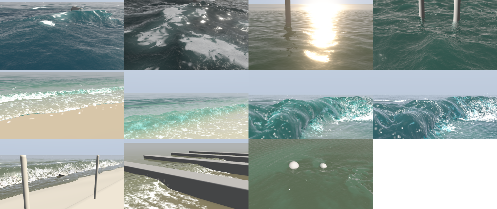
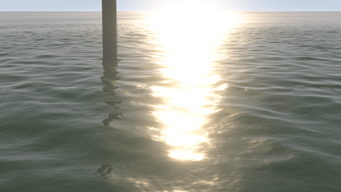
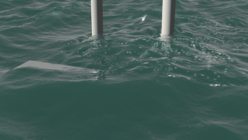
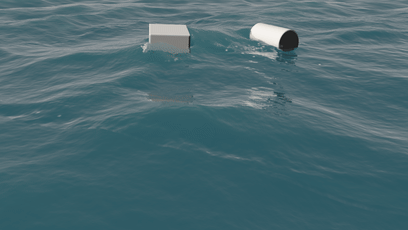
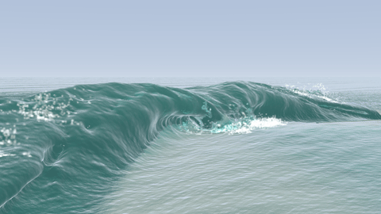
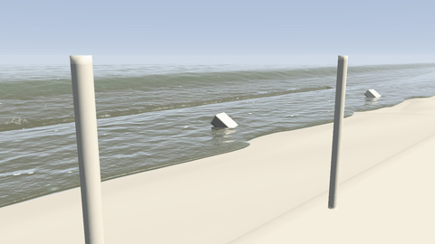
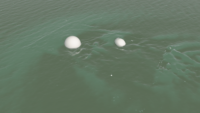

# The sea, surf and rivers

Open water that runs on to the horizon, a real ocean spectrum of waves, whitecaps and foam, beaches and breaking surf, tsunamis and tidal bores, and rivers flowing past rocks.

## Sea presets

| Sea preset | Size | Notes |
|---|---|---|
| Open ocean | 12 m of sea | Wind waves over a long swell, scattered whitecaps and their streaks, a buoy riding it |
| Storm at sea | 16 m, 20 m/s wind | Steep, confused seas breaking everywhere, foam streaks down the wind, overcast |
| Calm lake | 5 m of lake | Glassy water at sunset, a faint swell, drifting patches of breeze (cat's paws) |
| Harbour chop | 5 m, pier posts | Short confused waves slapping pier posts and throwing up spray |
| Beach break | 1 m surf | A swell spilling into white water on a sandy beach and running up the sand |
| Shore break | 1 m wave, close up | A wave rearing up on a steep beach, its lip pitching over a hollow, seen from the water's edge |
| Reef barrel | 2 m tube | A groundswell jacking up over a slab reef: a thick lip thrown over a hollow tube that peels along the reef, seen with a long lens from the channel |
| Big wave | 7 m tube | The reef barrel scaled up four times (every length ×4, every time ×2): a mountain of water throwing a lip as thick as a house |
| Tsunami | 4 m tsunami | A town's seafront from a hotel balcony: the sea draws back, a wall of water breaks into a white bore, floods over the sea wall and carries off boats and cars (13 s) |
| Tidal bore | 60 cm bore | A breaking front running up a river against its current |
| River past rocks | 1.8 m/s | Boulders in a fast river, eddies and foam lines carried downstream past the box |

## Open water

### Open water

*Liquid › Water level* makes the water carry on past the open sides of the box: a pond, a flooded street, the sea. The box fills to that level at the start, waves run out of the box instead of bouncing back (a calming layer along the sides, *Edge absorption*), liquid that heaps up at the edge runs off over it, and the flat water is drawn out to the horizon, blended seamlessly into the simulated surface.

### The open water round the box

The box hands on what happens in it to the open water around it (*Open water area*, advanced: six times the box by default). Its wakes and splash rings spread out across the open water, exact for waves on water of that depth, so a boat's V of wake fans out behind it past the box. Its foam drifts on. The current it makes flows on around other rocks and piers, trailing foam. The sea bed under the open water (colliders, a terrain) makes the sea's waves shoal and break into surf over the shallows, with a sandy bed showing through.

## The sea

### The sea

*Liquid › Wave height* puts a sea on the open water. It is a real ocean spectrum: millions of waves summed by FFT at four scales at once, from swell hundreds of metres long down to ripples a centimetre or two long, running on seamlessly to the horizon. *Wavelength*, *Wave direction*, *Crest spread* (long parallel crests to a confused sea) and *Choppiness* (sharp crests, broad troughs) shape it; *Wind speed* feeds the short waves, so a calm day is glassy and a gale is rough. *Swell height*, *wavelength* and *direction* add a long, smooth swell from a storm far away, on top of the local waves. *Sea depth* (advanced) sets how deep the sea is, so waves on shallow water slow and steepen; *Wave detail* trades memory for crisper close-ups. The box simulates its part of the sea: the sea flows in and out through its sides, so the box carries the same waves, and floating things ride them. Past the box, waves too small for a pixel become roughness instead of shimmer, which also spreads sun glints into a glitter path.

### Sea foam and light

Crests break into whitecaps where they fold over, about as often as on a real sea in that wind (1 % of the surface at 10 m/s, 10 % in a gale; *Liquid look › Whitecaps* scales it). The foam they leave lasts (*Sea foam lifetime*), thins into lace and is drawn out along the wind into streaks (*Foam streaks*), drifting with the wind and the current; under a breaking crest the churned bubbles glow pale turquoise. Sunlight glows green-blue through the thin tops of the waves (*Crest glow*), and *Gusts* darken drifting patches of ripples. *Bottomless* (Liquid look) takes the bottom out of sight for deep water.

## Beaches, surf, surges and currents

### Beaches and surf

Put a sea bed under the waves, for example one of the built-in shapes (a mesh collider with `builtin:beach.png`, `sandbar.png`, `reef.png`, `point.png` or `slab.png`, sized in metres). Set *Liquid › Waves come in* to *Only from where they come from*: the sea flows in and out through that side only, with a boundary that lets the waves reflected off the shore back out (so the box keeps the sea's level), and the other sides become walls, as in a wave tank. Along the waves they are mirrors: past them you see the box's own water reflected, so the break peels on and the run-up carries on along the beach instead of stopping at a wall of glass. The waves slow, steepen and break over the bed in the box: spilling on a gentle beach, plunging on a steep one, and on a slab reef (deep water right up to a steep reef face, as in *Reef barrel*) throwing a thick lip out over a hollow tube that peels along the reef. A long-period swell arrives in sets. The lip and the tube need fine cells (7 cm or so for a 2 m wave) and the whole of the water simulated (turn *Narrow band* off). For white water that looks like surf, raise *Whitewater › Amount* (4 to 6) and *From churning*, set *Minimum speed* about half the wave's speed and *From crests* low, so the foam comes from where the lip lands and the water churns rather than from every steep crest.

### Surges, bores and tides

*Liquid › Surge* adds a single long wave to the sea (*Surge shape*): a solitary wave (a hump that passes), a bore (a front behind which the water stays raised, like a tidal bore running up a river or a flood), or a tsunami: the sea first draws back, baring the sea floor, then a front floods in and the water stays high, as most real tsunamis arrive. It travels at the speed of a long wave, arrives at *Surge arrives*, steepens and breaks into a churning bore over the shallows and runs up any beach in the box; with a surge the box's side past the shore lets the flood pour on inland. Floating colliders (cars, boats) ride it and are carried along. Keyframe *Water level* for a tide.

### Currents

*Liquid › Current* makes the open water flow past: a river, a tidal channel. The water enters the box on one side and leaves on the other, around posts and rocks, trailing a wake. The ripples and the sea's waves on the open water drift with it, and past the box the current carries on around other obstacles, with lines of foam.

