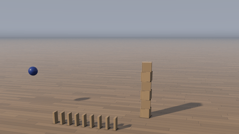
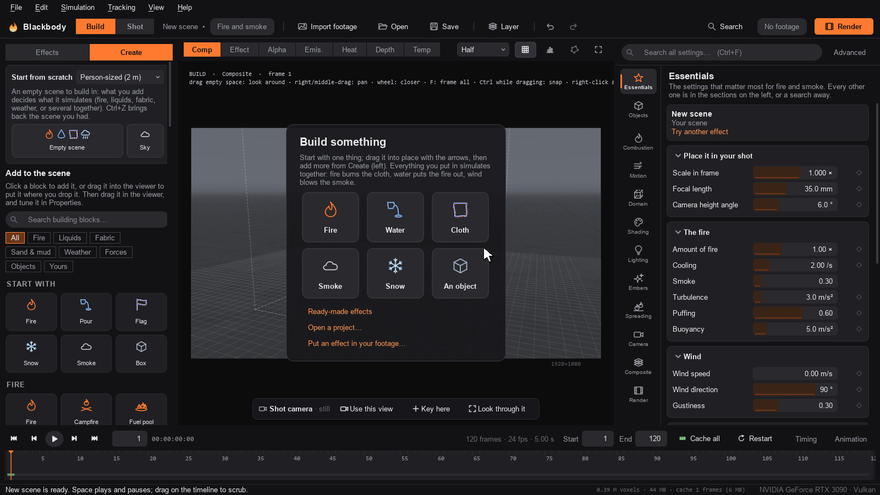
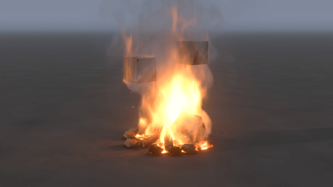
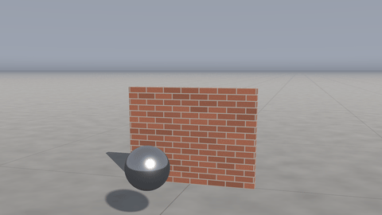
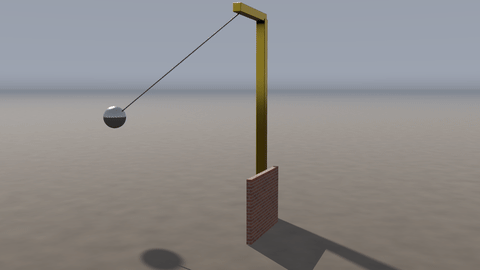
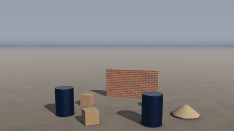
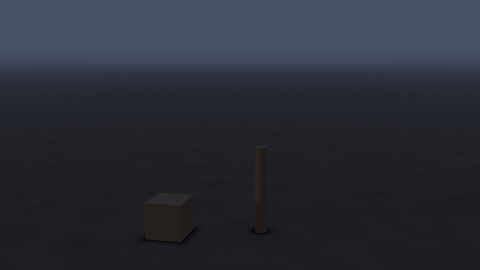
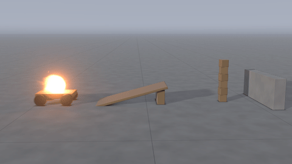

# Things that fall

Any object (collider) can fall: it drops, tumbles, slides, bounces, stacks and knocks into other things, and the smoke, the water and the wind push it about. Turn on *Falls* in its Properties (*Physics*), or add one from the *Things that fall* group in Create. It works in every kind of scene: a crate dropped into a campfire, a boulder into a pond, a tower of blocks knocked down in an empty set.

## Making something fall

- *Falls* makes the object a free rigid body. Its keyframes now set only where it starts: from there it moves by itself.
- *Falls from* is when it is let go, in seconds from the first frame. Until then it is held where its keys put it, so it can be carried or lifted into place and then dropped. Negative values drop it during the pre-roll, so it has landed when the shot starts.
- *Thrown at* gives it a speed when it is let go (a thrown ball, a launched crate), and *Spinning at* a spin. One with moving keys also carries on at the speed its keys gave it.
- *Material* is what it is made of: how heavy, slippery and bouncy it is, and how it looks. *Density*, *Friction* and *Bounce* set their own values where you need them (0, or -1 for friction and bounce, uses the material's).

The *Things that fall* blocks are real size: a falling box, a bouncy ball, a 1 m boulder, a thrown steel ball, a steel drum, a domino run, a tower of blocks and a stack of crates.

## Materials

| Material | Density (kg/m³) | Friction | Bounce | Look |
|---|---|---|---|---|
| Wood (pine) | 550 | 0.45 | 0.35 | grain and knots |
| Stone (granite) | 2650 | 0.6 | 0.25 | speckled crystals |
| Concrete | 2400 | 0.65 | 0.2 | blotches and pores |
| Brick | 1900 | 0.6 | 0.15 | bricks and mortar |
| Steel, aluminium | 7850, 2700 | 0.45 | 0.45 | brushed metal |
| Glass, ice | 2500, 917 | 0.5, 0.05 | 0.5, 0.25 | clear: they refract what is behind them |
| Plastic, rubber | 950, 1100 | 0.35, 0.9 | 0.5, 0.8 | glossy, matte |
| Ceramic, cardboard, foam | 2300, 120, 40 | | | |
| Painted metal, plaster wall, fabric, earth | | | | |

The numbers are handbook values. Friction is the Coulomb coefficient: a block on a slope slides once the slope is steeper than the angle whose tangent is its friction (24° for wood). Bounce is the share of its speed a thing keeps off a hard floor. A hollow everyday thing uses its weight over the space it takes up: a cardboard box 120 kg/m³, a crate of slats about 300.

## What moves them

- **Each other and the ground.** Things stack and stand in towers, slide and roll, and knock each other over. Objects that stay put hold them up; keyframed ones push them (a door swinging into a pile of boxes, a car through crates). A fixed mesh holds them on its real shape (things rest between the logs of a pile, on stairs); a falling mesh collides as its outline (its convex hull). An image heightfield is terrain they land and roll on.
- **The air.** The gas pushes them with its drag, measured around each one every frame: a blast blows light things away, a fire's updraft lifts paper, wind slides a cardboard box. They push the gas back as they move, as every moving object does: a falling crate shoves the smoke aside.
- **Water.** In a liquid scene they float or sink by their density, bob, drift with the flow and tip, as *Floats* objects do (*Falls* also lets them fall through the air first).
- **Fire.** A *Burnable* one with Spreading fire on catches where flames touch it and keeps burning as it tumbles: its fire is in its own frame.

Things attached to a falling object (*Attach to* in the viewer's menus) go with it: a fire on a crate, a lamp on a swinging sign, the pins of a flag on a falling pole.

## Breaking

*Breaks* (Properties › *Breaking*) cuts an object beforehand into pieces glued together, which come apart where it is hit or loaded harder than it holds. A wall is knocked through, a pane shattered, a vase smashed, a crate splintered. A joint gives way when it is pulled apart harder than its strength over its area, sheared harder than that plus the friction of what presses it together, or bent past what its section holds. So a wall stands under its own weight, a soft knock cracks it, and a hard one brings it down, the bricks above the hole caving in.

- *Breaks into*:
  - *Chunks*: stone, concrete, pottery.
  - *Bricks*: a box laid as bricks in running bond, held by mortar.
  - *Shards*: glass, slivers radiating from where it is hit.
  - *Splinters*: wood, pieces long along the grain.
- *Pieces*: how many (more take longer to simulate).
- *Strength* scales how strongly the pieces hold.
- *Held by*: what holds one that does not fall: glued to the ground along its base (a wall), held round its edges (a pane in its frame), or nothing.
- A hollow object (*Hollow* above 0) breaks as a shell: a vase into strips of its wall, a crate wall by wall.
- With *Falls* on too, it falls whole until it hits something hard enough: a dropped vase shatters, a thrown crate splinters.

Broken faces show the material's inside: raw brick, pale wood, the green edge of glass. Where it breaks it throws up dust, as much as the material holds (mortar, plaster and soil most, glass hardly any), in the smoke's colour (Shading › *Smoke colour*: a pale brown for dust). Hundreds of pieces are drawn, shadowed, hide the fire and the liquid behind them, and the gas and the water flow round them and are pushed by them.

The *Things that fall* blocks include a brick wall, a glass pane in its frame, a concrete pillar, a wooden crate that splinters and a vase. Presets: *Ball through a brick wall*, *Stone through a window*, *Vase off a table*.

## Breaking and burning

An object that both *Breaks* and is *Burnable* (with Spreading fire on) burns piece by piece. Each piece heats where flames or hot gas touch any part of it, or from a burning piece glued to it as the fire creeps across, and catches. It burns through its fuel over Spreading fire's *Burn time*, longer the thicker it is, giving the fire its fuel, heat and smoke. Then it smoulders, glowing as it dies down, and most pieces crumble to ash, while some stay as black charcoal. The glue between two pieces is only as strong as the less charred of them lets it be, so a burning structure sags and falls in: a post burnt through at its foot topples, and a shed's posts give way under its roof. Pieces that have fallen burn on where they lie.

Preset: *Shed on fire*, a fire inside a wooden shed, its posts, walls and roof all breakable and burnable.

## Joints and ropes

*Joined by* (Properties › *Joint*) holds an object to another object or to a fixed point. An object with a joint falls (it needs no *Falls*).

- **A rope** holds it at its length: it hangs and swings, goes slack when it is thrown up or knocked toward where it hangs from, and is caught again with a jolt. *Rope length* is how long it is (0: as long as it is at the start). *Rope is* draws it as a rope or a steel cable, hanging in a curve when it is slack, and *Thickness* is how thick.
- **A spring** pulls it back toward its length at rest (*Rope length*) with *Spring stiffness* newtons for every metre it is stretched. A weight on a spring bounces with the period 2π√(m/k) and settles stretched by its weight over the stiffness.
- **A hinge** lets it turn about one line only (*Hinge axis*, in its own frame, through *Joint on it*): a door, a gate, a lid, a seesaw, a wheel on its axle.
- **A ball joint** lets it turn any way about one point (*Joint on it*): a pendulum on a rod, a sign hanging from a bracket.

Where it is held:

- *Joined to* is the name of the object at the other end: a beam, a crane's jib, a moving arm it is carried by, or another falling thing (two crates tied together). Empty, it hangs from *Anchor*, a fixed point.
- *Joint on it* is where it is held, in its own frame ((0, 0, 0) is its middle). A rope or a spring held at its middle is tied where its surface faces the other end: the top of a ball hanging from above. *Joint on the other* is where the rope or the spring is tied on the object it is joined to.
- A hinged or ball-jointed object spins about its joint when it is given *Spinning at*: a door pushed open turns about its hinges.
- *Joint friction* slows a hinge or a ball joint down: at 0 it swings for ever, at 0.5 a door settles in a couple of seconds.
- *Breaks at* is the force it gives way at. A rope snaps when it is jerked harder than that (a weight that falls before its rope catches it pulls several times its weight), and a hinge tears out of a door too heavy for it.

The *Ropes and hinges* blocks are a wrecking ball on a crane, a rope swing, a door on hinges in its frame, a hanging lamp (its light swings with it), a weight on a spring and a seesaw that flips a ball into the air. Preset: *Wrecking ball*, through a brick wall.

## Explosions

An emitter's *Blast* (in its *Motion* settings) is an explosive charge, in kilograms of TNT, that goes off when the emitter ignites (*Ignite at*). Its blast wave throws every object that falls away from it, at the speed its impulse gives the object: the impulse on the face toward it, falling off as one over the distance and growing as the charge to the power two-thirds. A kilogram a metre off gives 400 Pa s (the shock's impulse, doubled as it reflects), enough to throw a 40 cm wooden crate at 5 m/s. Breakable things are blown apart: each piece takes its own push, and the joints between pieces thrown apart break. Sand, snow, mud, jelly and clay are thrown too ([Sand, snow and mud](matter.md)). The emitter's own burst (*Fuel*, *Temperature*, *Burst speed*) makes the fireball and the smoke.

The *Explosion* block in Create › *Fire* is a 2 kg charge with its fireball. Preset: *Blast in a yard*.

In the viewer each charge is marked where it is, as a burst the size of its fireball, bright as it goes off, with its weight and the frame it goes off on.

## Lightning

A light of the *Lightning* kind is a bolt from its *Position* to where it *Strikes*. Its channel is jagged at every scale, as real lightning is (about 1.4 times as long as the straight line), with branches that light up only in its first flash. It flashes a few times down the same channel (*Flashes*: its return strokes, tens of milliseconds apart, each fading in about 20 ms). Its core glows white-hot, with a halo in the air round it, and through the flash it lights the set and the smoke like a row of lamps down its channel (*Intensity*). Where it strikes it starts a fire (*Sets fire where it strikes*), which catches whatever will burn there when Spreading fire is on. *Branches*, *Thickness* and *Bolt seed* shape it.

The *Lightning* block is in Create › *Lights*. In the viewer its channel is drawn from where it starts to where it strikes; select it and drag the diamond at the bottom over the ground to choose where it strikes. Preset: *Lightning strikes a post*.

Lightning is drawn on the stage, so in sky scenes, where there is no stage, it does not show yet.

## Tilted objects

*Tilt* and *Roll* (Properties › *Shape*) tip an object over, after its *Rotation* about the vertical. *Tilt* leans its top toward its front (it turns about its own sideways axis); *Roll* leans its top to its left (about its own front-to-back axis). A plank tilted 20° is a ramp; a wall can lean, a wheel lie on its side or stand on its rim. Everything meets it at its slope: smoke slides up its underside, water runs down it, sand piles on it, cloth drapes over it, and a falling thing slides down it if the slope is steeper than its friction angle (a wooden box on a wooden plank: past 24°) and stays put if not. Keyframe *Tilt* or *Roll* to tip a tray or flip a flap: what is on it is thrown by its turning.

The *Ramp* block (Create › *Objects*) is a 2 m plank propped up at 20°. *Ball down a ramp* (*Things that fall*) rolls a steel ball down one into a row of dominoes.

## Motors

A hinge with a *Motor speed* (Properties › *Joint*, in turns a minute) is driven round at that speed: anticlockwise looking down its *Hinge axis* from its tip (negative: the other way). *Motor strength* is the most turning force the motor has, in newton metres. The motor gets up to speed as fast as that can turn what it drives, and holds the speed against the load; a load too much for it (an arm too heavy to lift, a cart on too steep a slope) stalls it. The motor pushes back on what it is joined to: four wheels hinged to a cart drive the cart along, and a fan on a fixed post just turns. Keyframe *Motor speed* to start, speed up or stop it: keyed down to 0, it brakes.

The *Machines* blocks (Create › *Machines*) are a motor cart (four rubber wheels at 30 turns a minute: it drives off at half a metre a second), a turntable that spins up until the blocks on it fly off, and a windmill whose sails stir the smoke. Preset: *Cart off a ramp*, a burning cart that jumps a ramp into a tower of blocks.

## How they look

Without footage, objects are drawn in CG in their materials (wood, stone, brick and so on), lit in the same light as the smoke: the key light with soft shadows, the sky (darker in corners and under things), the fire's own light with shadows, and the lights in the set. Glass and ice are clear: you see the fire and the set through them, bent, and the sky in them. *Own colour* draws one in a colour of its own. What fire does to a burnable object shows: it browns as it heats, blackens as it burns, with embers glowing in its char, then greys with ash and dies down to a dull red smoulder. The floor where it has burnt (Spreading fire, *Ground*) blackens the same way.

Behind them is the stage (Composite › *No footage*): a floor out to the horizon under a sky in the ambient light of Lighting (or the environment HDRI), or a flat background colour. *Floor* is what the floor is made of: studio grey, concrete, wooden boards, tiles, dirt, grass, sand or a 1 m checker for judging scale. The fire lights the floor and the objects around it, and smoke shades them. Presets keep the flat background they were made on; set *Backdrop* to *Floor and sky* to put them on the stage.

## In your footage

*Look* says how an object is drawn: *CG*, *In the footage*, or *Automatic*. Automatic is CG without footage, and with footage for things that fall or float (they cannot be in your footage). An object *In the footage* stands in for the real thing in the shot: it is not drawn, but it hides the fire behind it, and the CG objects behind it.

CG objects go over the footage lit by the shot's light, and their shadows darken the footage where they fall on the ground or on an object in the footage. The footage's depth pass and matte hide them behind the real things in the shot.

 beside a fire in a shot: lit by the fire and the key light, with their shadows on the real ground.")

## Limits

- A scene holds up to 16 objects in all, falling or not (a broken one's pieces do not count: there can be hundreds).
- A mesh cannot break yet.
- A rope or a spring passes through things in its way: only its ends are held (it does not wrap round a post), and it
  weighs nothing. Each object has one joint; hang a chain as links, each joined to the one above.
- The strengths are effective ones, set so that things break as they look like they should: a joint feels the whole
  impact spread over its face, where a real brittle thing breaks at the tiny point it is hit.
- A falling mesh collides as its convex hull: its hollows and dents are filled in.
- Contacts are slightly soft, so bounces are within about 0.05 of a material's bounce, and the least a thing bounces is about 0.2. Things that start inside each other are thrown apart when they are let go (the log says which).
- In a liquid scene with grey stand-ins (Water › *Colliders*), things that fall or float are drawn as stand-ins in their material's colour.
- A motor holds its speed, not its angle: things on separate motors drift a little out of step when their loads differ. Give one balanced part one motor (the windmill's sails are two bars crossed on its hub).
- Emitters still turn only about the vertical: an emitter attached to a tilted object keeps upright.

Under the hood, MuJoCo (Apache-2.0) integrates the bodies: their contacts, friction and stacking, with the time step their size needs. The gas, the water and the cloth see them as moving objects every substep.
