# Presets

Blackbody comes with 100 presets. Click one in the app's Effects panel to load it into your shot; every one is an ordinary scene you can change and save as your own. On the website the gallery plays a clip of each one that has one: <https://gjnail.github.io/blackbody/presets.html>.

## Fire and smoke

| | Preset | Notes |
|---|---|---|
| 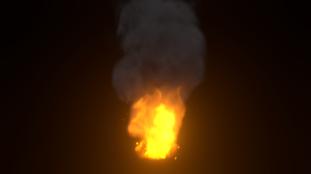 | **Campfire** 1.2 m flames | A wood campfire on the ground: lively flame tongues, grey smoke, a steady stream of embers. |
| 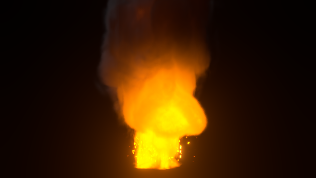 | **Bonfire** 5 m flames | A large pile of burning wood: tall rolling flames, a thick smoke column and a heavy shower of embers. |
| 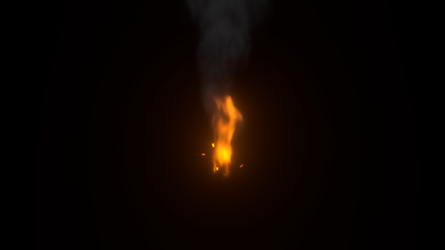 | **Torch** 40 cm flame | A hand-held torch head in mid-air: a compact, fast-flickering flame with a thin smoke trail. |
| 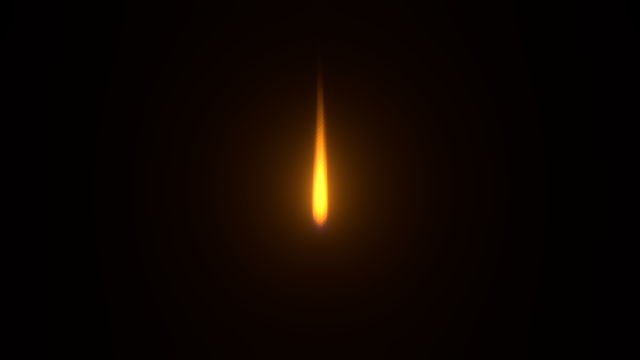 | **Candle** 4 cm flame | A single candle flame: calm and teardrop-shaped with a blue base. Pair with a slight breeze for flicker. |
| 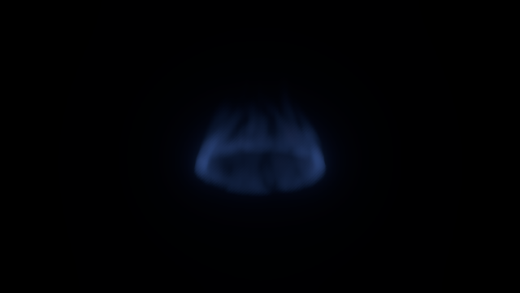 | **Gas burner** 10 cm flames | A ring of clean gas flames: blue at the base, almost no smoke. |
| 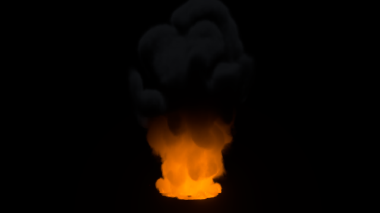 | **Fuel spill** 3 m flames | Burning petrol spread on the ground: pulsing orange flames and thick black smoke. |
| 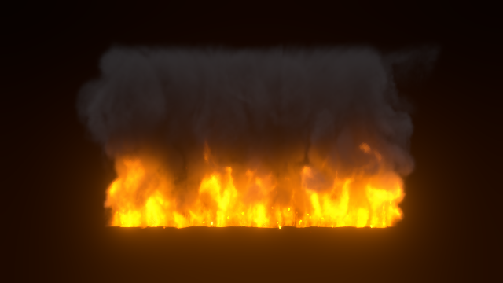 | **Fire line** 6 m long | A line of burning ground, like a fuel trail or the edge of a grass fire. |
| 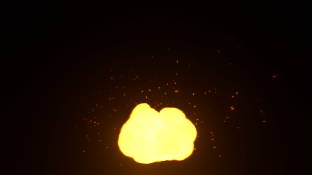 | **Fireball** 8 m ball | A fuel-air fireball: a blazing burst that rolls up into a cauliflower ball of flame, then a dark smoke column. |
| 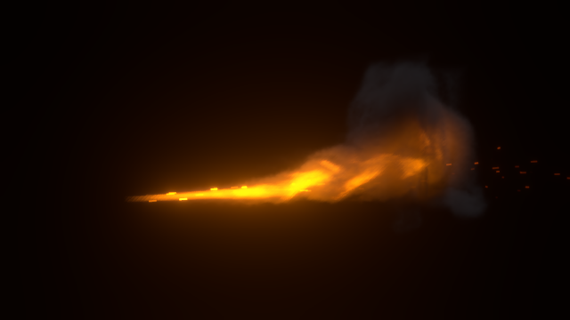 | **Flamethrower** 7 m jet | A pressurised jet of burning fuel that curls upward as it slows. |
| 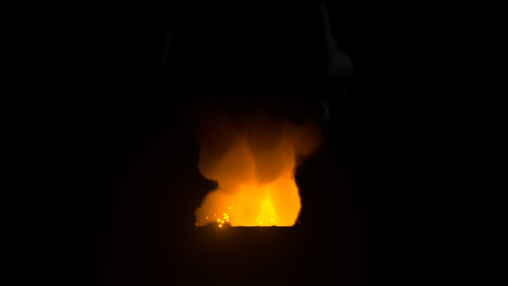 | **Vehicle fire** car-sized | Flames over a car-sized body with heavy black smoke. Place the collider box over the car in your footage. |
| 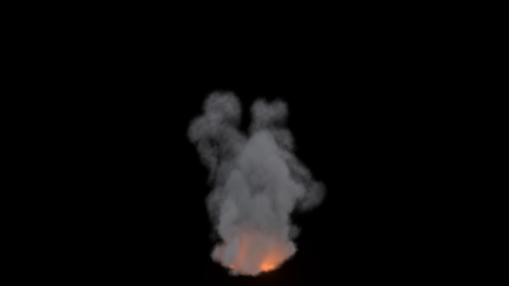 | **Smoke plume** 6 m column | Smouldering smoke with no visible flame, for aftermath shots. |
| 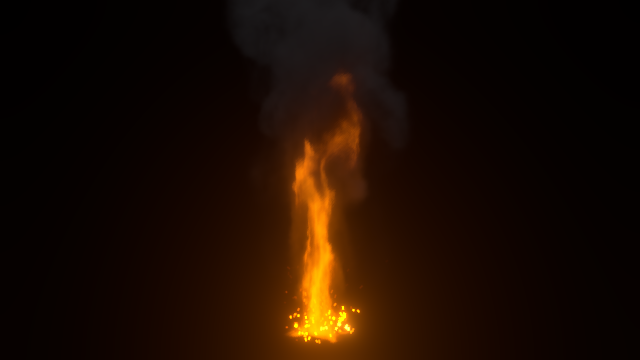 | **Fire whirl** 8 m column | A pool of burning fuel drawn into a spinning column of flame: a fire tornado. The emitter's Swirl sets the spin. |
| 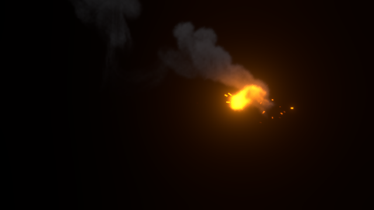 | **Waved torch** 40 cm flame, swinging | A torch swung back and forth: the flame and its embers trail behind the moving head. Keyframe an emitter's position to move it. |
| 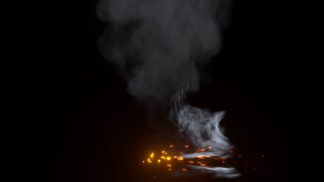 | **Fire put out** 1.2 m flames, hosed | A campfire hit by a hose after a second and a half: the flames collapse and the fire turns to billowing steam. |
| 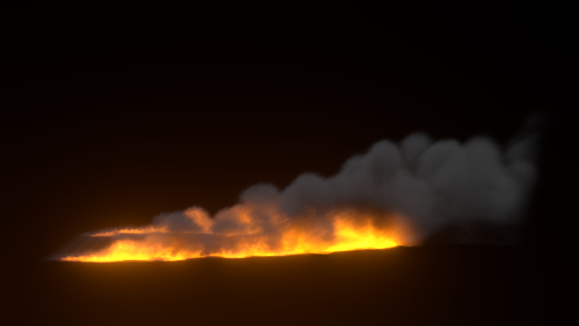 | **Grass fire** spreading in wind | A dropped torch lights dry grass and the wind drives the fire front across the ground. Spreading fire burns the floor by itself. |
| 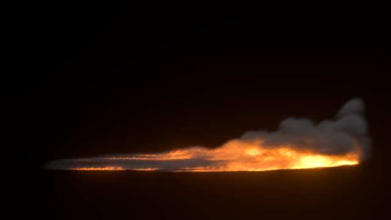 | **Spot fires** wind-driven embers | A strong wind throws burning embers ahead of a grass fire; where hot ones land they start new fires, which the wind then joins up. Spreading fire › Spot fires. |
| 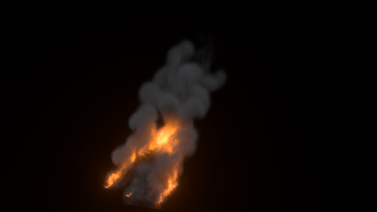 | **Fire running uphill** 8 m slope | A fire lit at the foot of a grassy slope runs up it, driven by the breeze that climbs the hill and by its flames leaning onto the unburnt grass above. The slope is a heightfield: a greyscale image used as a Burnable mesh collider. |
| 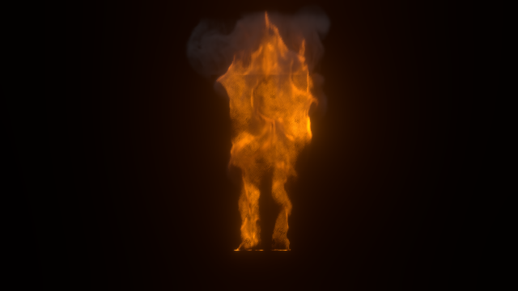 | **Curtain catching** 2.4 m curtain | A small flame at the hem of a curtain climbs it and spreads across. The curtain is a collider marked Burnable. |
| 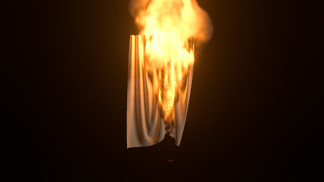 | **Burning curtain** 2.4 m curtain | A lighter at the hem of a real cotton curtain: it catches, the flames race up it, and it chars, burns through and falls apart in about ten seconds, feeding the fire as it goes. The curtain is a Fabric: try silk, wool (it puts itself out) or polyester (it shrinks away and melts). |
| 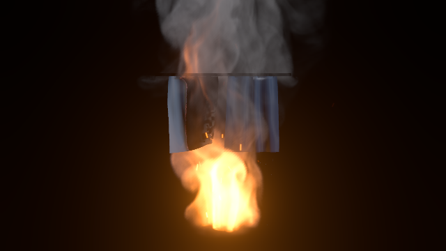 | **Wet and dry towels** 70 cm towels | Two cotton tea towels hung over a fire on a cold, damp morning. The dry one catches and burns away in seconds. The soaked one drips, steams and holds at 100 C while the fire boils its water off, and outlasts it: it cannot catch until it has dried. Wet at start, on a Fabric, sets how soaked it is. |
| 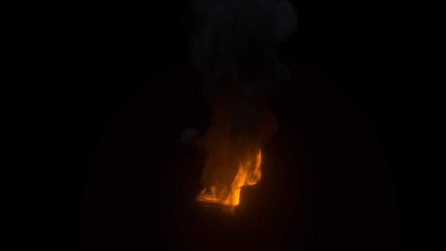 | **Burning armchair** mesh, 1 m | Fire spreading over an armchair from a flame on its seat. The chair is a mesh (OBJ) collider marked Burnable: use your own model the same way. |
| 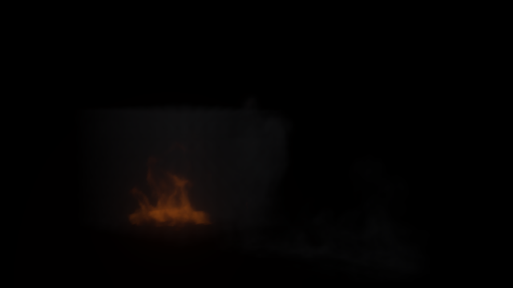 | **Starved room fire** room, 2.6 m | A fire in a closed room uses up its air and dies down, filling the room with hot smoke and unburnt fuel that leaks under the door. When the door slides open at 6 s, fresh air gets in and flames roll out of the doorway. Uses tracked air and a moving collider. |
| 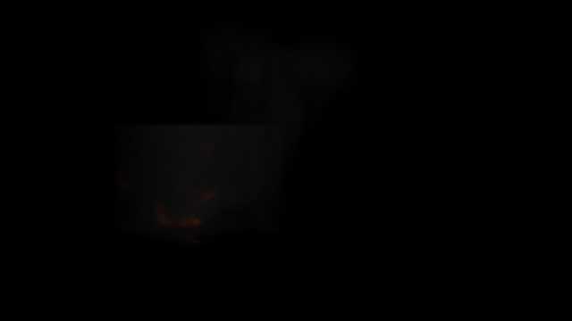 | **Backdraft** small room, 1.6 m | A fire in a shut room uses up the air and dies back, filling the room with hot, fuel-rich smoke. When the door slides open at 4 s the smoke pours out of the doorway, meets fresh air and ignites, and the flames roll back in along the air coming in. Soot blackens the ceiling and the door frame. Uses tracked air, Flame speed and Soot stains. |
| 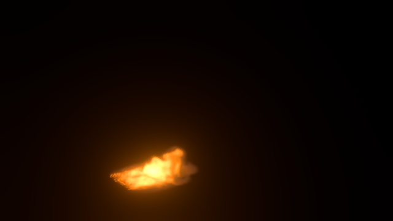 | **Fuel spill flash fire** 3 m of spilled petrol | Petrol vapour from a spill creeps along the ground, heavier than air. A spark at 3 s lights its edge and a flame front runs back across the vapour to the puddle, which keeps burning. Uses Flame speed and Fuel vapour weight. |
| 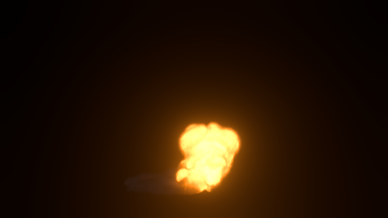 | **Gas cloud ignition** 5 m cloud | A burst of propane spreads into a low cloud that drifts onto a pilot flame at about 2 s: a flame front burns through the whole cloud in half a second and it swells into a fireball. Uses Flame speed, Fuel vapour weight and Heat expansion. |
| 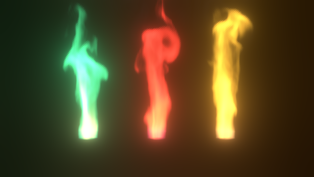 | **Coloured flames** 3 burners | Three burners dosed with flame colourants: copper (green), strontium (red) and sodium (orange). Set any emitter's Colourant to colour its flame. |
| 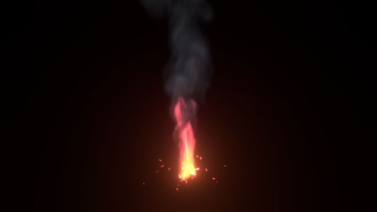 | **Road flare** 20 cm flame | A burning road flare on the ground: a searing strontium-red flame, white smoke and red sparks. |
| 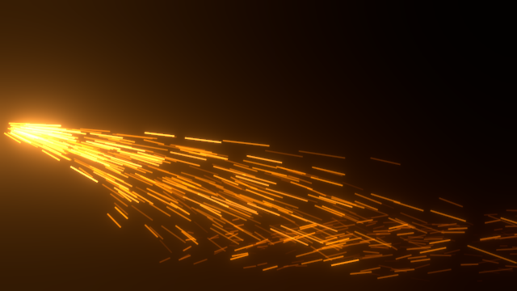 | **Grinder sparks** angle-grinder cut | A spray of white-hot metal sparks from a cut: launched in a narrow cone, falling at full gravity and skittering off the floor. |
| 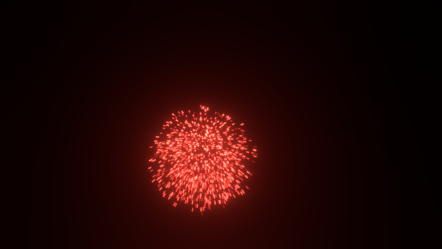 | **Firework bursts** 20 m bursts | Three shells bursting into stars: red strontium, green copper and gold. Each star takes its emitter's colourant colour. |
| 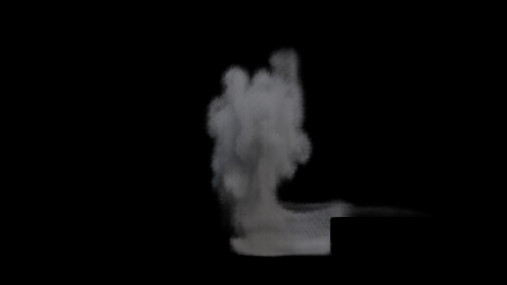 | **Car through smoke** car at 30 km/h | A car drives through a smoke column and drags it along in its wake. Keyframe a collider's position to move it. |
| 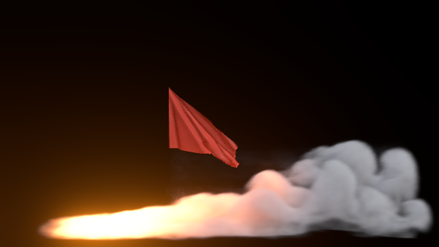 | **Flag in smoky wind** 1.5 m flag | A nylon flag on a pole streams and flutters in a gusting wind while the smoke of a fire upwind blows past it; the flag stirs the smoke behind it. The flag is a Fabric held by one side: change its material, size or the wind. |
| 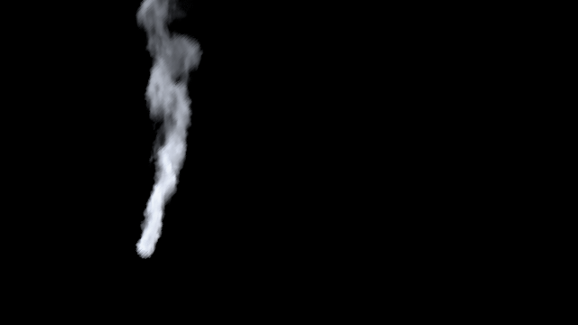 | **Kettle steam** spout plume | Steam from a kettle spout: clear right at the spout, clouding over as it cools, then evaporating as it mixes into the room. |
| 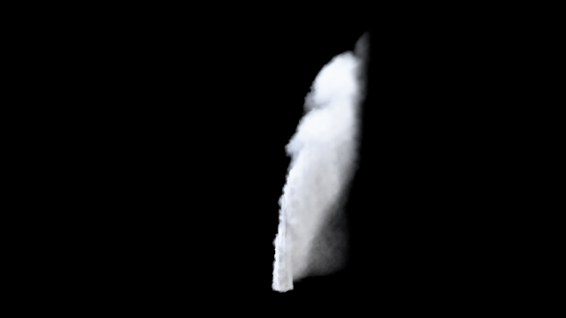 | **Steam vent** 6 m plume, cold day | A pipe venting steam into freezing air: a dense white column that billows and thins as it rises. |
| 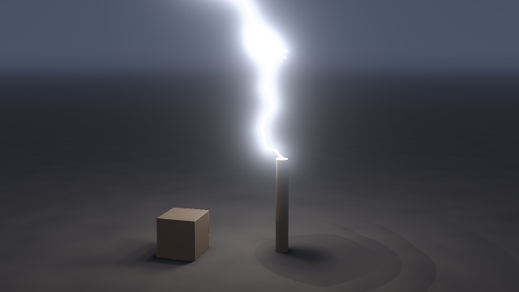 | **Lightning strikes a post** 4 m bolt | At dusk, lightning strikes a wooden post: three flashes down a branching channel light up the yard, and the post catches and burns. A light of the Lightning kind, and Spreading fire. |
| 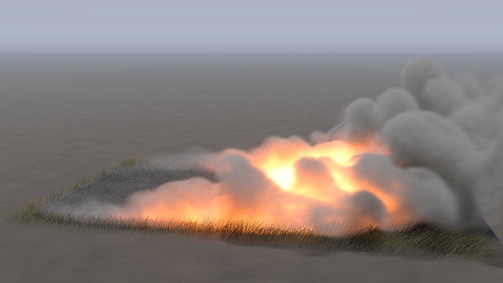 | **Meadow fire** 8 m field of long grass | A line of fire lit along the edge of a field of dry long grass: the wind drives the front across it, the grass bending ahead of the flames, catching, burning down to black stubble and feeding the fire as it goes. Grass & plants: Long grass, dried. |

## Things that fall

| | Preset | Notes |
|---|---|---|
| 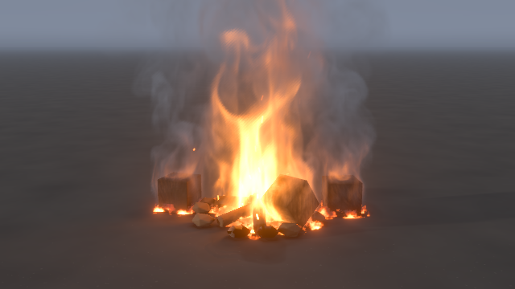 | **Crates into a fire** 1 m campfire | Three wooden crates dropped onto a campfire one after another: they land on the burning logs, shove the smoke aside, catch and burn. Burnable objects with Falls on, and Spreading fire. |
| 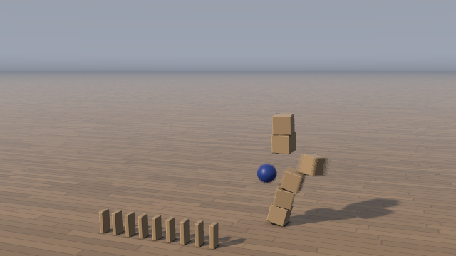 | **Knocking down a tower** 1.2 m tower | A bowling ball thrown into a tower of wooden blocks beside a run of dominoes, on the stage in sunlight: the blocks tumble and bounce, the dominoes fall in turn. Objects with Falls on, drawn in their materials. |
| 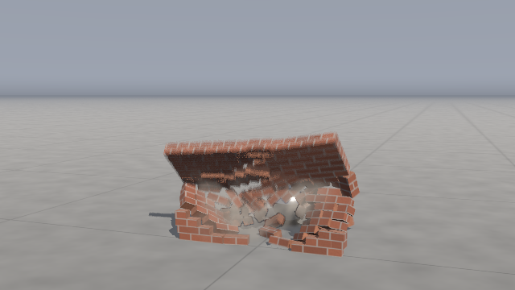 | **Ball through a brick wall** 1.6 m wall | A 260 kg steel ball into a brick wall: it punches through, the mortar gives way brick by brick, the wall above it caves in and the dust rolls out. A breakable box in Bricks. |
| 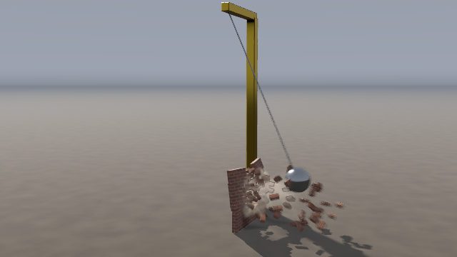 | **Wrecking ball** 2 m wall | A 900 kg wrecking ball on a crane’s cable swings down into a brick wall at 6 m/s and bursts through it in a cloud of dust. An object joined to the crane by a rope (Properties › Joint) and a breakable box in Bricks. |
| 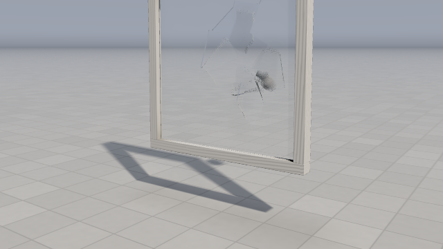 | **Stone through a window** 1 m pane | A stone thrown through a pane of window glass held in its frame: it punches a hole, shards break away round it and fall, the rest stays in the frame. A breakable thin box of glass in Shards. |
| 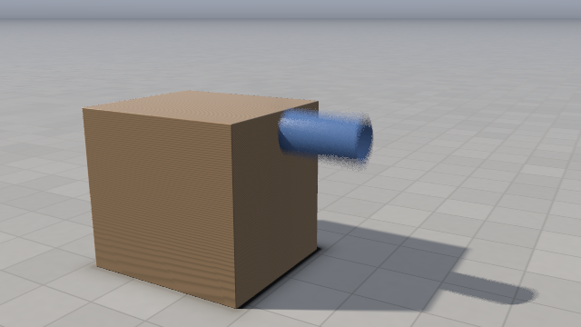 | **Vase off a table** 35 cm vase | A pottery vase knocked off the edge of a table: it tips, falls a metre, lands on its rim and shatters across the tiles. A breakable hollow cylinder of Ceramic. |
| 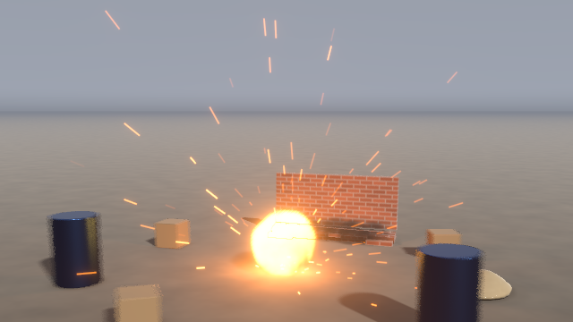 | **Blast in a yard** 2 kg charge | Two kilograms of explosive go off among crates, barrels, a brick wall and a heap of sand: a fireball, the crates and barrels thrown clear, the wall blown down brick by brick, the sand flattened, then a column of smoke. An emitter with Blast set. |
| 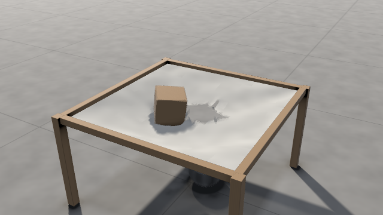 | **Ball through a sheet** 2 m sheet | A crate dropped onto a cotton sheet laced into a frame lands in it and rests, the sheet sagging under it. Then a steel ball dropped beside it rips a ragged hole: the crate tips in after it, both fall through, and the torn flaps hang down. Fabric held by all its edges, with Tears on; objects with Falls on. |
| 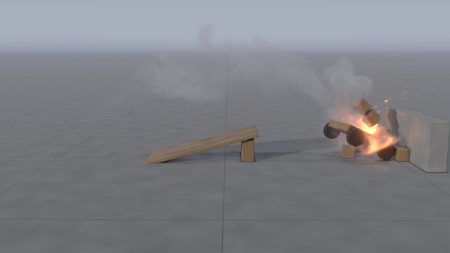 | **Cart off a ramp** 1 m cart, 6 m run | A cart with a fire on its back, its four wheels turned by motors, races up a ramp, jumps off its end and bowls over a tower of blocks, trailing flame and smoke, and brakes into a barrier. Motors on hinges (Joint › Motor speed, keyed down to brake), a tilted plank (Shape › Roll) and a fire attached to the cart. |
| 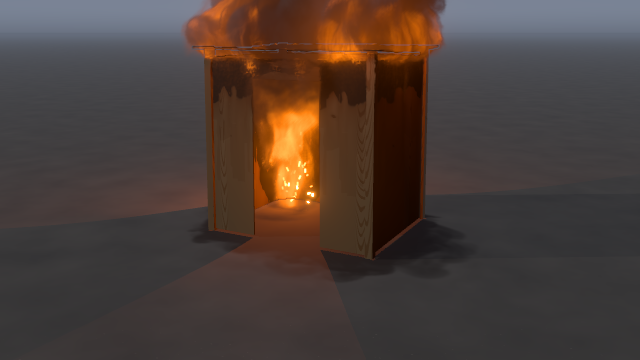 | **Shed on fire** 2 m wooden shed | A fire inside a wooden shed: its walls and posts catch, char and weaken until the posts burn through, the roof falls in and the walls break up, the burnt pieces smouldering and crumbling to ash. Objects that are both Breakable and Burnable burn piece by piece. |

## Sand, snow and mud

| | Preset | Notes |
|---|---|---|
| 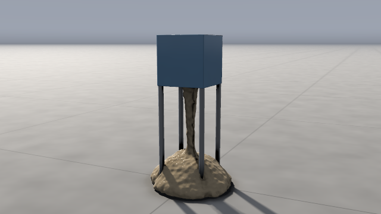 | **Sand from a hopper** 40 cm hopper | Forty litres of dry sand run out through a hole in the bottom of a hopper on legs and build a heap at its angle of repose round the legs. Matter in Sand, filling a hollow box with an opening in its floor. |
| 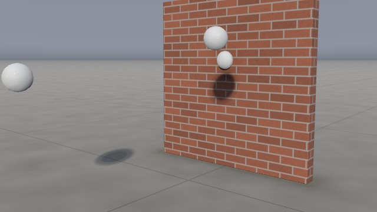 | **Snowballs at a wall** 18 cm snowballs | Three snowballs of packing snow thrown one after another at a brick wall: each squashes where it hits and sticks to the bricks. Matter in Packing snow, thrown. |
| 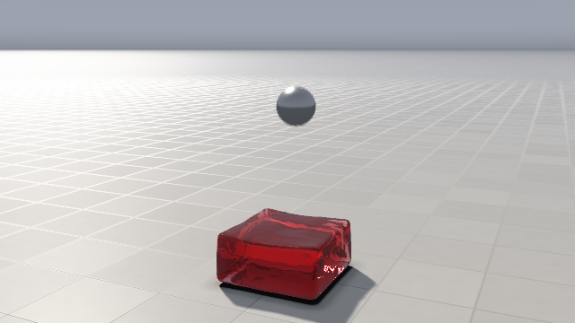 | **Ball dropped on jelly** 34 cm block | A 7 kg steel ball dropped onto a block of jelly: the jelly squashes deep, throws the ball back up and wobbles. Matter in Jelly and an object that falls, pushing each other. |
| 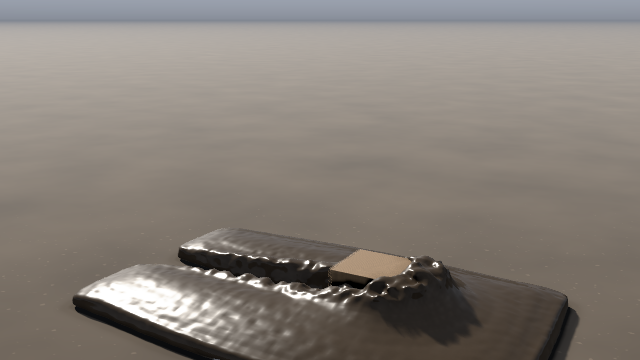 | **Crate through mud** 1.6 m of mud | A crate dragged through a bed of thick mud: it ploughs a trench, pushes up a bow wave that slumps back, and leaves ridges. Matter in Mud, and an object moved by its keys. |
| 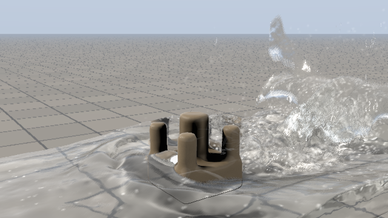 | **Sand castle and a wave** 32 cm castle | A wall of water let go at a castle of damp sand: the wave breaks over it and the castle stands, then the water soaks into it, undermines it and slumps it into a mound that the sloshing water carries. Matter in Wet sand and a block of water in a closed box. |
| 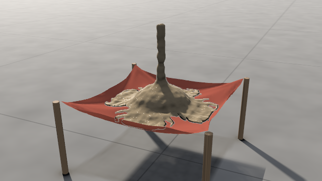 | **Sand into a sling** 90 cm sheet | Sand poured onto a cotton sheet tied to four posts: it heaps in the dip it makes, the sheet sagging under its weight, and not a grain gets through. Matter in Sand, poured; Fabric held by its four corners. |
| 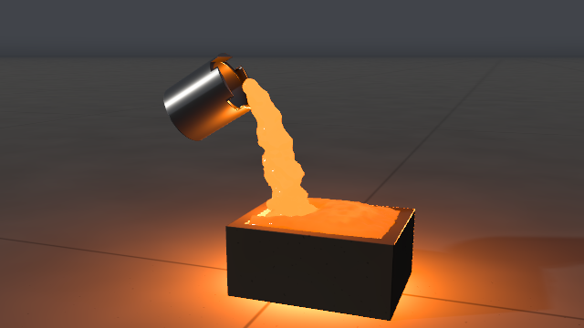 | **Pouring molten iron** 3 litres of iron | Molten iron at 1320 °C poured from a ladle into a mould: it glows orange and lights the floor round it, fills the mould, and dims to red as its skin cools and sets. Matter in Molten iron, poured. |
| 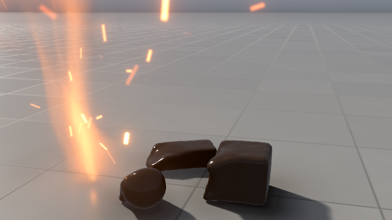 | **Chocolate by a fire** 20 cm flames | Three pieces of chocolate on a slab beside a small fire: its radiant heat softens the side of each that faces it, the nearest first, and they slump and run into glossy puddles. Matter in Chocolate, with Heat speed 30 (it melts some thirty times quicker than for real). |
| 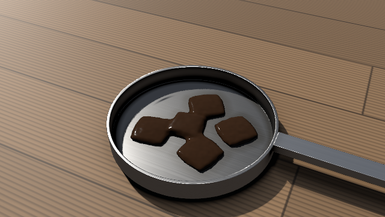 | **Chocolate in a hot pan** 24 cm pan | Squares of chocolate dropped into a steel pan at 180 °C: they melt from the bottom where they touch it, slump into glossy pools and run together. Matter in Chocolate; the pan’s Temperature 180 °C; Heat speed 60 (it melts some sixty times quicker than for real). |

## Water

| | Preset | Notes |
|---|---|---|
| 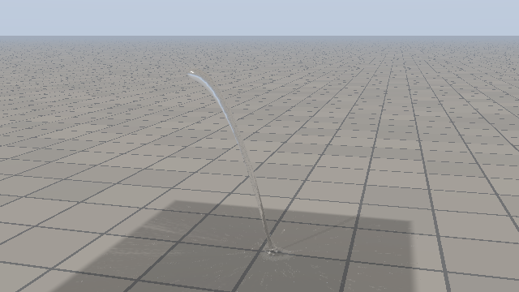 | **Pouring water** 80 cm pour | A steady stream of water poured from knee height onto the ground, splashing and spreading into a puddle. |
| 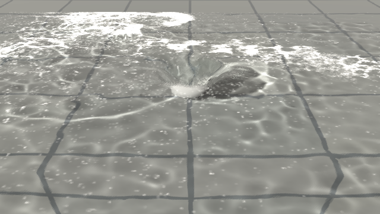 | **Rock into a pond** 15 cm rock | A rock dropped into still water: the crown splash, the cavity closing into a rebound jet, rings spreading out. The rock itself is a collider: put it in your footage or render it separately. |
| 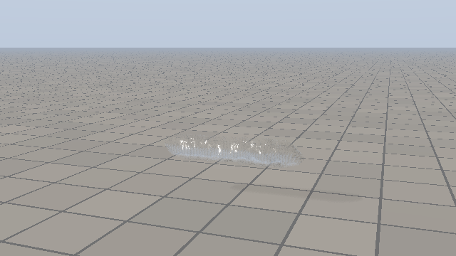 | **Thrown bucket** 8 litres | A bucket of water thrown forward: the mass spreads into sheets and drops in flight, then slaps onto the ground. |
| 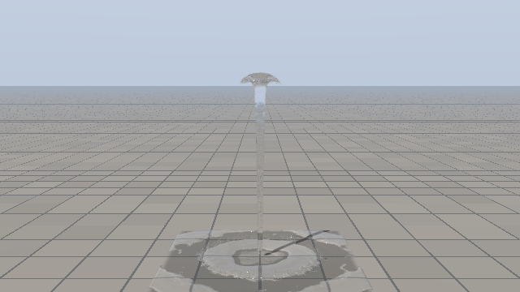 | **Fountain jet** 1.2 m jet | A vertical fountain jet that rises, breaks up at the top and rains back down onto the ground. |
| 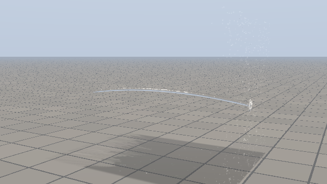 | **Hose on a wall** 1.5 m jet | A garden hose sprayed at a wall: the jet hits, fans out across the wall and runs down to the ground. The wall is a collider: line it up with the wall in your footage. |
| 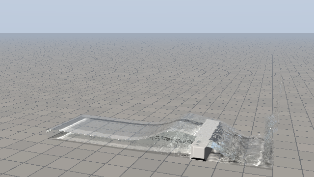 | **Breaking wave** 4 m channel | A wall of water released down a channel, crashing over a low obstacle. The channel sides are glass. |
| 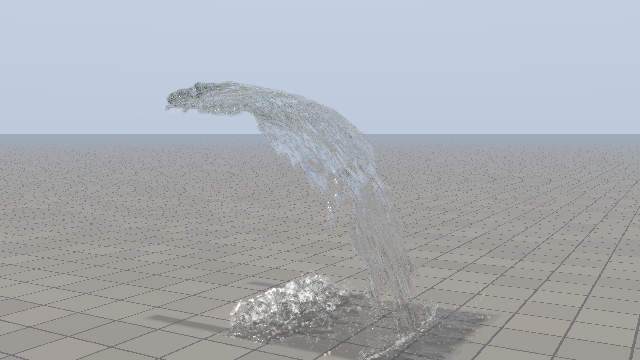 | **Waterfall** 1.5 m drop | A sheet of water flowing off a ledge and falling onto the ground below. |
| 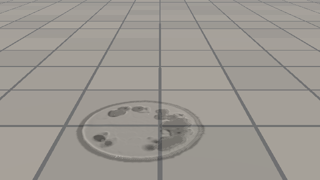 | **Spilled glass** 25 cl | A glass of water knocked over: it rushes out across the ground and settles into a puddle. |
| 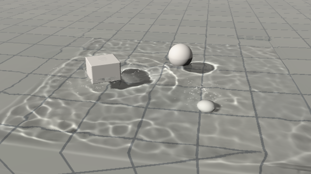 | **Things in a pond** 2.4 m pond | A crate, a ball and a stone dropped into open water: the crate plunges and bobs back up, the ball barely dips, the stone sinks. The liquid moves them (Floats), and rings spread out past the frame. |
| 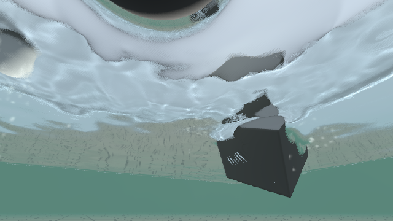 | **Pond from below** 2.4 m pond | The floating things seen from under the water: the sky through a bright circle overhead (Snell's window), the surface a rippling mirror of the pond floor all around it, the crate and the ball hanging from it, and the water fading green into the distance. The camera is under the water level; the view follows it. |
| 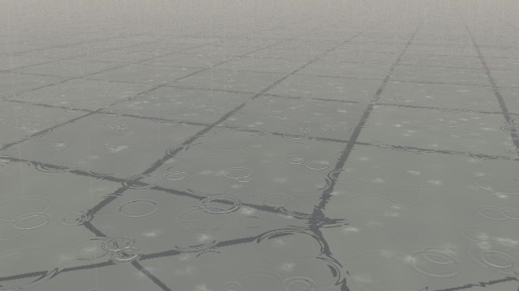 | **Rain on a pond** 3 m pond | Steady rain on still water: rings spreading from every drop, little crowns of spray where they land, streaks falling through the air. Rain sets the rate (mm/h), Raindrop size the drops. |
| 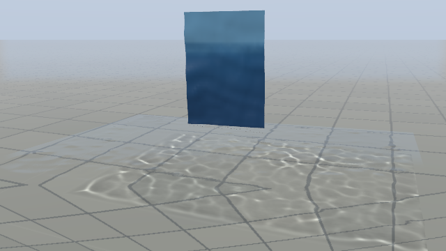 | **Towel dipped in water** 40 x 55 cm towel | A cotton hand towel dunked in a pond and lifted out again. Below the water it darkens as it soaks, and comes out heavy and limp, with a sharp line where the wet ends. Water runs down the cloth to its hem and drips back into the pond, faster at first, then more and more slowly; the towel stays damp. It is a Fabric whose pins are keyframed; set Wet at start to hang it wet. |
| 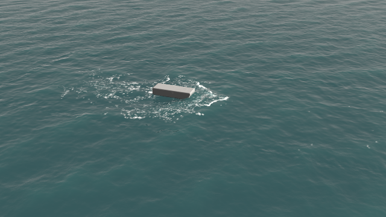 | **Boat wake** 1.2 m hull, 2.5 m/s | A small hull running across a lake in a light breeze: bow wave, spray blown off by the wind, and a V of wake that fans out behind it across the open water, long after the hull has gone by, with a trail of foam behind it. The open water round the box carries the wake on past its edges. |
| 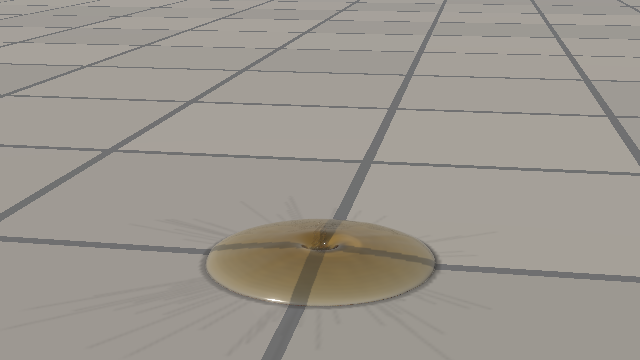 | **Honey** 45 cm pour | A thin stream of honey poured onto a surface: it lands slowly and builds a thick, rounded pool that creeps outward. Viscosity makes it thick; lower it for syrup or oil. |
| 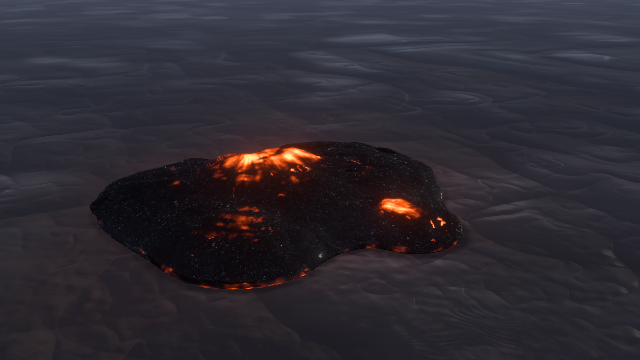 | **Lava flow** 4 m flow | Pahoehoe lava welling up at a vent at dusk and spreading over the ground in a lobe that buds toes at its edge. Fresh melt glows orange through a thin glassy skin, in stretch marks drawn out along the flow; within seconds the skin greys over and darkens, tearing where the flow pulls it apart and roping up where it is squeezed. The foot of the advancing lobe glows where it splits along the ground, the air over the lava shimmers and its glow lights the ground. |
| 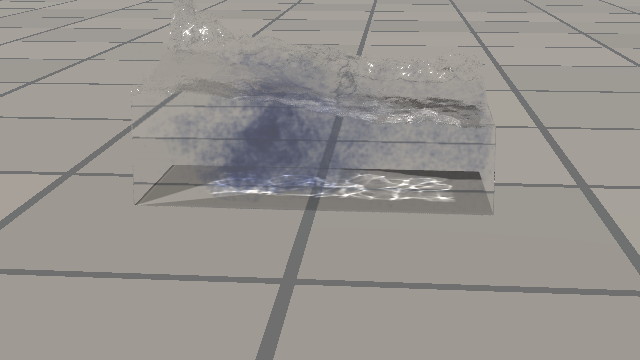 | **Ink in water** 50 cm tank | A thin stream of ink poured into a tank of still water: it plunges in a dark thread, curls into mushroom clouds and billows, and slowly clouds the water blue. Dye and cloudiness are per source. |
| 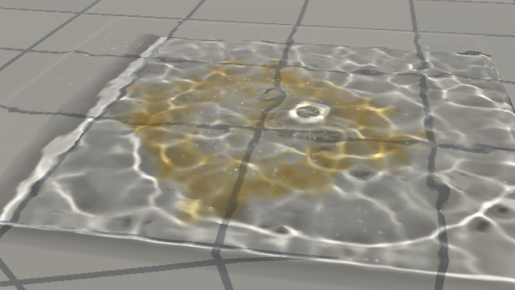 | **Oil on water** 1.2 m pool | Oil poured onto still water: lighter than the water, it dives in, bobs back up and spreads into an amber slick on the surface. Each source can pour its own density and dye. |
| 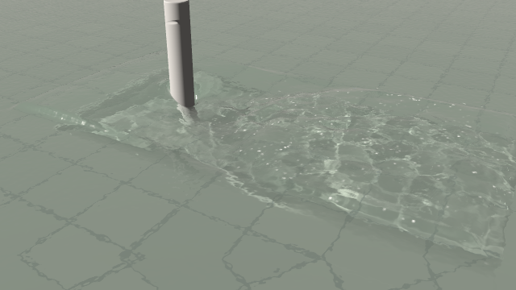 | **River past a post** 3 m of river | A river flowing past a post: the water piles up against it, splits and trails a wake of eddies and foam downstream. The open water carries on to the horizon, flowing with the current. |
| 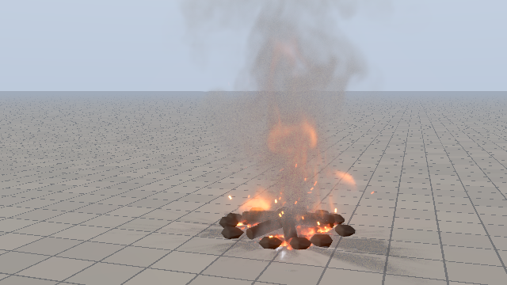 | **Hose on a fire** 1 m campfire | A campfire knocked down by a hose. The stream sweeps across the fire: where it lands the flames collapse, the soaked logs stop burning and the hot embers boil the water off in a thick white plume of steam that billows up through the smoke; a corner the water missed keeps burning, and the water runs off across the ground. Flames behind the stream show through it, refracted. |
| 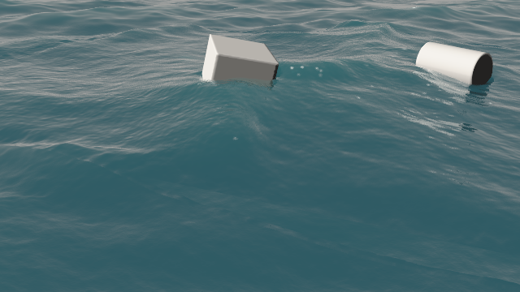 | **Crates at sea** 6 m of sea | A patch of open sea in a swell, running on to the horizon, with two crates riding the waves: they bob, tilt and roll as the crests pass. Waves, whitecaps and wind chop on the open water; deep water (Bottomless) seen from above. |
| 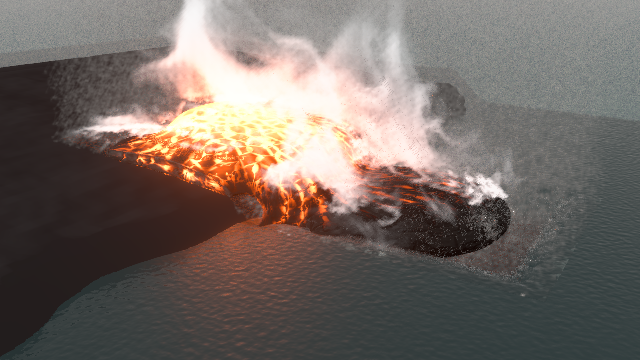 | **Lava into the sea** 4 m of shore | Lava running off a rock shelf into the sea. Where it meets the water it boils it: a thick white plume of steam billows up off the shoreline, and the lava front chills black and glassy while the lava behind it keeps glowing. The hot air over the flow shimmers. |
| 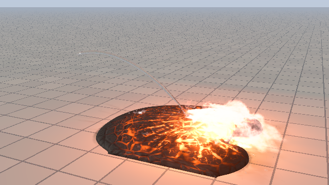 | **Water on lava** 1.5 m lava pool | A pool of lava fed from a vent, and a hose turned on it after a second: the water flashes to steam where it lands, drops skitter and sizzle away on the hot surface, and the lava chills black and glassy under the stream while the rest keeps glowing. |
| 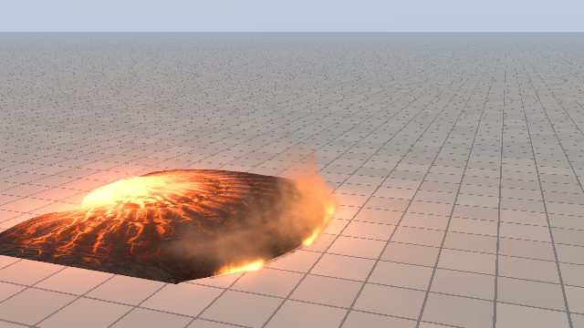 | **Lava into grass** 4 m flow | A lava flow creeping into dry grass. The air over the lava is hot enough to light the grass just ahead of the front, so a line of flame and smoke runs ahead of it and the lava rolls on over the burnt ground. Spreading fire is on: the ground is the grass. |

## The sea

| | Preset | Notes |
|---|---|---|
| 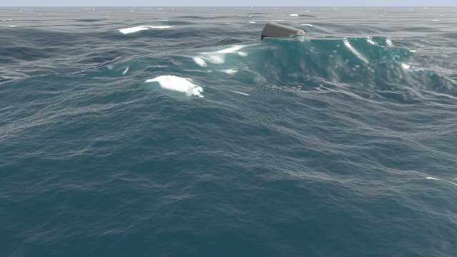 | **Open ocean** 12 m of sea, to the horizon | Deep water in a fresh breeze: local wind waves on top of a long swell from a storm far away, scattered whitecaps whose foam drifts off in streaks, sunlight glowing through the crests and a glitter path under the sun. A buoy rides it. |
| 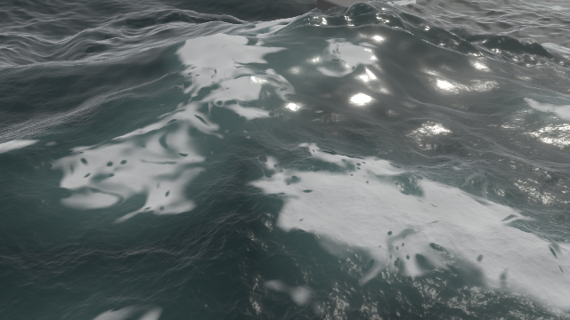 | **Storm at sea** 16 m of sea, 20 m/s wind | A gale: steep, confused seas over a big swell, crests breaking all over into whitecaps, the foam they leave drawn out into long streaks down the wind, gusts darkening patches of the water. Overcast light. A crate is thrown about. |
| 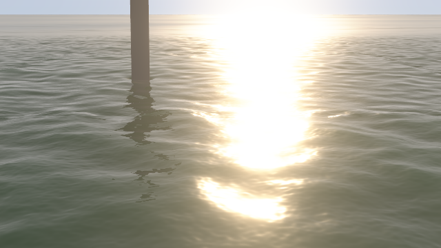 | **Calm lake** 5 m of lake | A still lake late in the day: glassy water, a faint swell left by a boat long gone, and puffs of breeze (cat’s paws) roughening drifting patches of ripples. A mooring post stands in it. |
| 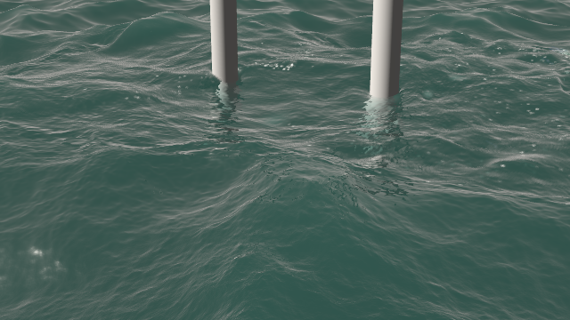 | **Harbour chop** 5 m, pier posts | Short, choppy waves running in from every side in a breezy harbour, slapping against the posts of a pier and throwing up spray; a few whitecaps on the steepest crests. |
| 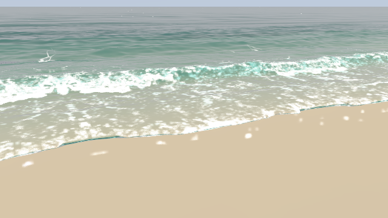 | **Beach break** 1 m surf on a sandy beach | A swell rolling onto a sandy beach: the waves slow and steepen as they feel the bottom, spill over into white water and run up the sand, and the foam drifts back. Waves come in from the sea side only (the other sides are walls along them), as in a wave tank; the open water past the box shoals too. |
| 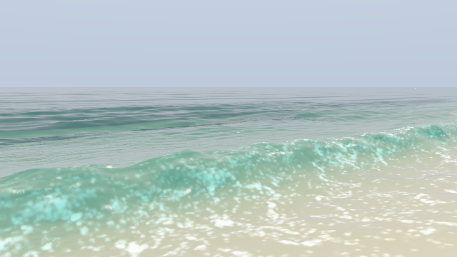 | **Shore break** 1 m wave, close up | A wave dumping onto a steep beach, seen close: it rears up in the shallows, pitches its lip forward over a hollow tube and crashes onto the sand, then rushes up the beach as white water. A small box with fine cells: the lip and the tube stay crisp. |
| 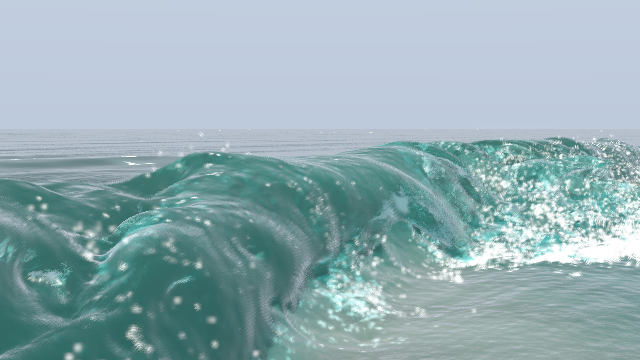 | **Reef barrel** 2 m tube over a slab reef | A long-period groundswell meeting a slab reef: deep water right up to a steep reef face, so each wave jacks up in a few metres, throws a thick lip out over a hollow tube and peels along the reef, exploding into white water where the lip lands. Seen with a long lens from the channel beside the break. Fine cells (7.5 cm) and every drop of the water simulated (no narrow band): a few seconds a frame. The sides along the waves are mirrors, so the break carries on past the box. |
| 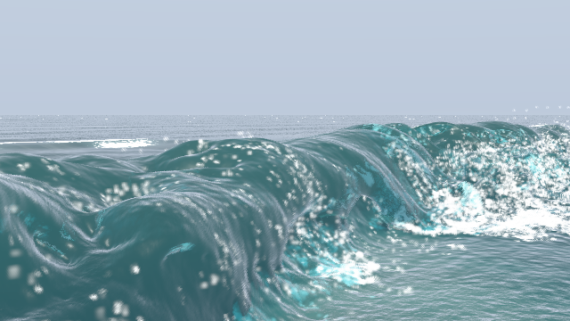 | **Big wave** 7 m tube over an outer reef | A giant winter swell meeting a deep outer slab: a mountain of water jacks up out of deep water, throws a lip as thick as a house over a tube you could drive a truck through, and explodes into a wall of white water. The Reef barrel scaled up four times, as a wave tank scales: every length times four, every time twice as slow (Froude scaling), so it breaks the same way, at 30 cm cells. |
| 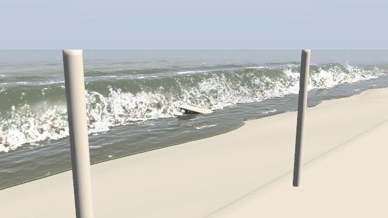 | **Tsunami** 4 m tsunami onto a seafront | A tsunami reaching a town’s seafront, seen from a hotel balcony: first the sea draws back, baring the sea floor, then a wall of water rises out of the bay, breaks into a churning white bore, runs up the beach and pours over the sea wall into the streets, lifting the boats and the cars on the promenade. 13 seconds; every drop of the water simulated (no narrow band), 25 cm cells. The surge is one long wave (Liquid, Surge shape Tsunami); the sides along it are mirrors, so the flood runs on along the shore past the box. |
| 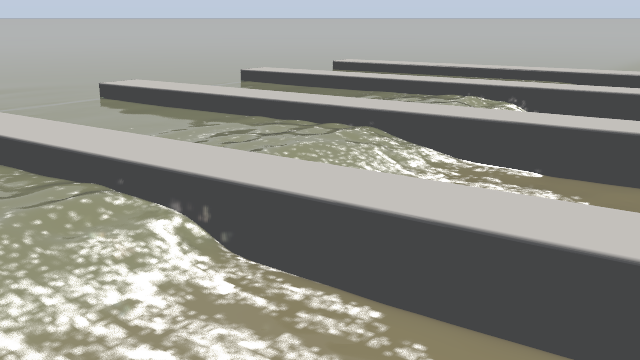 | **Tidal bore** 60 cm bore up a river | The incoming tide running up a river as a single breaking front: the water behind it stands higher and flows upstream against the river’s current, churning white along its face and rolling up the banks. A bore surge (Liquid, Surge shape). |
| 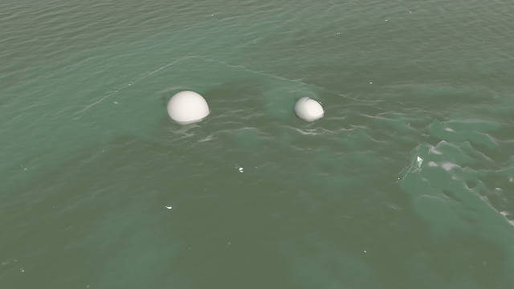 | **River past rocks** 1.8 m/s current | A fast river running past boulders: the water piles up against them, pours round, and trails eddies and lines of foam far downstream, past the edge of the box, where the open water carries the current on round another rock. |

## Ice and steam

| | Preset | Notes |
|---|---|---|
| 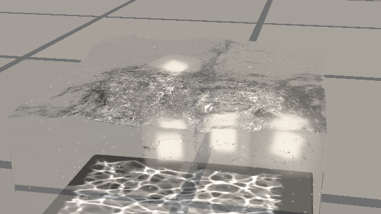 | **Ice cubes in water** 4 cm cubes, 24 cm tank | Four ice cubes from the freezer (-18 C) dropped into a tank of water at room temperature. They plunge trailing bubbles, bob back up and float with about a tenth of their height out of the water, as ice does: clear at the rim, milky at the core where they froze last, wet and glossy as they start to melt. |
| 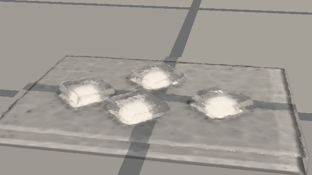 | **Ice melting** 4 cm cubes, time-lapse | Four ice cubes standing in a shallow tray of warm water (30 C), heat sped up 40 times (5 s is 3 minutes): their edges round off, they shrink and settle, and the meltwater runs down their sides and spreads into the tray. The cold meltwater sinks under the warm water around them. |
| 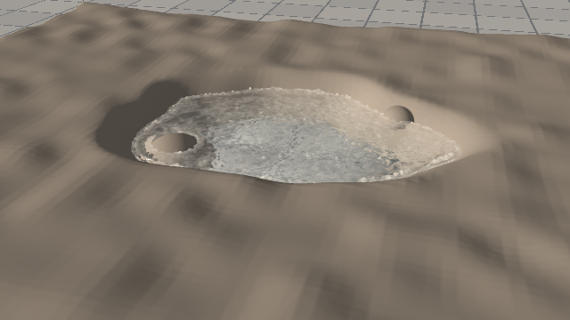 | **Pond freezing over** 1.6 m pond, time-lapse | A small pond through a night of hard frost (-18 C, a light breeze), heat sped up 3000 times (each second is 50 minutes): a skin of clear ice creeps out from the frozen banks and the rocks, joins up across the pond and thickens, and the ripples die under it. Water is densest at 4 C, so the pond freezes from the top down, over clear water that stays a little above freezing, kept warm by the earth under it. |
| 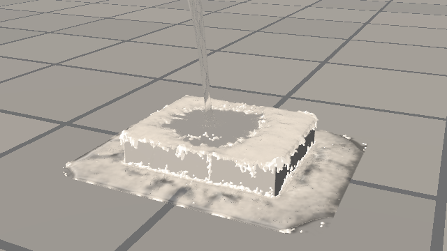 | **Water on dry ice** 40 cm slab, -78 C | Water poured onto a slab of dry ice on a frozen day: it freezes where it lands, first a glaze, then a growing mound of white, rimed ice the rest of the stream runs over and freezes onto. Heat sped up 20 times. |
| 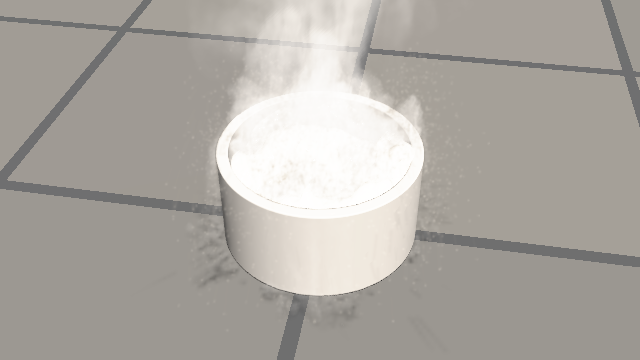 | **Boiling pot** 20 cm pot, rolling boil | A pot of water on full heat: steam bubbles stream up from spots on the hot bottom, the boil rolls the surface, bursting bubbles spit drops, and steam rises off it, clear right over the water and clouding as it cools in the kitchen air. |
| 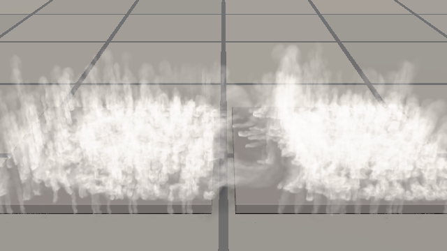 | **Water on hot steel** 2 plates, 150 C and 300 C | A glass of water splashed across two steel plates. On the left one (150 C) it boils where it lands, sizzling, spitting and steaming away in a few seconds. The right one (300 C) is past the Leidenfrost point: the water rides on its own vapour, never quite touching the steel, so it glides and skates across it in beads and puddles and boils off far more slowly. |
| 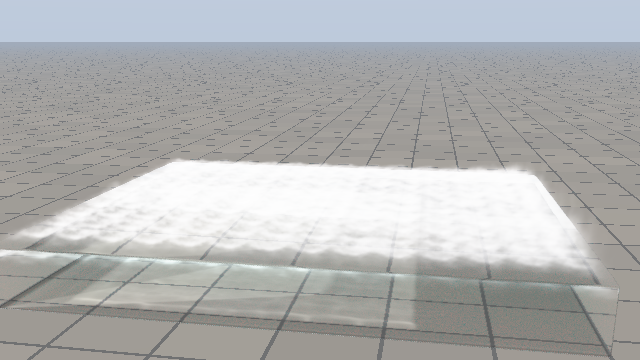 | **Hot pool in frost** 2 m pool, -12 C air | A hot spring pool (40 C) on a freezing morning: the water evaporates into the dry, cold air, which cannot hold the vapour, so it condenses straight into a fog that rises off the whole surface and drifts away on the breeze (sea smoke, steam fog). |
| 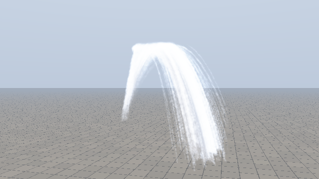 | **Boiling water into -30 C air** 5 litres thrown | A pot of boiling water flung into the air on a -30 C day. The spray is so hot and the air so cold and dry that the drops evaporate as they fly, and the vapour freezes into a roaring cloud of ice fog, while what is left of the water falls as a shower of cooling drops. |

## Weather and sky

| | Preset | Notes |
|---|---|---|
| 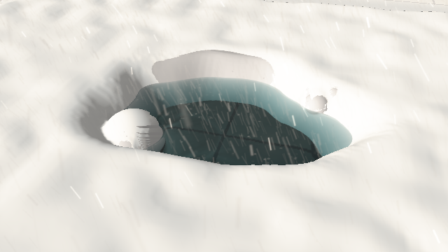 | **Snow on a pond** 1.6 m pond, -4 C | Steady snow on a small pond on a still, grey winter day (-4 C). The flakes drift down, tumbling and fluttering, and settle into a white blanket on the frozen banks and the rocks, while those that reach the water (2 C) vanish into it as they touch, cooling it. |
| 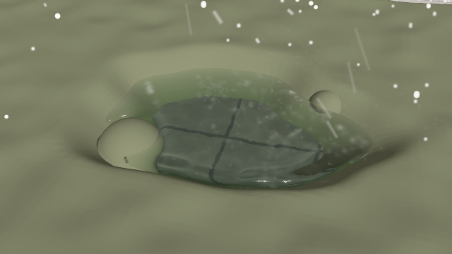 | **Hailstorm** 18 mm hail, 1.6 m pond | A summer thunderstorm drops hail the size of grapes on a garden pond (22 C). The stones fall at 15 to 20 m/s, some partly melted on the way down from the freezing level high above; they crack into the water in crowns of spray, bounce and skitter on the banks, and lie there in white drifts, melting slowly on the warm ground. |
| 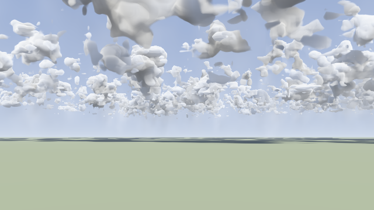 | **Cumulus building** 20 km of sky, time-lapse | A summer afternoon (26 C at the ground, a light breeze), a minute to each second: thermals rise off the sun-warmed fields, and where they pass their condensation level, about a kilometre up, cumulus bubble into being, flat-based and sunlit, build as the latent heat of their condensing vapour lifts them, and flatten against the warm layer of air above, drifting with the breeze and their shadows over the ground. |
| 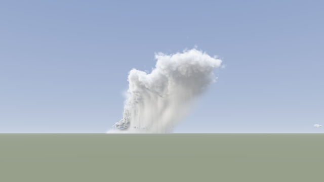 | **Thunderstorm** 60 km of sky, time-lapse | A single storm in a hot, humid, sheared afternoon air mass (about 3000 J/kg of CAPE), a minute to each second. A warm bubble of air rises, condenses, and its latent heat drives an updraft of 40 to 60 m/s that towers into a cumulonimbus, overshoots the tropopause at 12 km and spreads its anvil downwind; ice, snow and hail grow in it, and grey shafts of rain and hail fall from its base, their cold outflow spreading over the ground. |
