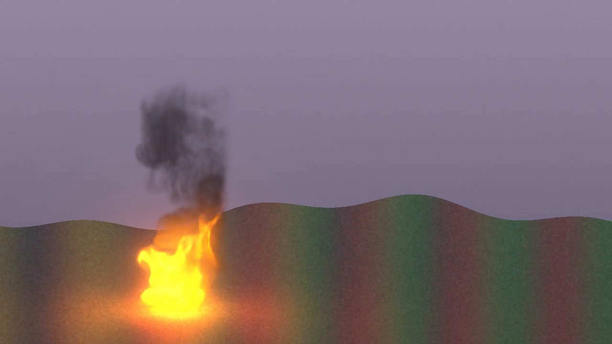
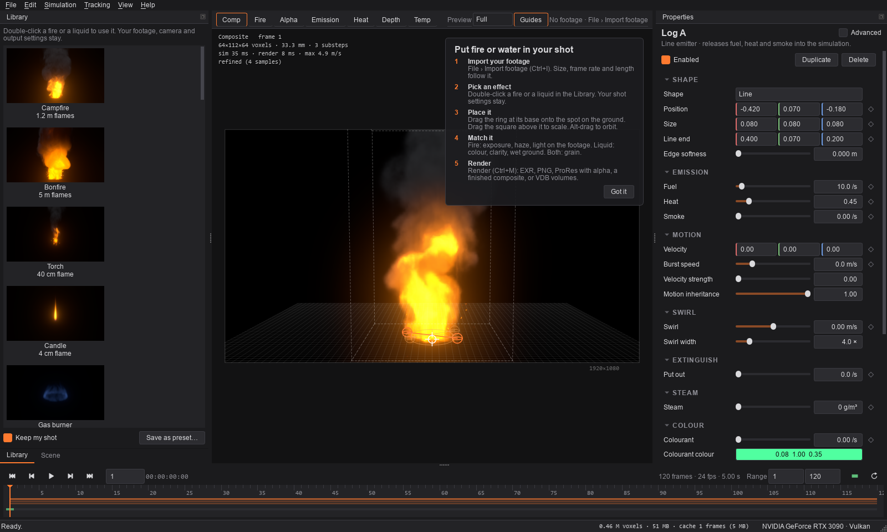
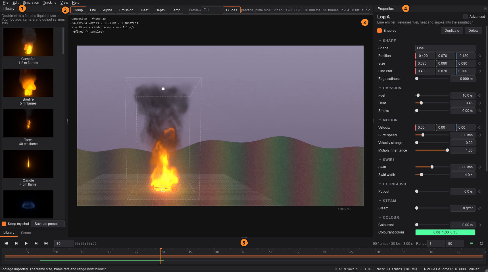
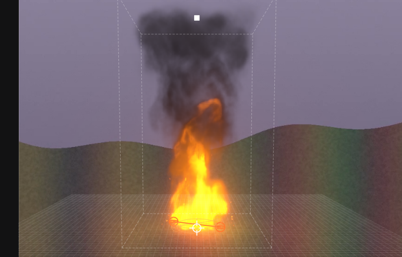
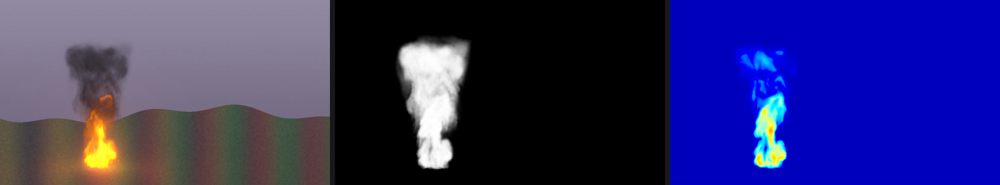
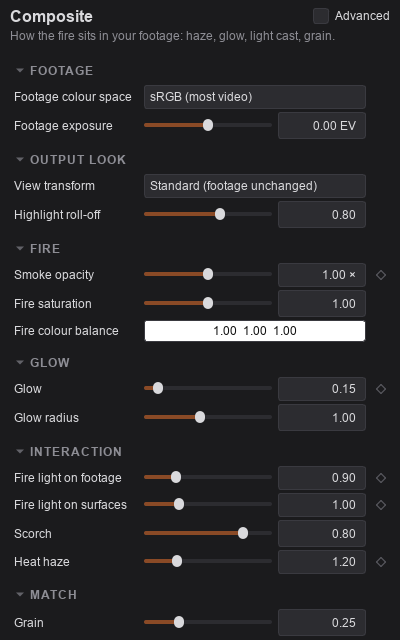
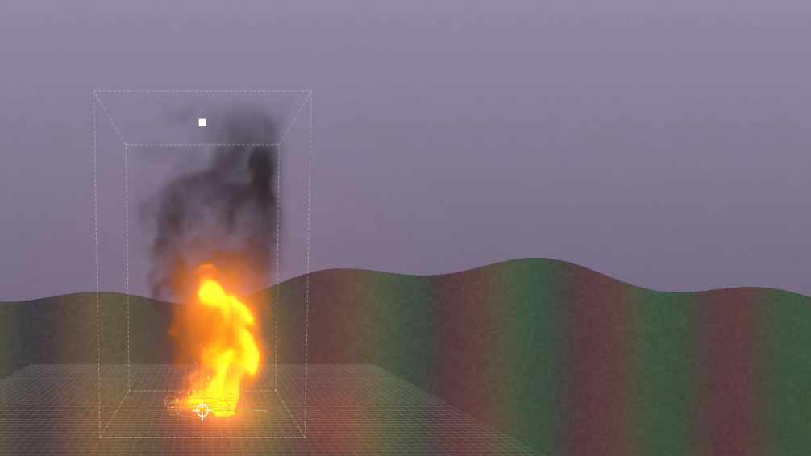
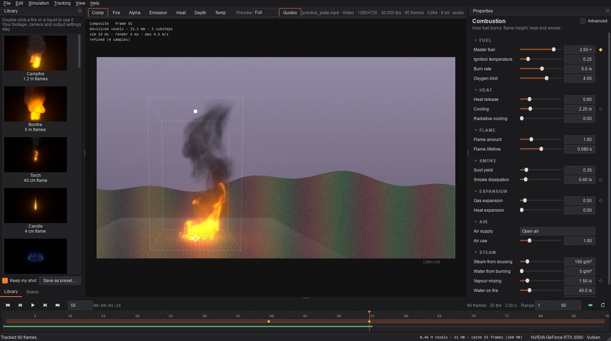
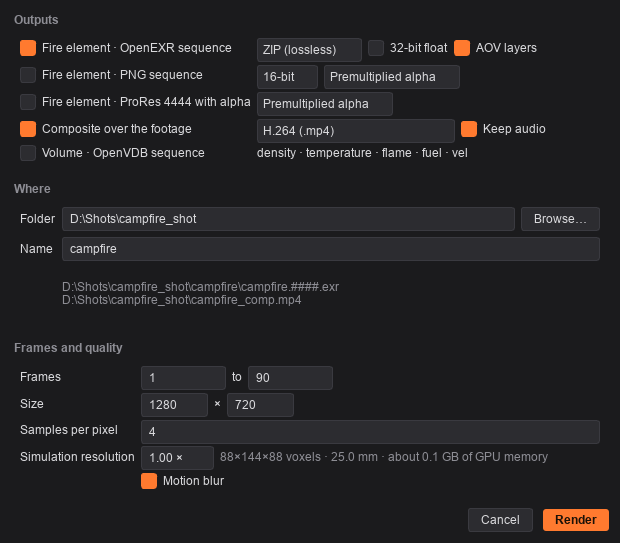
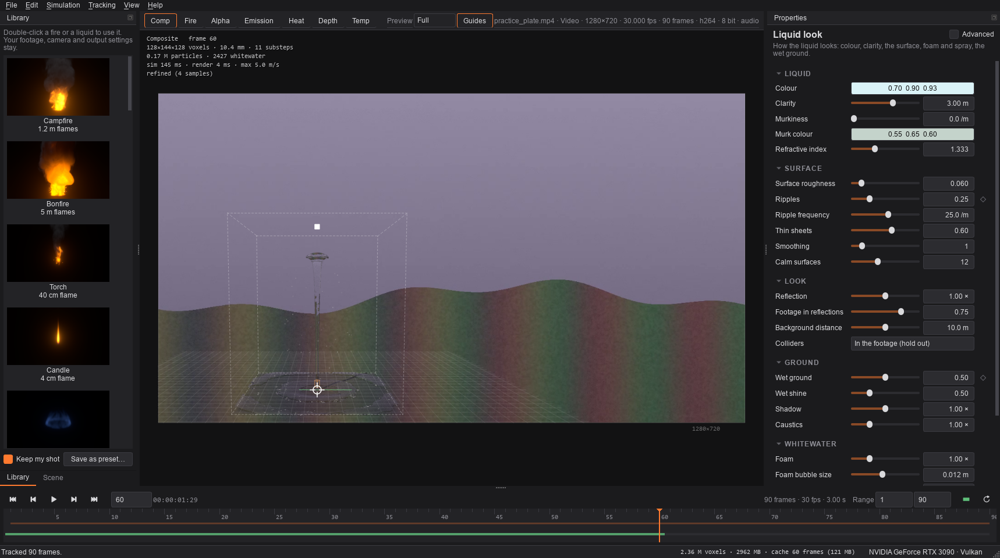

# Tutorial: your first fire shot

In this tutorial you put a campfire into a short panning shot, match it to the footage, make it flare up, and render a finished composite and a fire element for compositing. Then you render the same shot from the command line, and swap the fire for water.

It takes about 30 minutes. You learn the steps every Blackbody shot goes through; the [README](../README.md) has the full reference for each one.



## Before you start

You need:

- **Blackbody running.** See *Install and run* in the [README](../README.md#install-and-run).
- **A shot to work in.** Any clip with some ground in it works. To follow along exactly, make the practice plate the tutorial uses: a 3-second, 1280×720, 30 fps dusk landscape with a slow pan and a sound track. From the Blackbody folder:

  ```bash
  .venv/Scripts/python tools/make_test_footage.py out/practice_plate.mp4
  ```

  On macOS or Linux use `.venv/bin/python`. (The generator is part of the source, not the standalone app. With the standalone app, use a clip of your own.)

The numbers in this tutorial are for the practice plate. With your own footage, use them as a starting point and trust your eye.

## 1. Find your way around

Open Blackbody. The first time, a card in the viewer lists the five steps of a shot, and a campfire burns over black. Click **Got it**; **Help › Getting started** brings the card back.



The window has five parts. You will use all of them:



1. **Library.** The built-in fires, smoke, sparks, steam and liquids. Its **Scene** tab lists what is in the shot (emitters, colliders) and the groups of settings (Combustion, Motion, Composite and so on).
2. **View bar.** What the viewer shows: the composite, the fire over black, its alpha, and passes such as heat and depth (keys **1** to **7**). *Preview* sets the resolution of the live preview, and *Guides* shows or hides the handles and the simulation box (**G**).
3. **Viewer.** Your frame. The text at the top left is the simulation grid, the size of one cell, and how long each frame took. It says *refined* once a paused frame has been redrawn at full quality.
4. **Properties.** The settings of whatever is selected: an emitter, a collider, or a group of settings from the Scene tab. Tick *Advanced* for expert settings.
5. **Timeline.** Play controls, the current frame, the frame range, and a bar underneath that turns green as frames are simulated and cached. Keyframes show as diamonds.

The status bar at the bottom shows the GPU Blackbody is using.

## 2. Import your footage

Choose **File › Import footage** (**Ctrl+I**) and pick `out/practice_plate.mp4`.

The top right of the view bar now describes the clip: `practice_plate.mp4 · Video · 1280×720 · 30.000 fps · 90 frames · h264 · 8 bit · audio`. The output size, frame rate and frame range (1 to 90) have changed to match it, so there is nothing to set up.

## 3. Pick a fire

In the **Library**, check that **Keep my shot** (under the thumbnails) is ticked, then double-click **Campfire**.

*Keep my shot* swaps in the new fire but keeps your footage, frame range, output settings and where the fire sits in the frame. Untick it to load a preset exactly as it was made. Like every change in Blackbody, loading a preset can be undone with **Ctrl+Z**.

## 4. Place it

With *Guides* on, the fire has two handles:



- **The ring** is the base of the fire. Drag it onto the ground in the left third of the frame, near the bottom.
- **The square** is the top of the simulation box. Drag it down to make the fire a little smaller in the frame.

To type exact values instead, open the **Scene** tab, click **Camera**, and under *Placement* set **Base X** to 0.30, **Base Y** to 0.90 and **Scale in frame** to 0.65. (The left of the practice plate has the most texture in the ground, which you will need for tracking in step 8.)

Two more moves to know:

- **Alt-drag** in the viewer walks the camera around the fire (*Orbit* and *Camera height angle*); **Alt + right-drag** changes its *Distance*. Distance changes the perspective, not the size: the fire stays pinned to the ring at the size you set.
- **Mouse wheel** zooms the viewer, **middle-drag** pans it and **F** fits it again. These change only your view, not the shot.

> **With your own footage:** set *Camera › Focal length* and *Sensor width* to the lens and camera the shot was filmed with, *Camera height angle* to how much the camera looks down, and *Roll* to match a tilted horizon.

## 5. Play it

Press **Space**.

Blackbody simulates the fire as it plays: fuel burns, hot gas rises and swirls, smoke drifts. The campfire starts with 2.5 seconds of *pre-roll* (*Domain › Pre-roll*), simulated before frame 1, so it is already burning when the shot starts. The viewer says `simulating… frame N` while it catches up.

As frames are simulated, the bar under the timeline turns green. Green frames are cached: scrubbing back over them is instant.

What happens when you change a setting depends on what it controls:

- **How it looks** (Shading, Lighting, Camera, Composite): the cached frames are redrawn, with no re-simulation.
- **How it moves** (Combustion, Motion, the emitters): with **Simulation › Live tweaking** on (the default), the simulation keeps running with the new values, and the cache is dropped. Changing the size or resolution of the box restarts it.

**Simulation › Cache the frame range** (**Ctrl+Shift+C**, or the green button at the right of the timeline) simulates the whole shot in one go. If playback is slow, set *Preview* in the view bar to *Half* or *Quarter*.

## 6. Look at it the way a compositor would

Pause on a frame and press **1**, **3** and **5** in turn:



- **Composite** (1) is the fire in your footage.
- **Alpha** (3) is how much the fire hides what is behind it. Smoke is solid; flame is mostly light, so it has little alpha. This is what your editor or compositing app receives.
- **Heat** (5) is the hot air that makes the footage shimmer. It drives the heat haze.

**Fire over black** (2) is useful for judging the flames alone. Press **1** to go back to the composite.

## 7. Make it sit in the shot

In the **Scene** tab, click **Composite** and set:

| Setting | Value | What it does |
|---|---|---|
| Heat haze | 1.2 | Shimmer in the footage behind and above the fire |
| Fire light on footage | 0.9 | The fire lights up the ground around it |
| Grain | 0.25 | Film grain on the fire, to match the noise in the plate |



Then click **Motion** and set **Wind speed** to 0.6 m/s, a light breeze. The flames and smoke now lean to screen right (*Wind direction* 90°). Wind changes the simulation, so the fire re-simulates from here. A little wind goes a long way on a fire this size: much more and the flames lie down along the ground.

A few things make settings quicker to work with:

- **Drag a setting's name** sideways to scrub its value (hold **Shift** for fine steps). **Double-click the name** to reset it.
- **Hover** over a setting for a tooltip that explains it, often with typical real-world values.
- **Too bright or too dim?** *Shading › Fire exposure* is in stops, like a camera.

You do not need to light the smoke: *Lighting › Match ambient to footage* is on, so the smoke picks up the colour and brightness of the plate.

## 8. Track the camera move

Play the shot. The camera pans, but the fire stays in the same place in the frame, so it slides across the ground.

Choose **Tracking › Track the fire base** (**Ctrl+T**). Blackbody follows the patch of ground under the ring through the whole shot, forwards and backwards from the current frame, and the status bar reports `Tracked 90 frames.` The tracked path appears as a thin green line through the ring (short here, because the pan is slow), and the fire now stays put on the ground:



If the fire should sit slightly elsewhere, drag the ring: the whole track moves with it. **Tracking › Clear track** removes the track.

The tracker follows one point in 2D, and needs texture under the ring (it tells you if there is too little). For shots with a strong change of perspective, import a camera solve instead with **File › Import camera track (.chan)** (see *Moving shots* in the README).

## 9. Make it flare up

Any setting with a **◆** next to it can be animated. Make the fire flare up as if someone threw fuel on it:

1. In the **Scene** tab, click **Combustion**.
2. Go to frame 40 (type it in the frame box at the left of the timeline, or use the arrow keys).
3. Click the **◆** next to **Master fuel**. The diamond fills in: there is a key at 1.00 on this frame.
4. Go to frame 55 and set **Master fuel** to 2.5. Because the setting is now animated, this adds a second key by itself.



Play it: after frame 40 the fire starts to swell. Fuel takes a moment to burn and rise, so the flames keep growing after the last key and roar by the end of the shot. *Master fuel* scales every emitter at once, which makes it the quickest way to ignite, grow or put out a fire. Right-click a **◆** to remove a key or clear the animation.

## 10. Save and render

Choose **File › Save** (**Ctrl+S**) and save the project as `campfire_shot.bbfire` in the `out` folder, next to the practice plate. The project remembers the footage; if you move both, Blackbody finds the clip next to the project.

Choose **File › Render** (**Ctrl+M**):



1. Under **Outputs**, tick:
   - **Fire element · OpenEXR sequence**: the fire alone, with alpha and extra layers, for Nuke, After Effects, Fusion or Resolve.
   - **Composite over the footage**, and choose **H.264**: the finished shot, with the plate's sound.
2. Under **Where**, pick a folder. *Name* starts the file names (`campfire`, after the preset), and the files it will write are listed underneath.
3. Under **Frames and quality**, leave the range at 1 to 90. *Simulation resolution* shows the grid size and roughly how much GPU memory the final render needs; lower it if your GPU runs out.
4. Click **Render**.

The final render simulates again at full resolution with 4 samples per pixel and motion blur, so it takes longer than playback: about 20 seconds for this shot on an RTX 3090. A progress window shows each frame as it finishes; **Open folder** takes you to the files:

- `campfire/campfire.0001.exr` … `.0090.exr`: scene-linear, premultiplied RGBA, with `emission`, `glow`, `heat` and `depth` layers. Use `heat` to drive a displacement if you want to redo the haze in comp.
- `campfire_comp.mp4`: the finished shot.

For a single frame to check or share, **File › Export this frame** (**Ctrl+Shift+E**) saves the current frame at final quality, as a PNG of what the viewer shows or as an EXR fire element.

## 11. Render from the command line

The project file renders without opening the app, which is how you queue shots or use a render farm.

Open a terminal in the Blackbody folder. The command depends on how you run Blackbody:

- From source: `.venv/Scripts/python -m blackbody` (on macOS and Linux, `.venv/bin/python -m blackbody`)
- Standalone: `dist/Blackbody/blackbody-cli.exe` (it sits next to `Blackbody.exe`)

The examples below write `blackbody` for short. A quick draft of the first 30 frames, to check the shot:

```bash
blackbody render out/campfire_shot.bbfire -o out/draft/comp.mp4 --frames 1-30 --draft
```

The full-quality composite:

```bash
blackbody render out/campfire_shot.bbfire -o out/renders/comp.mp4
```

The output type follows the file extension: `.mp4` is an H.264 composite over the footage, `.exr` a fire element, and `####` becomes the frame number. `--set` changes any setting for one render without touching the project, which makes it easy to try variations (*wedges*). A version with sootier, darker smoke:

```bash
blackbody render out/campfire_shot.bbfire -o out/wedge/soot15.####.exr --set combustion.soot=1.5
```

To find a setting's command-line name, `blackbody settings combustion` lists every setting in a section with its default, typical range and the name you see in the app (*Soot yield* is `combustion.soot`). A misspelt name stops the render before it starts, with a suggestion. `blackbody presets` lists the presets. See *Command line* in the README for the rest.

## 12. Swap the fire for water

Back in the app, go to the **Library**, scroll past the fires, and double-click **Fountain jet** (with *Keep my shot* still ticked).



A jet of water now rises from the same spot, breaks up at the top and rains back down, wetting the ground. The placement, track and render settings carried over. The Scene tab changes to match: emitters become *Sources*, and **Liquid** (how it behaves) and **Liquid look** (how it looks) take the place of the fire settings. Try these in **Liquid look**:

- **Colour** and **Clarity** for tea, muddy water or wine
- **Wet ground**: how much the ground darkens where the water has been
- **Background distance**: how strongly the footage bends through the water

Liquids are simulated as particles, often millions of them, so they are slower than fire; keep the box tight around the action. **Ctrl+Z** takes you back to your campfire.

## What next

You have been through every step of a shot: import, pick, place, match, track, animate and render. From here, the [README](../README.md) covers:

- **Presets:** fires, smoke, sparks, steam and liquids, each a starting point at real-world size
- **Swirl, sparks, steam and more:** fire whirls, dousing, spreading fire, burning meshes, coloured flames
- **Moving shots:** camera solves from Nuke, Blender, SynthEyes, 3DEqualizer and PFTrack
- **Outputs:** premultiplied or straight alpha, heat distortion in Nuke and After Effects, OpenVDB volumes in Blender and Houdini
- **Performance and memory:** resolution, GPU memory and render times

To keep a fire you have tuned, click **Save as preset…** under the Library. It appears at the end of the Library, with a thumbnail of your shot.

## If something goes wrong

| Problem | Fix |
|---|---|
| Flames or smoke are cut off at the top or sides | The simulation box is too small. Raise *Domain › Height* (or *Width* and *Depth*). |
| Playback is slow | Set *Preview* to *Half* or *Quarter*, or lower *Domain › Interactive resolution*. |
| The fire slides over the ground | The camera moves: track it (step 8) or import a camera solve. |
| "Too little detail at this spot to track" | Move the ring onto a textured spot or a corner, track, then drag the ring back. |
| The render runs out of GPU memory | Lower *Simulation resolution* in the Render dialog. |
| Blackbody uses the wrong GPU | See *Troubleshooting* in the README. |
