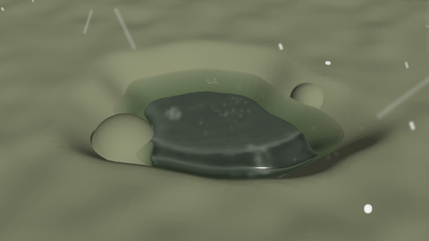
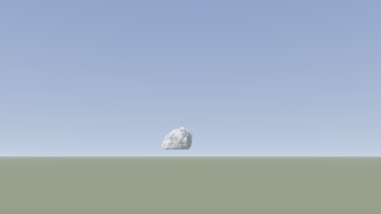

# Weather and clouds

Snow, sleet, freezing rain, graupel and hail falling on a liquid scene, decided by the temperatures of the sky above; and the sky itself: clouds that build from the sun-warmed ground into storms.

## Weather presets

| Weather preset | Size | Notes |
|---|---|---|
| Snow on a pond | 1.6 m pond, -4 °C | Steady snow on a winter pond: flakes tumbling down and settling into a blanket on the frozen banks and rocks, vanishing into the water |
| Hailstorm | 18 mm hail | A summer storm's hail on a garden pond: stones cracking into the water in crowns of spray, bouncing on the banks and lying in white drifts |

## Snow, sleet, freezing rain, graupel and hail

*Weather › Precipitation* sets what falls on a liquid scene (or a fire-and-liquid one), and it is simulated piece by piece. What reaches the shot is decided the way the sky decides it: each size of snowflake, graupel pellet, hailstone or drop that forms in the cloud is followed down through the column of air above (its temperatures and humidity at every height), melting, refreezing, evaporating or sublimating as that air makes it. Snow that falls through a layer of air above freezing melts (slowly in dry air, which it cools by evaporating, so snow survives to the ground at a few degrees above freezing); partly melted, it refreezes in the cold air below into ice pellets: sleet; melted right through, its drops stay liquid below freezing, since nothing makes them freeze, and freeze onto whatever they hit: freezing rain. Hail falls from high in the storm and melts below the freezing level, so small hail reaches the ground as big raindrops. *Sleet* and *Freezing rain* set a warm layer aloft that does this; *From the temperatures aloft* takes yours (advanced). What arrives also depends on the air at the ground (*Liquid › Air temperature*): snow in mild air arrives wet, or as rain.

### In the shot

In the shot each piece carries on: it falls at its own speed (snowflakes about 1 m/s, graupel 2 to 3, hail 10 to 30, sleet 5 to 8, drops 4 to 9), is carried by the wind (*Liquid › Wind*) and its gusts and eddies, snowflakes flutter and spiral as they fall, and it keeps exchanging heat and water with the air round it. Where it lands: snow settles; graupel and ice pellets bounce a little and settle; hailstones bounce, then rest where they stop, white stones that melt where they lie; drops wet the surface, or glaze it with clear ice if they are supercooled or the surface is below freezing. Into the liquid: hail and pellets throw up crowns of spray, and everything that falls in becomes part of the water, carrying its heat: snow cools the water it melts in, and on water near freezing it floats as slush.

### On the ground

On the ground (*Lies on the ground*): what lands on the ground and on the colliders' tops builds up. Fresh snow settles at the density it falls at (light and fluffy in hard frost, heavier and wetter near freezing), packs down over hours, melts by the warmth of the air and of what it lies on, holds some of its meltwater and drains the rest; it does not stay on slopes much steeper than 45°. Glaze builds up from freezing rain. *Already lying* starts the shot with snow on the ground; *Build-up speed-up* makes it build up (and melt) faster, as a time-lapse, while it still falls at its real speed.

### How it is drawn

Drawn as it looks: snowflakes soft and bright, glowing when backlit, ragged clumps of crystals close to the lens; hail as balls of ice, white at the core and clear at the rim; sleet and drops as tiny clear lenses streaking past. Lying snow is bright and faintly blue in its hollows, its crystals glinting in the sun; wet snow greyer and glossier; a dusting covers in patches. Glaze and wet ground shine with the sky's reflection.

- The *Area* (Weather) is the width of ground round the box it is simulated over: make it reach as far as the camera sees falling snow.

## Clouds and storms

Set *Domain › Simulation* to *Clouds and weather* to simulate the sky: a box of air kilometres across (the scene's metres are kilometres at *Atmosphere › Scale* 1000), its clouds, their rain, snow and hail.

### The air column

*Atmosphere* sets the air at every height, as a sounding does: the temperature and humidity at the ground, the layer the sun-warmed ground keeps stirred (its air cooling 9.8 °C per km as it rises), how fast the air above cools with height (steeper is less stable: towering clouds and storms), the humidity aloft, the tropopause (where storms stop and spread their anvils), and a layer of warmer air that caps the clouds at its height (fair-weather cumulus; on a storm day it holds the sky clear until something breaks through). The wind blows at its strength and direction at the ground, stronger with height (shear tilts clouds and organises storms) and turning (*Veer*). *Follow the storm* moves the box with the clouds, as research models do (at the mean wind of the lowest 6 km), so a storm stays in the middle of it instead of drifting out of its side.

### What drives it

The sun-warmed ground gives the air heat and moisture, unevenly (*Thermal size*, *Patchiness*): thermals rise, and where they pass their condensation level the vapour condenses into cumulus, whose latent heat lifts them on. A *Warm bubble* starts a single storm in the middle of the box.

### The clouds' water

The clouds' water, in every cell: vapour condenses into cloud water above freezing and more and more into ice the colder it is; in mixed cloud ice grows at the water's expense. Cloud water coalesces into rain (*Rain needs*), rain sweeps up cloud and evaporates below the cloud in dry air (cooling it: the downdraft and the cold outflow of a storm); ice aggregates into snow, snow collecting supercooled cloud water becomes graupel, and graupel and hail grow in the updraft, sweeping up cloud water and rain; below the freezing level snow and hail melt. Every change of phase heats or cools the air by its latent heat, and the weight of the water the air carries drags it down. Rain, snow and hail fall through the air at their own speeds (*Hail fall speed*) and reach the ground.

- **Time.** Clouds take ten to thirty minutes to build and a storm an hour: *Time-lapse* runs that many seconds of sky for each second of the shot.

### How clouds are drawn

Drawn physically: sunlight reaching each part of the cloud through the cloud between it and the sun, droplets throwing it forward (the silver lining of a cloud in front of the sun) and ice crystals less sharply, light scattered many times keeping thick clouds' sunlit sides white, skylight from above and round the sides (dark bases, bright tops, blue-grey shadowed sides), grey rain shafts and white snow curtains under the cloud, streaked by falling, the air fading everything into the haze of the horizon with distance (*Sky › Visibility*), the clouds' shadows on the ground, wet ground under the rain.

### Detail finer than the grid

A cloud's edge is sharp (where the air is saturated there is cloud, where it is not there is none), so a cell part-filled with cloud is drawn as cloud where billowing noise puts it and clear air elsewhere: a cumulus' surface heaped into rounded lobes with creases between, half a cell out and in, whatever its density; flat at its base, where the rising air reaches its condensation level; softer for ice cloud. The anvil's snow is drawn as the anvil's ice. The sunlight is traced through this detail near each point, so the lobes shade one another. The sun is *Lighting*'s; *Draw the sky* off draws only the clouds, over your footage.

- **Terrain**: colliders are hills and mountains (heightfields sized in kilometres) the wind flows over.

| Sky preset | Size | Notes |
|---|---|---|
| Cumulus building | 20 km, time-lapse | A summer afternoon, a minute to each second: thermals off the warm fields set off flat-based cumulus that build and flatten against a warm layer, drifting with their shadows |
| Thunderstorm | 60 km, time-lapse | A warm bubble breaks the cap on a hot, humid, sheared day: a cumulonimbus towers to 12 km on an updraft of 40 to 60 m/s, spreads its anvil, and rains and hails on the ground |
